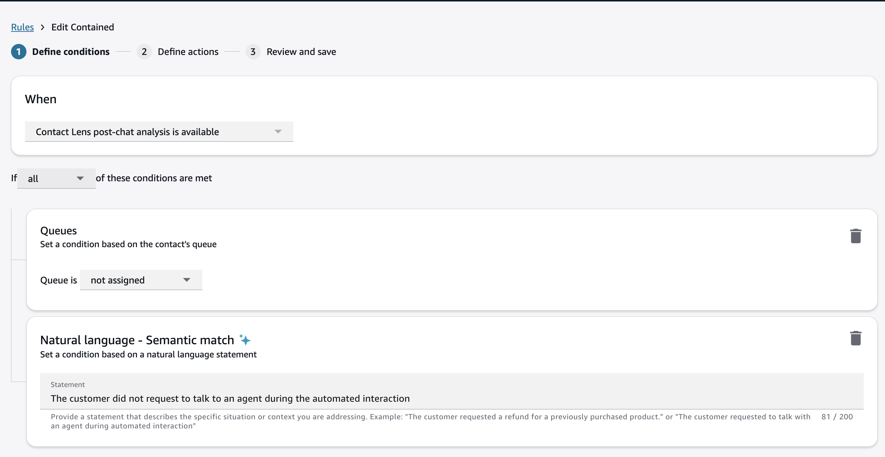
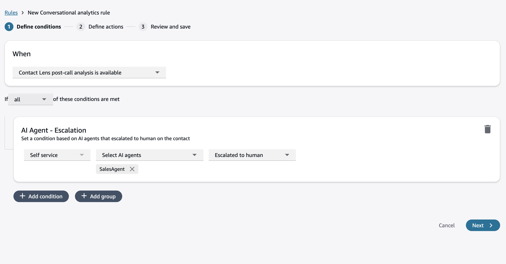
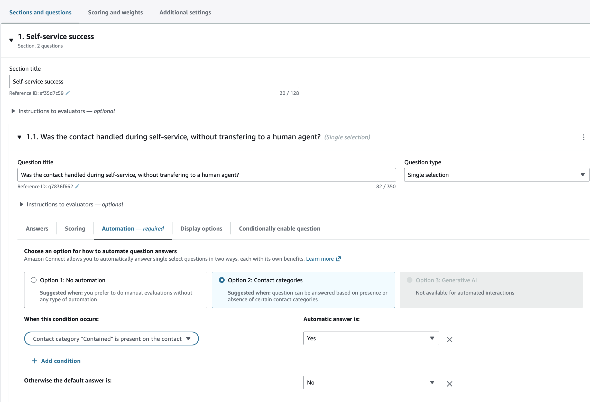
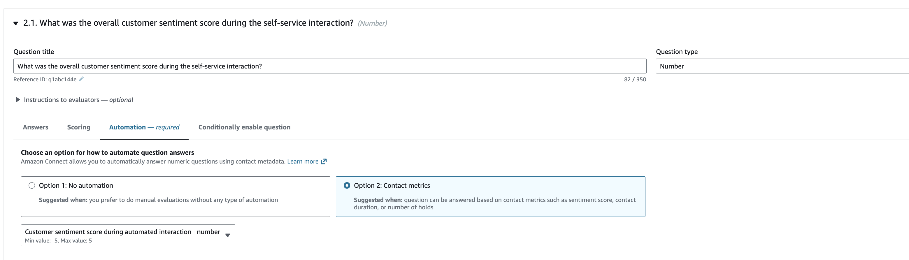
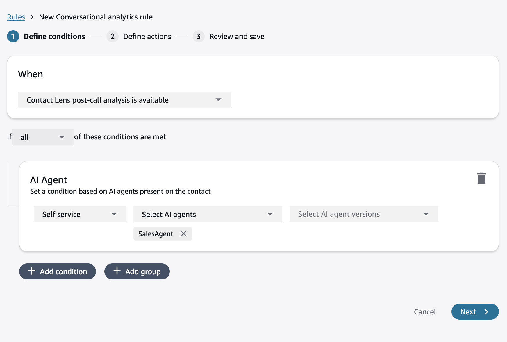
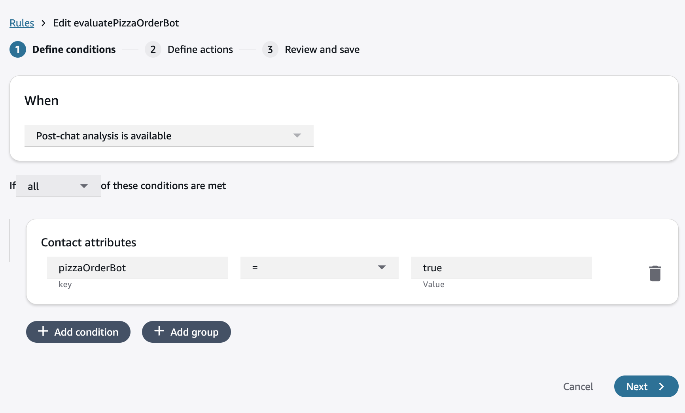

#

Performance evaluations of self-service interactions in Amazon Connect

Amazon Connect provides you with the ability to automatically evaluate the quality of self-service
interactions and get aggregated insights to improve customer experience. Managers can
define custom criteria to assess the quality of self-service interactions, that can be
filled manually or automatically using insights from conversational analytics, and other
Amazon Connect data. For example, you can automatically assess if the AI agent repeatedly fails to
understand the customer, resulting in poor customer sentiment and transfer to a human
agent. Managers can review these insights in aggregate and on individual contacts,
alongside self-service interaction recordings and transcripts, to identify opportunities
to improve bot or AI agent performance.

###### Note

Performance evaluations of self-service interactions is only available as part of
Amazon Connect (with unlimited AI). For more information, see [Amazon Connect pricing](https://aws.amazon.com/connect/pricing/ "https://aws.amazon.com/connect/pricing/").

To automatically evaluate self-service interactions, you need to first [Enable conversational analytics in
Amazon Connect Contact Lens](enable-analytics.md "enable-analytics.md"). Performance evaluations can evaluate the entire self-service
interaction, irrespective of whether it's handled by touch tone, Lex bots, Amazon Connect AI agents
or custom bots within Amazon Connect. The steps to set up automated evaluations of self-service
interactions are as follows:

- [Step 1: Create a draft evaluation form](#step-create-draft-form-self-service "#step-create-draft-form-self-service")
- [Step 2: Set up automation](#step-setup-automation-self-service "#step-setup-automation-self-service")
- [Step 3: Set up a rule to automatically submit
  evaluations of self-service interactions](#step-setup-rule-self-service "#step-setup-rule-self-service")

## Step 1: Create a draft evaluation form

You can define custom criteria to evaluate self-service interactions. These
criteria can measure self-service resolution, customer experience or bot/AI agent
behaviors.

An example evaluation form is as follows:

Section 1: Self-service success

- **1.1** Was the contact handled
  during self-service, without transferring to a human agent?
  (Single selection)
- **1.2** Was the customer able to
  self-serve at least one of their needs? (Single selection)

Section 2: Customer experience

- **2.1** What was the overall customer
  sentiment score during self-service? (Number)
- **2.2** Did the customer express
  frustration during self-service? (Single selection)

Section 3: AI agent behaviors

- **3.1** Did the AI agent fail to
  understand the customer and asked them to repeat themselves?
  (Single selection)
- **3.2** Was the AI agent rude or
  aggressive towards the customer at any point? (Single
  selection)

For additional details, see [Create an evaluation form in Amazon Connect](create-evaluation-forms.md "create-evaluation-forms.md").

## Step 2: Set up automation

You can automate evaluations of self-service interactions using Amazon Connect rules (including
generative AI-powered semantic match rules) and using integrated metrics such as
customer sentiment. Note that currently, you cannot use the integrated generative AI
within the evaluation form to automatically evaluate self-service interactions.

### Automation using rules

Start with setting up a rule:

1. On the navigation menu, choose **Analytics and
   optimization**, **Rules**.
2. Select **Create a rule**, **Conversational analytics**.
3. Under **When**, use the dropdown list to
   choose **post-call analysis** or **post-chat analysis**.

Example rules that you can create:

Self-service containment

- Add a new condition checking that the queue was not
  assigned and the contact was handled during the automated
  interaction.
- You can also use natural language intent to confirm that the
  customer did not request for a human agent during the
  automated interaction with the Lex bot or AI agent.

###### Note

Amazon Connect understands the following keywords within semantic match
rules:

- **System:** Denotes a bot or
  AI agent
- **Agent:** Refers to the
  human agent
- **Customer:** The person
  interacting with the contact center
- **Automated interaction:**
  Part of the customer interaction where human agent was not
  present on the conversation, including self-service
  interaction with bot or AI agent, and wait time in the
  queue
- **Human agent interaction:**
  Customer interaction with the human agent

- If you are using a Amazon Connect AI agent, you can also check if the
  AI agent for self-service escalated to a human or not.

Self-service success for at least one intent

Create a rule using **natural language - semantic
match** condition:

"During the automated interaction, the system successfully fulfilled
at least one of the customer requests, such as providing information
or completing another service request."

Bot/AI agent failing to understand the customer

Create a rule using **natural language - semantic
match** condition:

"The system failed to understand the customer and asked the customer
to repeat themselves."

Customer expressed frustration

Create a rule using **natural language - semantic
match** condition:

"Customer expressed frustration during the automated
interaction."

After you set up a rule you can use it to answer single selection or multiple
selection questions in your evaluation form. For example, if you created a rule to
check for self-service containment, then you can use that to answer a question on
whether the contact was handled during self-service.

### Automation using metrics

You can use contact metrics to automatically answer questions on the
self-service experience. For example, you can check for customer sentiment
during the automated interaction. To use metrics, ensure that the Question Type
is chosen as Number.

After you have set up automation on every question, you toggle on **Enable automated submission of evaluations** and activate the
form. You would then be guided to create a rule to automatically submit the
evaluation form.

For additional details, see [Step 6: Enable automated evaluations](create-evaluation-forms.md#step-automate "create-evaluation-forms.md#step-automate").

## Step 3: Set up a rule to automatically submit

evaluations of self-service interactions

You can use the following conditions to identify specific self-service
interactions.

AI Agent

To trigger a self-service interaction evaluation, you can identify if
specific AI agent(s) were active on the contact. You can also check for a
specific AI agent version.

Custom contact attributes and contact segment attributes

You can also use **custom contact
attributes** and **contact segment
attributes** set within flows to identify specific workflows,
bots, customer intents or outcomes. For example, you may set a contact
attribute within flows, `pizzaOrderBot = true` if a Lex bot
called "Pizza Order Bot" is invoked during the conversation.

After you have defined conditions:

1. On the **Define actions** page, provide a
   category name to identify the rule.
2. Choose **Add action**, select **Submit automated evaluation**, and select the form that
   you want to use for automatically submitting an evaluation. (This action is
   already selected on the page if you created the rule when you activate the
   form.)

For more information, see [Create a rule
in Contact Lens that submits an automated evaluation](contact-lens-rules-submit-automated-evaluation.md "contact-lens-rules-submit-automated-evaluation.md").
