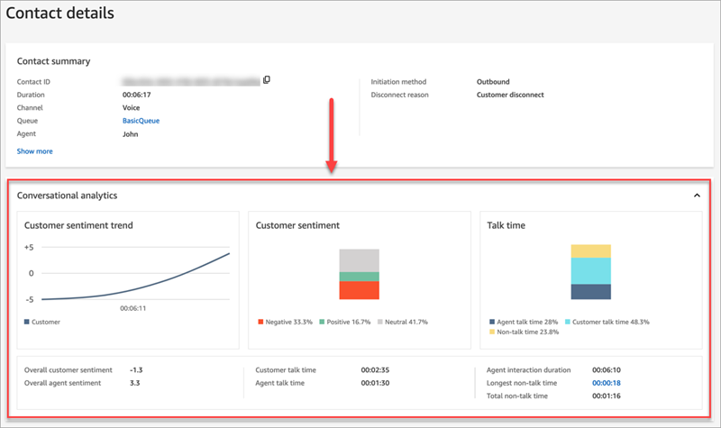
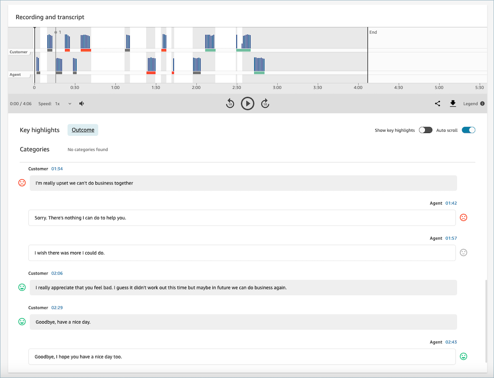
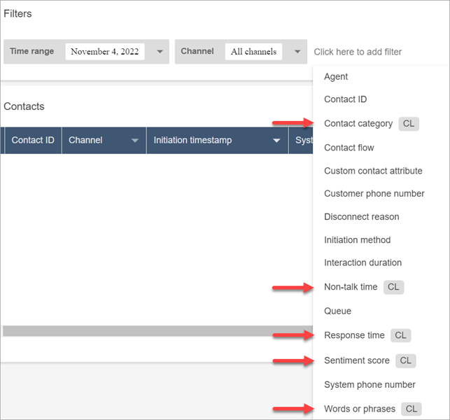

# Assign permissions to use

Contact Lens conversational analytics in Amazon Connect

To keep customer data secure, you set security profile permissions to determine on
who can access information generated by Contact Lens conversational
analytics.

Following is a description of the required security profile permissions, as well
as some permissions that are helpful to have but not required. Several of these are
Search permissions, which are needed so you can find the contacts you want to
analyze. They aren't specific to Contact Lens conversational
analytics.

## Conversational analytics permissions

- **Contact Lens - conversational
  analytics**
  - On the **Contact details** page you can view
    graphs that summarize conversational analytics (customer
    sentiment, talk time for voice contacts), as well as sentiment
    colors and indicators for each conversation turn on transcripts
    and recordings. For example, the following image shows how this
    information is displayed on the **Contact
    details** page for a voice contact.

  **Contact Lens - conversational analytics -
  View** permission is also required to view
  sentiment indicators on conversation recordings and transcripts.

  

  

- **Call recordings (unredacted)**

On the **Contact details** and **Contact
search** pages for a contact, view unredacted audio
recordings.

- **Call recordings (redacted)**

On the **Contact details** and **Contact
search** pages for a contact, listen to call recordings in
which the sensitive data has been redacted.

- **Contact transcripts (unredacted)**

On the **Contact details** and **Contact
search** pages for a contact, view unredacted chat, email
conversations and unredacted voice transcripts produced by Contact Lens.

- **Contact transcripts (redacted)**

On the **Contact details** and **Contact
search** pages for a contact, view chat and voice
transcripts in which the sensitive data has been redacted.

###### Important

If you have permissions to:

- Both **Contact transcripts (unredacted) -
  Access** and **Contact transcripts (redacted) -
  Access**
  – OR –

- Both **Call recordings (unredacted) - Access**
  and **Call recordings (redacted) - Access**
  Note the following behavior:

- When
  redaction is enabled on the flow, redacted content is
  displayed on the **Contact details** and **Contact search** pages.
- When
  redaction is disabled on the flow or the contact is not
  analyzed by Contact Lens, unredacted content is displayed on
  the **Contact details** and **Contact search** pages.
  You cannot access both the redacted and unredacted version of a
  conversation at the same time.

## Search permissions

- **Contact search**

This permission is required so you can access the **Contact
search** page, which is where you can search contacts so
you can review the analyzed recording and transcript. In addition, you
can do fast, full-text search on call transcripts, and search by
sentiment score and non-talk time.

- **View my contacts**

This permission is required if you need to access the
**Contact search** page, review only those contacts
that you handled, and review the analyzed recording and
transcripts.

###### Important

If both **Contact search** and **View my
contacts** permissions are granted, then the user will
have access to all contacts.

- **Search contacts by conversation
  characteristics**

This permission isn't required by Contact Lens conversational
analytics but it's helpful as it provides more search options.

On the **Contact Search** page:

    + For voice contacts, you can access additional filters that
     allow you to return results by sentiment score and non-talk
     time.
    + For chat contacts, you can access an additional filter to
     search for contacts by response time.
    + For both voice and chat, you can search conversations that
     fall into specific contact categories.

For more information, see [Search for sentiment
score/shift](search-conversations.md#sentiment-search "search-conversations.md#sentiment-search"), [Search for non-talk
time](search-conversations.md#nontalk-time-search "search-conversations.md#nontalk-time-search"), and [Search a contact
category](search-conversations.md#contact-category-search "search-conversations.md#contact-category-search").

The following image shows of the **Filters** section
of the **Contact Search** page, and the
**Filters** dropdown menu. Filters with
**CL** next to them are only available to users who
have this security profile permission.

- **Search contacts by keywords**

This permission isn't required by Contact Lens conversational
analytics but it's helpful as it provides more search options.

    + On the **Contact Search** page, you can
     access additional filters that allow you to search contacts by
     **Words or phrases**, such as
     "*thank you for your business*." For more
     information, see [Search for words or phrases](search-conversations.md#keyword-search "search-conversations.md#keyword-search").

    
