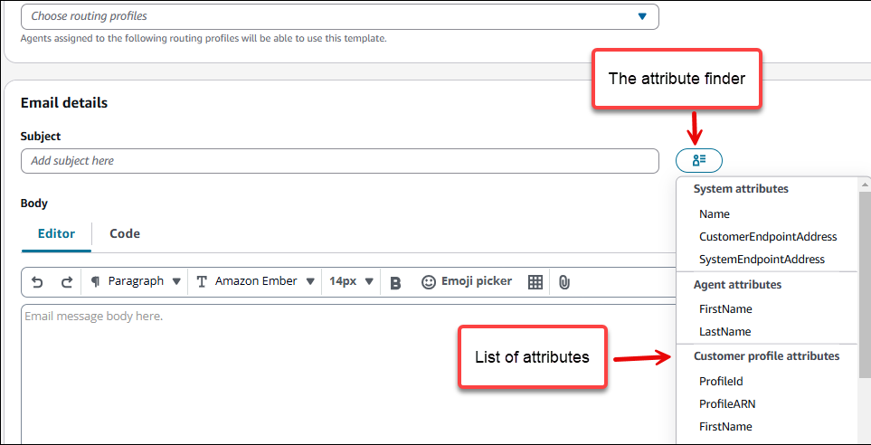
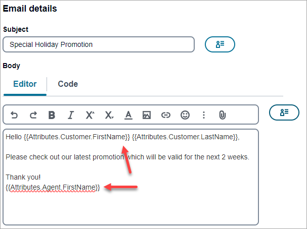

# Add personalized content to message

templates

To deliver dynamic, personalized content in messages that use a template, add
_message variables_ to the message template. A
_message variable_ is a placeholder that refers to
a specific attribute that you or Amazon Connect created to store information about your users.
Each attribute typically corresponds to a characteristic of a user, such as a user's
first name or the city where they live. By adding message variables to templates, you
can use these attributes to deliver custom content to each recipient of a message that
uses a template.

If a template contains message variables, Amazon Connect replaces each variable with the
current, corresponding value of the attribute for each recipient. It does this each time
it sends a message that uses the template. This means that you can send personalized
content to each recipient without creating multiple, customized versions of a message or
message template. You can also feel confident that the message contains the latest
information that you have for a recipient.

For example, if your project is a fitness application for runners and it includes
attributes for each user's first name, preferred activity, and personal record, you
could use the following text and message variables in a template:

`Hi {{Attributes.Customer.FirstName}}, attached is information about the
 insurance plans we discussed.`

When you send a message that uses the template, Amazon Connect replaces the variables with the
current value of each attribute for each recipient. The following examples show
this.

**Example 1**

`Hi Sofia, attached is information about the insurance plans we
 discussed.`

**Example 2**

`Hi Alejandro, attached is information about the insurance plans we
 discussed.`

## Add message variables

You can add message attributes to a new template you create or to an existing
template. If you add variables to an existing template, Amazon Connect doesn't necessarily
apply the changes to messages that use the template and haven't been sent yet. This
depends on the version of the template that you add variables to and how you
configured the messages that use the template.

###### To add a message variable to a message template

1. In the navigation pane, choose **Message
   templates**.
2. On the **Message templates** page, do one of the
   following:
   - To create a new template and add a message variable to it, choose
     **Create template**. Then, on the template
     page, enter a name for the template and, optionally, a description
     of the template.
   - To add a message variable to an existing template, choose the
     template that you want to add a variable to. Then, on the template
     page, choose **Edit**. Under **Template
     details**, use the version selector to choose the
     version of the template that you want to use as a starting point. If
     you choose the most recent version, you can save your changes
     directly to that version of the template. Otherwise, you can save
     your changes as a new version of the template.

3. In the message details section, determine where you want to add a message
   variable. For email templates, you can add variables to the message subject
   or the body. For SMS templates, you can add variables to the body.
4. Place your cursor where you want the attribute to be in your message.
   Click or tap on the **Attribute finder**, and then scroll
   to the type of attribute that you want to add a message variable for.

You can choose from the following types of attributes:

    * **System attributes**:

    	+ **CustomerEndpointAddress**: The
    	 customer's email address that initiated the contact.
    	+ **SystemEmailAddress**: The email address
    	 that the customer sent the email to.
    	+ **Name**: The display name in the email
    	 that the customer sent to your contact center.
    * **Agent attributes**:

    	+ **FirstName**
    	+ **LastName**
    * **Customer profile attributes**. For a complete
     list and descriptions, see [Customer Profiles attributes](connect-attrib-list.md#customer-profiles-attributes "connect-attrib-list.md#customer-profiles-attributes").

5. When you click an attribute in the Attribute finder, it is automatically
   placed in your message. You can copy and paste the attribute to another
   location.

After you paste attribute, Amazon Connect displays it enclosed in two sets of curly
braces—for example, `{{Attributes.Agent.FirstName}}`. The
following image shows an email message with three attributes: the customer's
first and last name, and the agent's first name.

 6. When you finish, do one of the following:

    * If you added message variables to a new template, choose
     **Save**.
    * If you added message variables to an existing template and you
     want to save your changes as a new version of the template, choose
     **Save as new version**.
    * If you added message variables to an existing template and you
     want to save your changes as an update to the most recent draft of
     the template, choose **Save**. If you want to
     update the draft and create a new version off of the draft, choose
     **Save as new version**.
