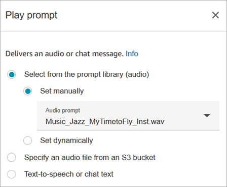
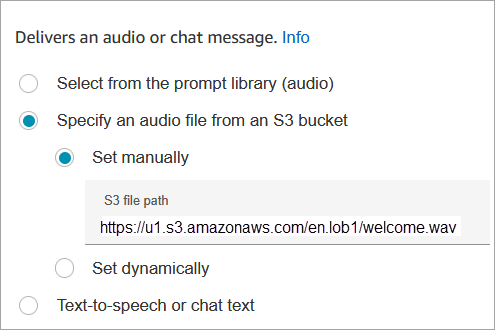
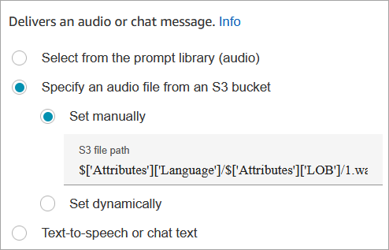
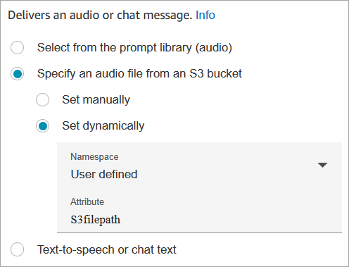
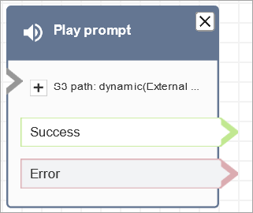
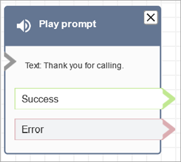

# Flow block in Connect Customer: Play prompt

This topic defines the flow block for playing audio prompts, text-to-speech messages,
or chat responses to customers and agents.

## Description

Use this flow block to play an audio prompt or a text-to-speech message, or to
send a chat response.

You can play prompts to customers (callers or customers using chat) and
agents.

For calls, you have the following options:

- **Use pre-recorded prompts**: Connect Customer provides
  a library of ready-made options.
- **Record your own prompts**. You have the
  following options:

  - Use the Connect Customer library. Upload your recordings directly from the
    Connect Customer admin website.
  - Use Amazon S3. Store your prompts on S3 and access them dynamically
    during calls.

- **Text-to-speech**. Provide plain text or
  SSML (Speech Synthesis Markup Language) to have it spoken as audio.

For chats, you have the following option:

- **Text prompts only**. Send plain text
  messages to both customers and agents. Audio options, like pre-recorded
  prompts, aren't available for chat.

## Use cases for this block

This flow block is designed to be used in the following scenarios:

- Play a greeting to customers. For example, "Welcome to our customer
  service line."
- Provide information that is retrieved from a database back to customers or
  agents. For example, "Your account balance is $123.45."
- Play pre-recorded audio while a customer is in queue or on hold.
- Play pre-recorded audio in your own voice from your S3 buckets.
- In an inbound flow, play an audio message or a text message to customers
  and agents simultaneously.

## Requirements for prompts

- **Supported formats**: Connect Customer supports .wav
  files to use for your prompt. You must use .wav files that are 8KHz, and
  mono channel audio with U-Law encoding. Otherwise, the prompt won't play
  correctly. You can use publicly available third-party tools to convert your
  .wav files to U-Law encoding. After converting the files, upload them to
  Connect Customer.
- **Size**: Connect Customer supports prompts that are
  less than 50MB and less than five minutes long.
- **When storing prompts in an S3 bucket:** For
  AWS Regions that are disabled by default (also called [opt-in](../../../general/latest/gr/rande-manage.md "../../../general/latest/gr/rande-manage.md") Regions) such as Africa (Cape Town), your bucket must be
  in the same Region.

## Contact types

| Contact type | Supported?                                                                                                                                          |
| ------------ | --------------------------------------------------------------------------------------------------------------------------------------------------- |
| Voice        | Yes                                                                                                                                                 |
| Chat         | Yes<br>If a chat contact is routed to this block, but the block is<br>configured for calls, the contact is routed down the<br>*_Error_<br>• branch. |
| Task         | Yes<br>If a task contact is routed to this block, but the block is<br>configured for calls, the contact is routed down the<br>*_Error_<br>• branch. |
| Email        | No. An email contact routed to this block takes the<br>*_Error_<br>• branch.                                                                        |

If a callback contact without an agent or customer is routed to this block, the
contact is routed down the **Error** branch.

## Flow types

You can use this block in the following [flow
types](create-contact-flow.md#contact-flow-types "create-contact-flow.md#contact-flow-types"):

| Flow type              | Supported?                                                                      |
| ---------------------- | ------------------------------------------------------------------------------- |
| Inbound flow           | Yes                                                                             |
| Customer queue flow    | Yes                                                                             |
| Customer hold flow     | No, use [Loop prompts](loop-prompts.md "loop-prompts.md") flow block<br>instead |
| Customer whisper flow  | Yes                                                                             |
| Outbound whisper flow  | Yes                                                                             |
| Agent hold flow        | No, use [Loop prompts](loop-prompts.md "loop-prompts.md") flow block instead    |
| Agent whisper flow     | Yes                                                                             |
| Transfer to agent flow | Yes                                                                             |
| Transfer to queue flow | Yes                                                                             |

## How to configure this block

You can configure the **Play prompt** block by using the Connect Customer admin website or
by using the [MessageParticipant](../APIReference/participant-actions-messageparticipant.md "../APIReference/participant-actions-messageparticipant.md") action in the Connect Customer Flow language.

###### Configuration sections

- [Prompts stored in the Connect Customer prompts library](#play-properties-library "#play-properties-library")
- [Prompts stored in Amazon S3](#play-properties-s3 "#play-properties-s3")
- [Text-to-speech or chat text](#play-properties-text-to-speech "#play-properties-text-to-speech")
- [Flow block branches](#play-branches "#play-branches")
- [Additional configuration tips](#play-tips "#play-tips")
- [Touchtone buffering](#play-touchtone-buffering "#play-touchtone-buffering")
- [Data generated by this block](#play-data "#play-data")

### Prompts stored in the Connect Customer prompts library

1. In the flow designer, open the configuration pane for the
   **Play prompt** block.
2. Choose **Select from the prompt library (audio)**.
3. Choose from one of the pre-recorded prompts included with Connect Customer, or
   use the Connect Customer admin website to [record and upload](prompts.md "prompts.md") your
   own prompt. There's no way to upload prompts in bulk.

The following image shows the **Properties** page of
the **Play prompt** block configured to play an Audio
prompt from the prompt library.



The following code sample shows how this same configuration would be
represented by the [MessageParticipant](../APIReference/participant-actions-messageparticipant.md "../APIReference/participant-actions-messageparticipant.md") action in the Flow language:

```
{
         "Identifier": "12345678-1234-1234-1234-123456789012",
         "Type": "MessageParticipant",
         "Parameters": {
             "PromptId": "arn:aws:connect:us-west-2:1111111111:instance/aaaaaaa-bbbb-cccc-dddd-eeeeeeeeeeee/prompt/abcdef-abcd-abcd-abcd-abcdefghijkl"
         },
         "Transitions": {
             "NextAction": "a625f619-81b0-46c3-a855-89151600bdb1",
             "Errors": [
                 {
                     "NextAction": "a625f619-81b0-46c3-a855-89151600bdb1",
                     "ErrorType": "NoMatchingError"
                 }
             ]
         }
   }
```

### Prompts stored in Amazon S3

Store as many prompts as you need in an S3 bucket and then refer to them by
specifying the bucket path. For best performance, we recommend creating the S3
bucket in the same AWS Region as your Connect Customer instance.

###### To specify an audio file from an S3 bucket

1. In the flow designer, open the configuration pane for the
   **Play prompt** block.
2. Choose **Specify an audio file from an S3 bucket**.
3. Choose **Set manually**, and then specify the S3 file
   path that points to audio prompt in S3. For example,
   `https://u1.s3.amazonaws.com/en.lob1/welcome.wav`.

The following image shows the **Properties** page of
the **Play prompt** block configured to set the S3 file
path manually.



The following code sample shows how this same configuration would be
represented by the [MessageParticipant](../APIReference/participant-actions-messageparticipant.md "../APIReference/participant-actions-messageparticipant.md") action in the Flow language:

```
{
      "Identifier": "UniqueIdentifier",
      "Type": "MessageParticipant",
      "Parameters": {
          "Media": {
              "Uri": "https://u1.s3.amazonaws.com/en.lob1/welcome.wav",
              "SourceType": "S3",
              "MediaType": "Audio"
          }
      },
      "Transitions": {
          "NextAction": "Next action identifier on success",
          "Errors": [
              {
                  "NextAction": "Next action identifier on failure",
                  "ErrorType": "NoMatchingError"
              }
          ]
      }
  }
```

###### To use attributes to specify an audio file path from an S3 bucket

- You can specify the S3 bucket path using attributes, as shown in the
  following image:



—OR—

- You can provide the S3 path with concatenation, as shown in the
  following example. With concatenation, you can personalize the prompt, for
  example, by line of business and language. For example:
  `https://example.s3.amazon.aws.com/$['Attributes']['Language']/$['Attributes']['LOB']/1.wav`

The following code sample shows how this same configuration would be
represented by the [MessageParticipant](../APIReference/participant-actions-messageparticipant.md "../APIReference/participant-actions-messageparticipant.md") action in the Flow language:

```
{
         "Identifier": "UniqueIdentifier",
         "Type": "MessageParticipant",
         "Parameters": {
             "Media": {
                 "Uri": "https://u1.s3.amazonaws.com/$['Attributes']['Language']/$['Attributes']['LOB']/1.wav",
                 "SourceType": "S3",
                 "MediaType": "Audio"
             }
         },
         "Transitions": {
             "NextAction": "Next action identifier on success",
             "Errors": [
                 {
                     "NextAction": "Next action identifier on failure",
                     "ErrorType": "NoMatchingError"
                 }
             ]
         }
     }
```

###### To specify the S3 path dynamically by using user-defined contact attributes

1. The following image shows a user-defined attribute named
   **S3filepath**.



The following code sample shows how this same configuration would be
represented by the [MessageParticipant](../APIReference/participant-actions-messageparticipant.md "../APIReference/participant-actions-messageparticipant.md") action in the Flow language:

```
{
   "Parameters": {
       "Media": {
           "Uri": "$.Attributes.MyFile",
           "SourceType": "S3",
           "MediaType": "Audio"
       }
   },
   "Identifier": "9ab5c4ee-7da8-44b3-b6c9-07f24e1846dc",
   "Type": "MessageParticipant",
   "Transitions": {
       "NextAction": "a625f619-81b0-46c3-a855-89151600bdb1",
       "Errors": [
           {
               "NextAction": "a625f619-81b0-46c3-a855-89151600bdb1",
               "ErrorType": "NoMatchingError"
           }
       ]
   }
}
```

The following image shows what this block looks like when the S3 path is set
dynamically. It shows the S3 path, and it has two branches:
**Success** and **Error**.



### Text-to-speech or chat text

You can enter a prompt in plain text or SSML. These text based prompts are
played as audio prompts to customers using Amazon Polly.

For example, the following image shows a **Play prompt**
block that is configured to play the message **Thank you for
calling** to the customer.


The following code sample shows how this same configuration would be
represented by the [MessageParticipant](../APIReference/participant-actions-messageparticipant.md "../APIReference/participant-actions-messageparticipant.md") action in the Flow language:

```
{
   "Parameters": {
       "Text": "<speak>Thank you for calling</speak>"
   },
   "Identifier": "9ab5c4ee-7da8-44b3-b6c9-07f24e1846dc",
   "Type": "MessageParticipant",
   "Transitions": {
       "NextAction": "a625f619-81b0-46c3-a855-89151600bdb1",
       "Errors": [
           {
               "NextAction": "a625f619-81b0-46c3-a855-89151600bdb1",
               "ErrorType": "NoMatchingError"
           }
       ]
   }
}
```

SSML-enhanced input text gives you more control over how Connect Customer generates
speech from the text you provide. You can customize and control aspects of
speech such as pronunciation, volume, and speed.

For a list of SSML tags you can use with Connect Customer, see [SSML tags supported by Connect Customer](supported-ssml-tags.md "supported-ssml-tags.md").

For more information, see [Add text-to-speech to prompts in flow blocks in Amazon Polly](text-to-speech.md "text-to-speech.md").

The following image shows what a **Play prompt** block looks
like when it's configured for text-to-speech. It shows the text to be played,
and it has two branches: **Success** and
**Error**.



### Flow block branches

This block supports the following output branches:

- **Success**: Indicates successfully played the
  provided audio or text message.
- **Error**: Indicates a failure to play provided audio
  or text message.
- **Okay**: Some existing flows have a version of the
  **Play prompt** block that doesn't have an
  **Error** branch. In this case, the
  **Okay** branch will always be taken at runtime. If
  you update the configuration of a **Play prompt** block
  that doesn't have an **Error** branch, an
  **Error** branch will be added to the block
  automatically in the editor.

### Additional configuration tips

- For step-by-step instructions about how to set up a dynamic prompt
  using contact attributes, see [Dynamically select which prompts to play in Connect Customer](dynamically-select-prompts.md "dynamically-select-prompts.md").
- When playing prompts from an S3 bucket, for best performance we
  recommend creating the bucket in the same AWS Region as your Connect Customer
  instance.
- When you use text, either for text-to-speech or chat, you can use a
  maximum of 3,000 billed characters, which is 6,000 characters total. You
  can also specify text in a flow using a contact attribute.

### Touchtone buffering

The **Play prompt** block includes a checkbox:
**Skip or interrupt this prompt when touchtone buffering is
enabled**.

- When the checkbox is selected and touchtone buffering is active:

  - If the buffer already contains digits, the prompt is
    skipped entirely and the contact proceeds to the next
    block.
  - If the buffer is empty, the prompt begins playing. If the
    customer presses a key during playback, the prompt is
    interrupted, the digit is added to the buffer, and the
    contact proceeds.

- When the checkbox is not selected, the prompt plays normally
  regardless of buffer state. This is the default behavior.

In the flow language, this is represented by the
`SkipWhenDTMFBufferEnabled` parameter on the
`MessageParticipant` action:

```
{
    "Identifier": "12345678-1234-1234-1234-123456789012",
    "Type": "MessageParticipant",
    "Parameters": {
        "SkipWhenDTMFBufferEnabled": "true",
        "PromptId": "arn:aws:connect:us-west-2:111111111111:instance/aaaaaaaa-bbbb-cccc-dddd-eeeeeeeeeeee/prompt/abcdefab-abcd-abcd-abcd-abcdefghijkl"
    },
    "Transitions": {
        "NextAction": "next-action-id",
        "Errors": [
            {
                "NextAction": "error-action-id",
                "ErrorType": "NoMatchingError"
            }
        ]
    }
}
```

For more information about touchtone buffering, see [Set Touchtone Buffer
Behavior](set-touchtone-buffer-behavior.md "set-touchtone-buffer-behavior.md").

### Data generated by this block

This block does not generate any data.

## Error scenarios

A contact is routed down the **Error** branch in the following
situations:

- If a callback contact without an agent or customer is routed to this
  block, the contact is routed down the **Error**
  branch.
- Connect Customer is unable to download the prompt from S3. This might be due to an
  incorrect file path, or the S3 bucket policy is not set up correctly and
  Connect Customer does not have access. For instructions about how to apply the policy,
  and a template you can use, see [Set up prompts to play from an S3 bucket in Connect Customer](setup-prompts-s3.md "setup-prompts-s3.md").
- Incorrect audio file format. Only .wav files are supported.
- The audio file is larger than 50MB or longer than five minutes.
- The SSML is incorrect.
- The text-to-speech length exceeds 6000 characters.
- The the Amazon Resource Name (ARN) for the prompt is incorrect.

## Sample flows

All of the sample flows use the **Play prompt** block. Take a
look at the [Sample inbound flow in Connect Customer for the first contact experience](sample-inbound-flow.md "sample-inbound-flow.md") to see a **Play prompt** for chat and one for audio.

## More resources

See the following topics to learn more about prompts.

- [Create prompts in Connect Customer](prompts.md "prompts.md")

- [Prompt
  actions](../APIReference/prompts-api.md "../APIReference/prompts-api.md") in the Connect Customer API Reference Guide.
