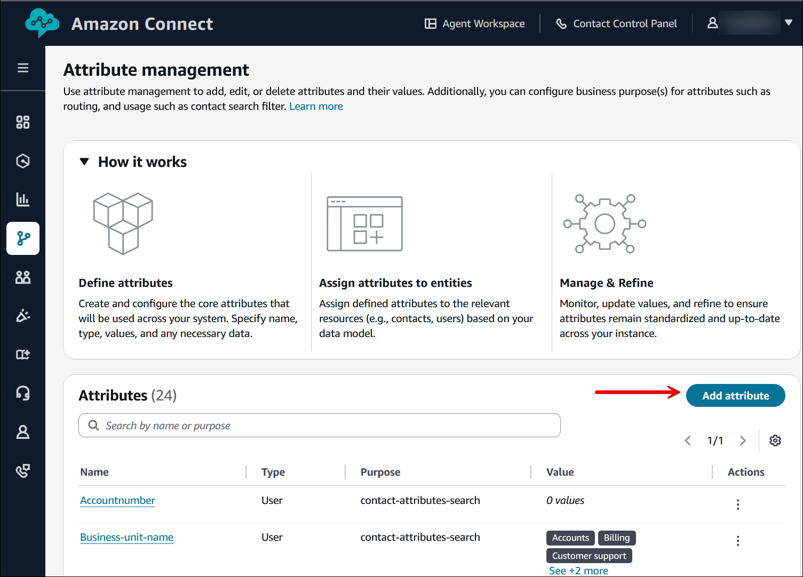
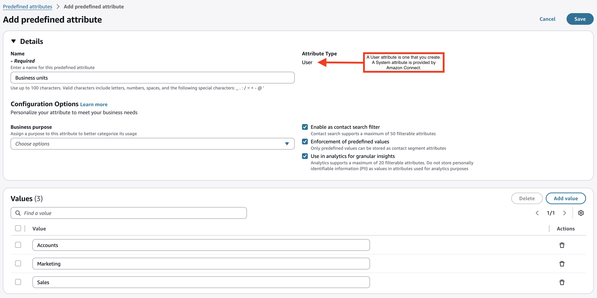

# Create predefined attributes for routing contacts to

agents

A predefined attributed is made up of a name-value pair. For example, a name such as
`language` and values such as `English`, `French`,
`Japanese`. You can use predefined attributes to route contacts to an agent
or pools of agents within a queue.

###### Tip

You define the level of an agent's proficiency in their user profile, not when you
create a predefined attribute. A proficiency level is an indicator, ranging from 1 to 5,
of the level of expertise of an agent for a given attribute value. Level 1 is the lowest
proficiency, while 5 is the highest.

You can create and manage predefined attributes manually by using the Amazon Connect admin website; the steps are
described in this topic. Or programmatically by using the [Predefined attribute management
APIs](#predefined-attributes-apis "#predefined-attributes-apis").

###### Contents

- [Important things to
  know](#important-things-predefined-attributes "#important-things-predefined-attributes")
- [System predefined attributes](#sytem-predefined-attributes "#sytem-predefined-attributes")
- [Create a predefined
  attribute](#predefined-attributes-create-web-admin "#predefined-attributes-create-web-admin")
- [Update the name of an attribute or
  value](#update-predefined-attributes "#update-predefined-attributes")
- [Predefined attribute management
  APIs](#predefined-attributes-apis "#predefined-attributes-apis")

## Important things to

know

- The information in a predefined attribute is not encrypted. We strongly
  recommend you follow the [Best practices for PII
  compliance in Amazon Connect](compliance-validation-best-practices-PII.md "compliance-validation-best-practices-PII.md").
- You can create up to 500 values per attribute.
- A predefined attribute **name** can be up to 100
  characters long.
- A predefined attribute **value** can be up to 100
  characters long.
- The pattern for predefined attribute name and value is
  `^(?!(aws:|connect:))[\p{L}\p{Z}\p{N}_.:/=+-@']+$`. For example,
  it can contain any letter, numeric value, whitespace, or `_.:/=+-@'`
  special characters, but can't start with `aws:` or
  `connect:`.
- You cannot create duplicate predefined attribute names or values. In addition,
  case sensitivity does not allow you to use duplicate names. For example, a new
  predefined attribute with the name `language` cannot be created if a
  predefined attribute with name `Language` exists in your Amazon Connect
  instance.
- An attribute can only be deleted if it not associated with any agent.

Before deleting an attribute, ensure none of the contacts are waiting for an
agent with that attribute or the contact will not find a match.

- For the quota for predefined attributes allowed in an Amazon Connect instance, see
  [Amazon Connect quotas](amazon-connect-service-limits.md#connect-quotas "amazon-connect-service-limits.md#connect-quotas").

## System predefined attributes

System attributes, identified as `connect:`, are predefined attributes set
by Amazon Connect. You cannot change or delete the `connect:` name and values.

The following system attributes are available:

- `connect:Language`. You can add 500 custom values for
  `connect:Language`.
- `connect:Subtype`. You cannot change `connect:Subtype`
  but it can be used in routing criteria for routing.

## Create a predefined

attribute

1. Log in to the Amazon Connect admin website with an **Admin** account, or an account
   assigned to a security profile that has **Routing** -
   **Predefined attributes** - **Create**
   permission.
2. In Amazon Connect, on the left navigation menu, choose **Routing**,
   **Predefined attributes**.
3. On the **Attribute management** page choose **Add
   attribute**, as shown in the following image.

 4. On the **Add predefined attribute** page, in
the **Details** section, complete the following fields as needed:

    1. **Name**: Enter a name for the segment attribute.
    2. **Use as a Contact search filter**: Choose if you want to enable contact search on this segment attribute.
    3. **Use in analytics for granular insights**: Choose if you want to enable Analytics on this
     segment attribute.

    Amazon Connect unlimited AI should be enabled for the instance in order to view this option.

    Note: Do not store personally identifiable information (PII) as values in attributes are used for analytics purposes.
    4. **Enforce valid values**: Choose to allow only predefined values when using this attribute as a contact segment attribute.

5. Choose **Add value** to add values to the
   attribute. For example, you might enter Sales, Marketing, and Accounts for Business units.

 6. Choose **Save** to save the predefined attribute and values.

## Update the name of an attribute or

value

1. Stop using the attribute on future contacts to drain all of the contacts on an
   active contact type.
2. Update all of the attributes.

## Predefined attribute management

APIs

- [CreatePredefinedAttribute](../APIReference/API_CreatePredefinedAttribute.md "../APIReference/API_CreatePredefinedAttribute.md")
- [UpdatePredefinedAttribute](../APIReference/API_UpdatePredefinedAttribute.md "../APIReference/API_UpdatePredefinedAttribute.md")
- [DeletePredefinedAttribute](../APIReference/API_DeletePredefinedAttribute.md "../APIReference/API_DeletePredefinedAttribute.md")
- [DescribePredefinedAttribute](../APIReference/API_DescribePredefinedAttribute.md "../APIReference/API_DescribePredefinedAttribute.md")
- [ListPredefinedAttributes](../APIReference/API_ListPredefinedAttributes.md "../APIReference/API_ListPredefinedAttributes.md")
