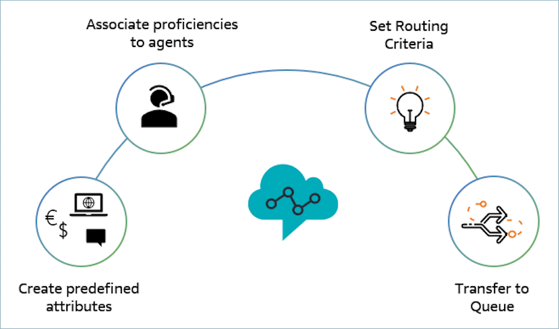
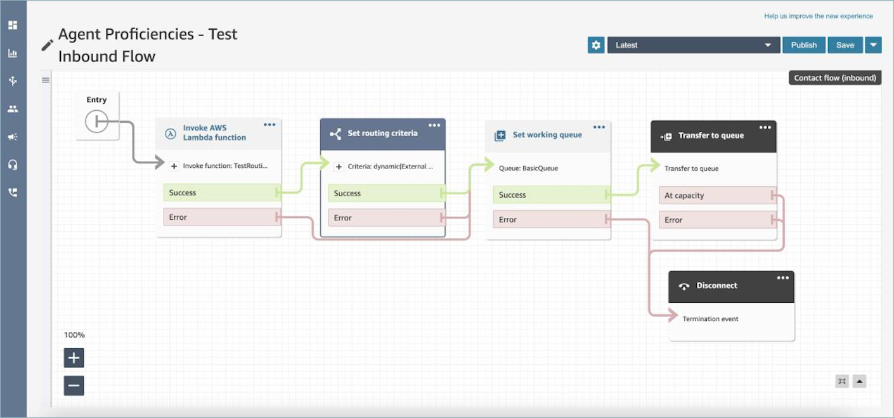

# Set up routing in Amazon Connect based on agent

proficiencies

Following is an overview of the steps to set up routing based on agent proficiencies:

1. [Create predefined attributes for routing contacts to
   agents](predefined-attributes.md "predefined-attributes.md")
   - You create the predefined attributes that you want to use to make a
     routing decision. In the next step, you can use predefined attributes
     individually, or you can combine them by using the `AND` or
     `OR` operators to form a routing step.

2. [Assign proficiencies to agents in your
   Amazon Connect instance](assign-proficiencies-to-agents.md "assign-proficiencies-to-agents.md")
   - You select predefined attributes and associate them with an agent. All
     available agents that meet a routing step requirement of a contact within
     the same queue will be considered for a match.

3. Set routing criteria
   - Use the [Set routing criteria](set-routing-criteria.md "set-routing-criteria.md") flow block to set a routing
     criteria manually or dynamically.

4. Transfer to queue

Use the [Transfer to queue](transfer-to-queue.md "transfer-to-queue.md") flow block to transfer the contact to a queue. After the contact is transferred,
Amazon Connect runs the routing criteria.

## Example of how to use agent proficiencies

for routing

Consider a scenario where a contact enters a queue **General Inbound
Queue** and two agents, Agent1 and Agent2, are available. A customer who
speaks French is seeking assistance regarding AWS DynamoDB. This is their second time
calling regarding the same issue and you would prefer to match them with an expert in
AWS DynamoDB. In order to preserve the customer experience, you want to implement the
following routing requirements:

- First look for an agent who is highly proficient in **French
  (>=4)** and an expert in **AWS DynamoDB (>=5)**
  for the first 30 seconds.
- If an agent is not found at this time, look for an agent who is highly
  proficient in **French (>=3)** and highly proficient in
  **AWS DynamoDB (>=5)** for the next 30 seconds. The
  requirement for French is relaxed to further expand the pool of eligible agents
  to meet the requirement.
- If no join is made at this point, look for an agent who is proficient in
  **French (>=3)** and highly proficient in **AWS
  DynamoDB (>=4)** and keep looking until an agent is found. Here the
  AWS DynamoDB requirement is relaxed to expand the pool of eligible agents who
  meet the requirement.

###### Note

For regulatory or compliance use cases you can use the **Never
Expire** option for the expiration timer to ensure any agent
who is joined on the contact meets a minimum requirement.

###### To route the contact to the above requirements, complete the following

steps:

1. **Create predefined attributes**: For example,
   add `Technology` as a predefined attribute in **User
   Management**, **Predefined Attributes** with
   `AWS DynamoDB` as one of the values.

| Name       | Value        |
| ---------- | ------------ |
| Technology | AWS Kinesis  |
| Technology | AWS DynamoDB |
| Technology | AWS EC2      |
| Technology | AWS Neptune  |

###### Note

**Connect:French** is already available as a value in
system attribute **Connect:Language** as a predefined
attribute. You can use this in your routing criteria. You can also add up to
128 customer languages as values to
**Connect:Language**. 2. **Associate proficiencies to users**: There are 2
agents, Agent1 and Agent 2, who speak French and are proficient in AWS DynamoDB
as shown below. In **User Management**, **Show Advanced
Settings** associate the following proficiencies to the Agent1 and
Agent2.

| Agent Name | Predefined Attribute | Value         | Proficiency Level |
| ---------- | -------------------- | ------------- | ----------------- |
| Agent1     | Technology           | AWS Kinesis   | 2                 |
| Agent1     | Technology           | AWS Dynamo DB | 5                 |
| Agent1     | Technology           | AWS EC2       | 4                 |
| Agent1     | Language             | French        | 3                 |
| Agent1     | Language             | English       | 4                 |
| Agent2     | Technology           | AWS Dynamo DB | 3                 |
| Agent2     | Technology           | AWS EC2       | 5                 |
| Agent2     | Technology           | AWS Neptune   | 5                 |
| Agent2     | Language             | French        | 4                 |
| Agent2     | Language             | English       | 3                 |

3. **Set routing criteria**: Use this flow block to
   create the following routing criteria manually or dynamically using JSON that is
   created by invoking a Lambda function as shown in a potential Inbound flow.
   Create the following routing criteria:
   1. Step 1: connect:Language(connect:French) >=4 **AND**
      Technology (AWS DynamoDB) >=5 **[30 seconds]**
   2. Step 2: connect:Language(connect:French) >=4 **AND**
      Technology (AWS DynamoDB) >=4 **[30 seconds]**
   3. Step 3: connect:Language(connect:French) >=3 **AND**
      Technology (AWS DynamoDB) >=4 **[Never expire]**The following image shows an example inbound flow that is configured for
      routing by agent proficiencies. This flow includes the following blocks: [AWS Lambda
      function](invoke-lambda-function-block.md "invoke-lambda-function-block.md"), [Set routing criteria](set-routing-criteria.md "set-routing-criteria.md"),
      [Set working queue](set-working-queue.md "set-working-queue.md"),
      [Transfer to queue](transfer-to-queue.md "transfer-to-queue.md"),
      and [Disconnect / hang up](disconnect-hang-up.md "disconnect-hang-up.md").

 4. **Transfer to queue**: After the contact is
transferred to the "General Inbound Queue," Amazon Connect immediately starts running the
routing criteria. The following steps occur before the contact is joined to
Agent1.

    1. **Routing Step 1**: For the first 30
     seconds (no match) as neither agent has an AWS DynamoDB proficiency >=
     5, Amazon Connect does not match with any agent.
    2. **Routing Step 2**: In the next 30
     seconds (no match) as neither agent is both highly proficient (>=4) in
     both French and AWS DynamoDB
    3. **Routing Step 3**: As soon as the
     previous step expires, Amazon Connect finds the available agent, Agent1 (French
     3, AWS DynamoDB 4) is proficient in French and highly proficient in AWS
     DynamoDB. Therefore, the contact is matched with Agent1.

There is a [one-click drill-down](one-click-drill-downs.md "one-click-drill-downs.md") in the
real-time metrics for queues table which shows you a list of the routing steps in use
for active contacts on the queue. You can find the definitions for the routing step
specific metrics under [Metric definitions in Amazon Connect](metrics-definitions.md "metrics-definitions.md").

## Contact record, contact event stream, and

agent event stream updates for agent proficiencies

Models have been added for proficiency routing in the following sections:

- [Data model for Amazon Connect contact records](ctr-data-model.md "ctr-data-model.md")
- [Agent event streams data model in
  Amazon Connect](agent-event-stream-model.md "agent-event-stream-model.md")
- [Contact events data model](contact-events.md#contact-events-data-model "contact-events.md#contact-events-data-model")

## Frequently asked questions

- **Are queues still relevant?**
  - Yes, queues are still necessary. The routing criteria is only activated
    when a contact is enqueued. Agent proficiencies provide additional control
    to target specific agents within a queue.

- **When should we model something as a proficiency instead of
  modeling it as a queue?**
  - This is a business decision. You should consider the impact on the number
    of queues you can eliminate and consolidate while using agent proficiencies.

- **Do agent proficiencies work across all channels?**
  - Yes, routing using agent proficiencies works for all channels.

- **How do I remove a routing criteria?**
  - You can interrupt a routing criteria using a customer queue flow.
  - You can also update the routing criteria this way.

- **How many times can I change a routing criteria on a queued
  contact?**
  - You can change the routing criteria an unlimited number of times. However,
    only the latest 3 routing criteria updates are stored on the contact record.

- **With agent proficiencies, do queue priority and delay
  operate as usual?**
  - Yes, queue priority and delay operate as they already do in a
    non-agent-proficiencies environment.

- **Which operators are supported for creating a routing
  criteria?**
  - The following Boolean operators are supported:
    - AND
    - OR

  - The following comparison operators are supported:
    - > =

  - You can also define a range of minimum and maximum proficiency levels such
    as:
    - connect:English(1-3)
    - connect:Chat(4-4)

  - You cannot use the same attribute more than once in an expression. For
    example, connect:English(1-3) AND connect:English(5-5) are not
    allowed.
  - NOT (for exclusion) - You can use the NOT operator to exclude agents with
    certain proficiencies when routing such as:
    - NOT connect:French(1-5)

- **Which characters can be used for predefined
  attributes?**
  - The pattern for predefined attribute name and value is
    `^(?!(aws:|connect:))[\p{L}\p{Z}\p{N}_.:/=+-@']+$`. For
    example, it can contain any letter, numeric value, whitespace, or
    `_.:/=+-@'` special characters, but can't start with
    `aws:` or `connect:`.

- **Can I add the same attribute multiple times in a routing
  criteria?**
  - Yes, you can the same attribute multiple times in a routing criteria.

- **When triggering a transfer (quick connect), is it possible
  to set the routing criteria?**
  - You use the [Set routing criteria](set-routing-criteria.md "set-routing-criteria.md") block in the transfer flow
    to set the routing criteria on the transferred contact segment. It is not
    possible to carry forward the routing criteria of previous contact to the
    new contact segment created after an agent has been joined.

- **What happens to the routing criteria if a contact is being
  transferred queue to queue, before it was routed?**
  - The routing criteria starts from the first step in the new queue in case a
    contact was transferred before being joined to an agent. For this, we
    carry-forward the routing criteria of previous contact to the new contact
    segment created due to queue transfer.

- **Does the contact record have a snapshot of the proficiencies
  of the matched agent?**
  - No, the contact record does not carry the proficiencies of an agent.
  - The agent event stream does have a snapshot of the agent's proficiencies
    at the time of joining.

- **Can we search for an agent by proficiency using
  APIs?**
  - No, this is not supported.

- **What happens if we delete an attribute if it is on an active
  contact?**
  - You can delete an attribute that is used on active contacts. However, any
    routing step with that attribute will not find a matching agent and the
    contact stays in the queue until the routing criteria expires.
  - All new contacts with that attribute start taking the error branch on the
    [Set routing criteria](set-routing-criteria.md "set-routing-criteria.md") block in the flow.

- **What happens to the routing criteria steps / expiration when
  an agent rejects a call?**
  - Routing considers a join to be complete when an agent accepts the contact
    and a join is completed. When an agent rejects a contact, the routing engine
    continues to run through the routing criteria with the timer continually
    running.

- **Will the agent who rejected the step be part of the pool
  when routing runs again?**
  - Yes, the agent continues to be a part of the pool when routing runs
    again.

- **Are historical metrics available?**
  - No, historical metrics are not available in analytics.
  - The contact record, agent event stream, and contact event stream contain
    all the required information.

- **Where can I find a sample Lambda function for setting
  routing criteria?**
  - For a sample Lambda function for setting routing criteria, see [Sample
    Lambda function for setting routing criteria](set-routing-criteria.md#set-routing-criteria-sample-lambda-function "set-routing-criteria.md#set-routing-criteria-sample-lambda-function").

- **What happens to the routing criteria set on a contact if the
  contact is being transferred to an agent queue?**
  - The routing criteria has no effect on contacts present in an agent queue.
    If a contact with routing criteria is transferred from an agent queue to a
    standard queue, then the routing criteria is forwarded to the new contact
    segment created due to queue transfer.
