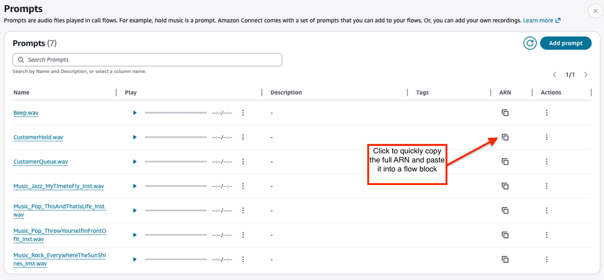

# Create prompts in Connect Customer

Prompts are audio files played in call flows. For example, hold music is a prompt. Connect Customer
comes with a set of prompts that you can add to your flows. Or, you can add your own
recordings.

We recommend that you align your prompts and routing policies with each other to ensure a
smooth call flow for customers.

You can create and manage prompts by using the Connect Customer admin site as described
in the topics in this section. Or you can use the [Prompt actions](../APIReference/prompts-api.md "../APIReference/prompts-api.md") documented in
the _Connect Customer API Reference Guide_.

###### Contents

- [How to create prompts](#howto-prompts "#howto-prompts")
- [Supported file types](#supported-file-types-for-prompts "#supported-file-types-for-prompts")
- [Maximum length for prompts](#max-length-for-prompts "#max-length-for-prompts")
- [Bulk upload of prompts not supported in UI, API, or CLI](#bulk-upload-prompts "#bulk-upload-prompts")
- [Add text-to-speech to prompts in flow blocks in Amazon Polly](text-to-speech.md "text-to-speech.md")
- [Create dynamic text strings in
  Play prompt blocks](create-dynamic-text-strings.md "create-dynamic-text-strings.md")
- [Dynamically select which prompts to play in Connect Customer](dynamically-select-prompts.md "dynamically-select-prompts.md")
- [Set up prompts to play from an S3 bucket in Connect Customer](setup-prompts-s3.md "setup-prompts-s3.md")
- [Choose the text-to-speech voice and language for audio prompts in Connect Customer](voice-for-audio-prompts.md "voice-for-audio-prompts.md")
- [Use SSML tags to personalize text-to-speech in Amazon Polly](ssml-prompt.md "ssml-prompt.md")
- [SSML tags in a Connect Customer chat conversation](chat-and-ssml-tags.md "chat-and-ssml-tags.md")
- [SSML tags supported by Connect Customer](supported-ssml-tags.md "supported-ssml-tags.md")

## How to create prompts

This topic explains how to use the Connect Customer admin website to create prompts. To create
prompts programmatically, see [CreatePrompt](../APIReference/API_CreatePrompt.md "../APIReference/API_CreatePrompt.md") in the
_Connect Customer API Reference Guide_.

1. Log in to Connect Customer using an account that has the following security
   profile permission:

   - **Numbers and flows**, **Prompts -
     Create**

2. On the navigation menu, choose **Routing**,
   **Prompts**.
3. On the **Prompts** page, choose **Add
   prompt**.
4. On the **Add Prompt** page, enter a name for the prompt.
5. In the **Description** box, describe the message. We
   recommend using this box to provide a detailed description of the prompt. It is
   helpful for accessibility.
6. Choose the following actions:

   - **Upload**—Select **Choose
     File** to upload a .wav file that you have legal permission
     to use.
   - **Record**—Choose **Start
     recording** and speak into your microphone to record a
     message. Choose **Stop recording** when you're
     finished. You can choose **Crop** to cut sections of
     the recorded prompt or choose **Clear recording** to
     record a new prompt.

7. In the **Prompt Settings** section, enter any tags you want
   to use to manage the prompt.

For example, you may have a department that manages prompts for greetings. You
can tag those prompts so users can focus on only those recordings that pertain
to them. 8. Optionally, add tags to identify, organize, search for, filter, and control
who can access this prompt. For more information, see [Add tags to resources in Connect Customer](tagging.md "tagging.md").

Use the filters on the **Prompts** page to filter the list of prompts
by **Name**, **Description**, and
**Tags**. To copy the full Amazon Resource Name (ARN) of a prompt
with just one choose, choose the **Copy** icon. When you [set up dynamic prompts in a flow](dynamically-select-prompts.md "dynamically-select-prompts.md"), you'll
need to enter the full ARN of the prompt.

## Supported file types

You can upload a pre-recorded .wav file to use for your prompt, or record one in the
web application.

We recommend using 8 KHz .wav files that are less than 50 MB and less than 5 minutes
long. If you use higher rated audio libraries, such as 16 KHz files, Connect Customer has to down
sample them into 8 KHz samples because of PSTN limitations. This may result in low
quality audio. For more information, see the following Wikipedia article: [G.711](https://en.wikipedia.org/wiki/G.711 "https://en.wikipedia.org/wiki/G.711").

## Maximum length for prompts

Connect Customer supports prompts that are less than 50 MB and less than 5 minutes long.

## Bulk upload of prompts not supported in UI, API, or CLI

Currently, bulk uploading of prompts is not supported through the Connect Customer console or
programmatically using the API or CLI.
