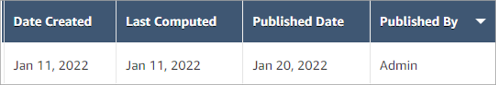

# Publish a capacity plan in Amazon Connect

When you are satisfied with the capacity plan outputs, choose **Publish
plan** to finalize your plan.

###### Note

You cannot edit the plan after it is published.

Your login name and the published date is displayed on the list view of the
capacity plans. For example, the following image shows a plan that was first created
on January 11, 2022, and then it was published on January 20, 2022 by Admin.

