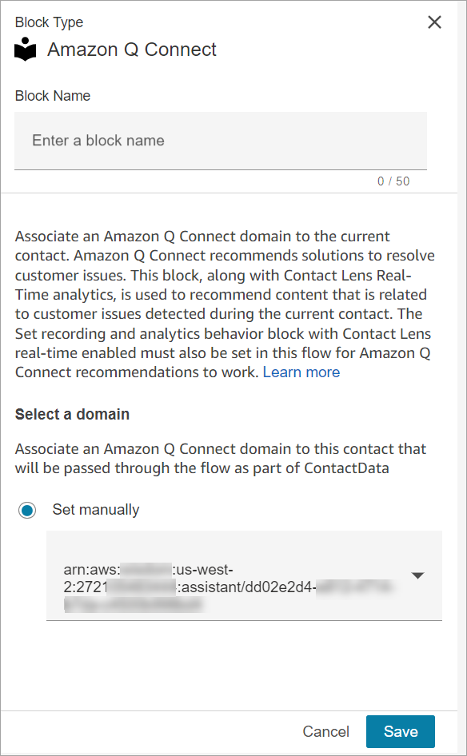
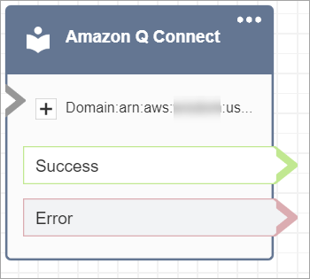

# Flow block in Amazon Connect: Amazon Q in Connect

This topic defines the flow block for Amazon Q in Connect.

## Description

- Associates an Amazon Q in Connect domain to a contact to enable real-time
  recommendations.
- For more information about enabling Amazon Q in Connect, see [Use Amazon Q in Connect for generative AI–powered agent
  assistance in real-time](amazon-q-connect.md "amazon-q-connect.md").

###### Tip

If you choose to [customize](customize-q.md "customize-q.md") your Amazon Q in Connect
experience, instead of adding this block to your flows, you need to create a
Lambda and then use the [AWS Lambda
function](invoke-lambda-function-block.md "invoke-lambda-function-block.md") block to add it to your
flows.

## Supported channels

The following table lists how this block routes a contact who is using the
specified channel.

###### Note

Nothing happens if a task or outbound mail is sent to this block, however,
**you will be charged**. To prevent this, add a
[Check contact
attributes](check-contact-attributes.md "check-contact-attributes.md") block before this one and
route tasks and outbound emails accordingly. For instructions, see [Personalize a contact's experience based on
how they contact your contact center](use-channel-contact-attribute.md "use-channel-contact-attribute.md").

| Channel | Supported? |
| ------- | ---------- | -------------------------------------------------------------------------------------------------------------------------------------------------------------------------------------------------------------------------------------------------------------------------------------------------------------------------------------------------------------------------------------------------------------------------------------------------------------------------------------------------------------------------------------------------------------------------------------------------------------------------------------------------------------------------------------------------------------------------------------------------------------------------------------------------------------------------------------------------------------------------------------------------------------------------------------------------------------------------------------------------------------------------------------------------------------------------------------------------------------------------------------------------------------------------------------------------------------------------------------------------------------------------------------------------------------------------------------------------------------------------------------------------------------------------------------------------------------------------------------------------------------------------------------------------------------------- |
| Voice   | Yes        |
| Chat    | Yes        |
| Task    | No         |
| Email   | Yes        | ## Flow types You can use this block in the following [flow types](create-contact-flow.md#contact-flow-types "create-contact-flow.md#contact-flow-types"):  • Inbound flow  • Customer Queue flow  • Outbound whisper flow  • Transfer to Agent flow  • Transfer to Queue flow ## Properties The following image shows the **Properties** page of the **Amazon Q in Connect** block. It specifies the full Amazon Resource Name (ARN) of the Amazon Q in Connect domain to associate to the contact.  ## Configuration tips  • To use Amazon Q in Connect with calls, you must enable Amazon Connect Contact Lens in the flow by adding a [Set recording and analytics behavior](set-recording-behavior.md "set-recording-behavior.md") block that is configured for Contact Lens real-time. It doesn't matter where in the flow you add the [Set recording and analytics behavior](set-recording-behavior.md "set-recording-behavior.md") block. Amazon Q in Connect, along with Contact Lens real-time analytics, is used to recommend content that is related to customer issues detected during the current call.  • Contact Lens is not required to use Amazon Q in Connect with chats. ## Configured block The following image shows an example of what this block looks like when it is configured. It has the following branches: **Success** and **Error**.  |
