# Queue and agent performance dashboard in

Amazon Connect

The **Queue and agent performance** dashboard helps you understand
the performance of your queues and agents compared over configurable periods of time. It
uses key metrics such as contacts handled, service level, and average handle time.

This dashboard includes:

- Real-time statistics such as number of agents online and current agent
  activity. It has the capabilities and metrics that are available on the
  **Real-time metrics** page.
- [Customer first callback
  mode](customer-first-cb.md#customer-first-callback-metrics "customer-first-cb.md#customer-first-callback-metrics") metrics. These metrics are only available on the dashboard and
  by calling the [GetMetricDataV2](../APIReference/API_GetMetricDataV2.md "../APIReference/API_GetMetricDataV2.md") API. They're not available on the Historical
  metrics report.

###### Contents

- [Enable access to the
  dashboard](#queue-performance-dashboard-enable-access "#queue-performance-dashboard-enable-access")
- [Performance
  overview chart](#queue-performance-dashboard-performance-overview "#queue-performance-dashboard-performance-overview")
- [Current queue overview](#current-queue-overview "#current-queue-overview")
- [Current agent performance](#current-agent-perf-overview "#current-agent-perf-overview")
- [Agent adherence](#agent-adherence-dashboard "#agent-adherence-dashboard")
- [Trailing agent performance](#trailing-agent-performance "#trailing-agent-performance")
- [Average queue answer time and contacts queued
  trend](#avg-queue-answer "#avg-queue-answer")
- [Contacts handled and
  average handle time trend](#queue-performance-dashboard-contacts-handled "#queue-performance-dashboard-contacts-handled")
- [Agent status drill down](#agent-status-drill-down "#agent-status-drill-down")
- [Dashboard
  functionality limitations](#queue-performance-dashboard-functionality-limitations "#queue-performance-dashboard-functionality-limitations")

## Enable access to the

dashboard

Ensure users are assigned the appropriate security profile permissions:

- **Access metrics - Access permission** or the
  **Dashboard - Access permission**. For information
  about the difference in behavior, see [Assign permissions to view dashboards
  and reports in Amazon Connect](dashboard-required-permissions.md "dashboard-required-permissions.md").

## Performance

overview chart

The **Performance overview** chart that provides aggregated
metrics based on your filters. Each metric within the chart is compared to your
"compare to" benchmark time range filter.

The following image shows an example **Performance overview**
chart:

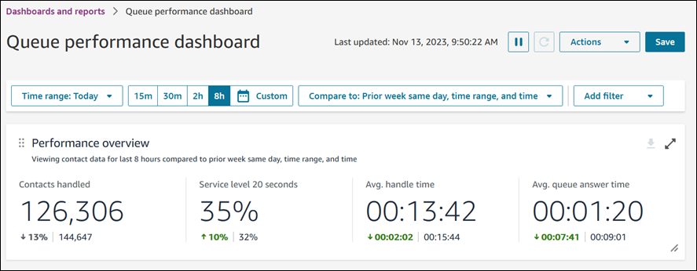

- **Contacts handled** during your time range selection was
  126,306, which is down ~13% compared to your benchmark number of contacts
  handled, 144,647 contacts.
- The percentages are rounded up or down.
- The colors that appear for the metrics indicate positive (green) or
  negative (red) compared to your benchmark.
- There are no colors for **Contacts handled**.

## Current queue overview

The **Current queue overview** widget provides real-time snapshot
metrics that display what is happening right now in your queues. You can configure
this widget in multiple ways including changing the metrics (but only to real-time
queue metrics), configuring the queues that are included, and re-ordering the
metrics.

The following image shows an example **Current queue
overview**.

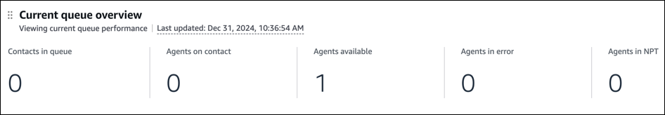

## Current agent performance

The **Current agent performance** widget provides a real-time
view of what agents are doing (equivalent to the real-time metrics page agent
widget) including time in status, current active contacts, and the next activity.

By default, this widget collapses the rows to give you an at a glance view of what
agents are doing. Choose **Expand all** to automatically expand all
the rows for a complete view of agent performance.

With the appropriate security profile permissions, from this widget you can listen
in to contacts and change agent statuses within this widget (similar to the
real-time metrics page).

###### Note

You can't change the grouping of this widget.

The following image shows an example **Current agent
performance**.

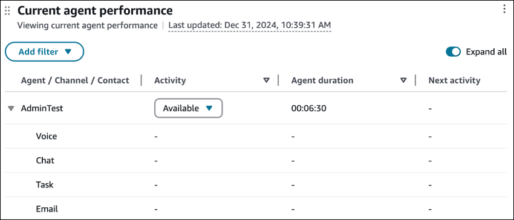

### Thresholds

You can also set thresholds on this widget, but several of the metrics behave
slightly differently. For agent activity you need to select two
conditions:

- What the activity type is (for example, rejected)
- The duration of that activity

You configure custom thresholds based on the state. For example, you can
define a cell that should flip to red if an agent is in missed call state for
more than 5 seconds but also only flip to red if an agent is on hold for more
than 5 minutes.

The following image shows an example of thresholds set on the
**Activity** metric.

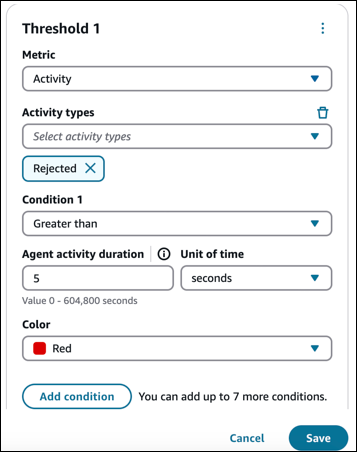

### Contact state filtering

You can filter by contact states to identify specific agents who have a
contact within a specific state. For example, if you want to quickly identify
agents who have a contact in error and can’t be routed additional contacts, you
can filter for "Missed" and "Rejected" to identify those agents and change their
status.

The following image shows a list of some of the filters available for contact
states.

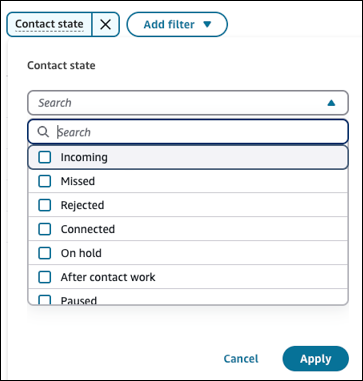

## Agent adherence

The **Agent adherence** widget provides a real-time view of agent
adherence metrics, including adherence status, duration, and percentage, enabling
supervisors to monitor and manage agent adherence. This widget supports filtering on
adherence status, duration, and percentage, sorting by duration or percentage, and
conditional formatting on duration and percentage to quickly identify adherence
breaches and take prompt action to address issues.

For example, you can filter for agents with a **Non-adherent**
status, sort by adherence duration, and highlight duration greater than 5 minutes to
quickly identify breaches and send reminders to bring agents back on task.

The following image shows an example of the **Agent adherence**
widget. The red highlight is conditional formatting applied on the
**Adherence status duration** (Adherence status duration >= 3
hours). The breach in the agent adherence is indicated by the **Non-adherent
status**.

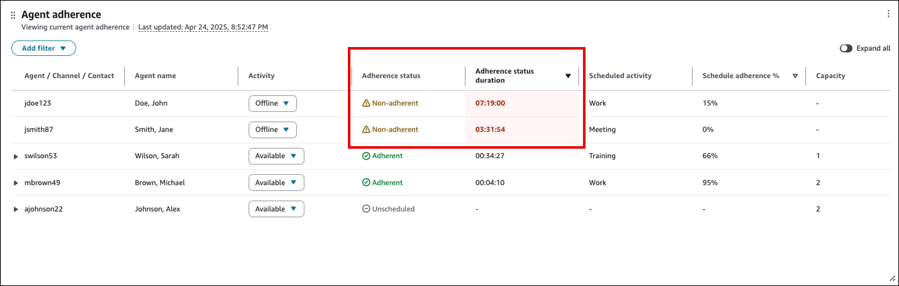

The following image shows an example of how to set up conditional formatting.

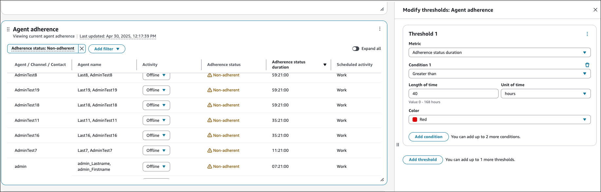

The following image shows an example of filtering the **Adherence status
duration**. In this case, Amazon Connect will display only those agents who are
not adherent for longer than 10 minutes.

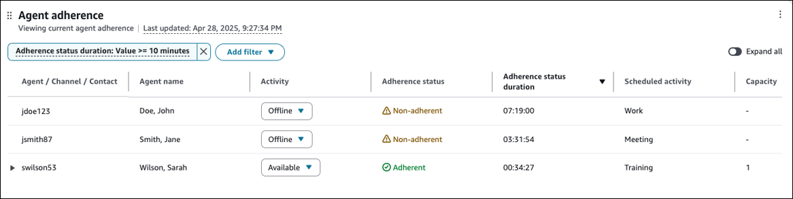

## Trailing agent performance

This table provides a historical view of performance over time.

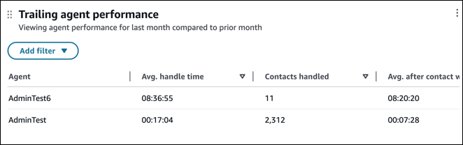

To see how your performance compares to the previous time range, choose
**Actions**, **Edit**. On the
**Edit** pane, choose **Show comparison**, as
shown in the following image.

You can also change the metrics, configure thresholds, or re-order
metrics.

## Average queue answer time and contacts queued

trend

The **Average queue answer time and contacts queued trend** is a
time-series chart that displays the count of contacts queued (blue bars) and the
average queue answer time (red line) over a given time period broken down by
intervals (15min, daily, weekly, monthly). You can also change the metrics and add
up to four different metrics as line graphs.

###### Note

This widget can support a maximum of two metric types (count, time,
percentage).

The following image shows the Contacts queued (blue bars) and Avg queue answer
time (red line), for four months.

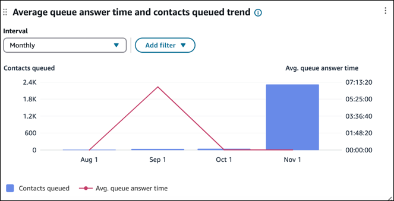

This next image shows the same data, but with the addition of the
**Contacts abandoned** (green) filter.

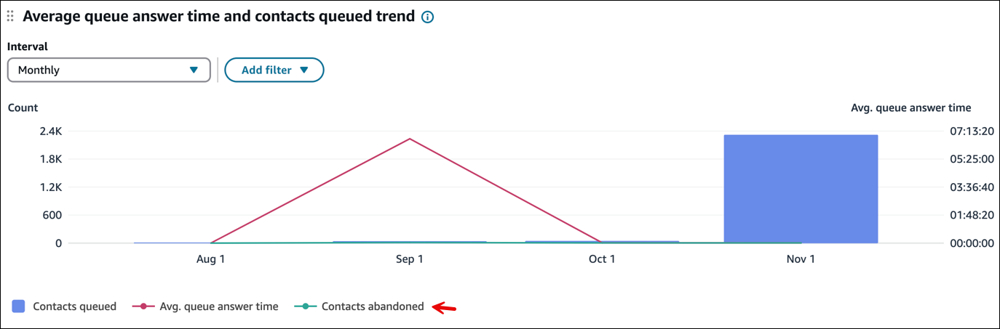

## Contacts handled and

average handle time trend

The **Contacts handled and average handle time trend** is a
time-series chart that displays the count of contacts handled (blue bars) and the
average handle time (red line) over a given time period broken down by intervals
(15min, daily, weekly, monthly).

To configure different time range intervals, choose **Interval**,
as shown in the following image.

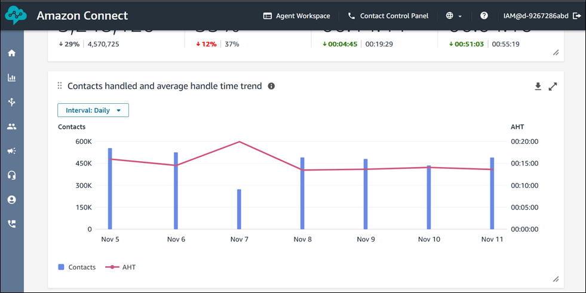

The available intervals depend on the page-level time range filter, which is set
at the top of the page. For example:

- If you have a "Today" time range filter at the top of your dashboard, you
  can only see an interval of 15min for the last 24 hours.
- If you have a "Day" time range filter at the top of your dashboard, you
  can see a trailing 8 day interval trend, or a 15min interval trend for the
  trailing 24 hours.

## Agent status drill down

The **Agent status drill down** widget displays the number of
agents logged into the Contact Control Panel (CCP), and their status. By default,
the widget groups data by queue. For more detail, you can add **Agent
status** as a secondary grouping to view agent count by their CCP
status within each queue.

The following image shows an example of the **Agent status drill
down** widget. It shows **Agent status** (for example,
Training, Lunch) as a secondary grouping.

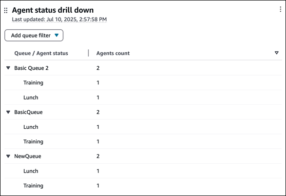

## Dashboard

functionality limitations

The following limitations apply to the Queue performance dashboard:

- Tag-based access controls are not supported on the dashboard.
