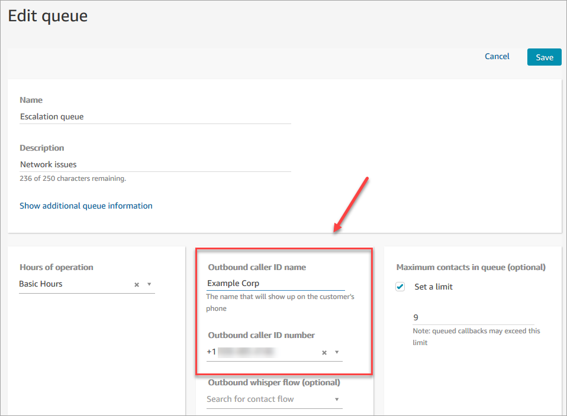

# Set up outbound caller ID in Amazon Connect

This topic explains how to set up your outbound caller ID name and number.

###### Contents

- [Outbound parameters: Set in queue](#set-callerID-name "#set-callerID-name")
- [How outbound
  parameters are selected](#how-outbound-parameters-selected "#how-outbound-parameters-selected")
- [How to set the caller ID number
  dynamically](#using-dynamic-caller-id "#using-dynamic-caller-id")
- [Use E.164 format for international phone
  numbers](#international-calls-ccp "#international-calls-ccp")
- [How to specify a custom caller ID
  number using a block](#call-number-block-how-it-works "#call-number-block-how-it-works")
- [CNAM](#CNAM "#CNAM")
- [Avoid labels like
  "spam"](#enroll-in-CNAM-services "#enroll-in-CNAM-services")

## Outbound parameters: Set in queue

You set the outbound caller ID name (such as the name of your company) and caller
ID number in the queue settings. To edit queue settings, on the navigation menu
choose **Routing**, **Queues**, and then choose
the queue you want to edit.

The following image shows an **Edit queue** page with an arrow
pointing to the **Outbound caller ID name** and **Outbound
caller ID number**.

### Outbound caller ID name

The **Outbound caller ID name** is set to the value that is
passed from the SIP header. For example,
`Alice<sip:alice@example.com>`.

###### Important

- Per SIP protocol RFC3261, the following characters are reserved:
  **; / ? : @ & = + $ ,**. Do not
  use these characters in the caller ID name. When these characters
  are included, outbound calls may fail or the caller ID name may
  display inaccurately.
- Amazon Connect runs on a SIP-only infrastructure through our carrier
  partners. However, the caller ID name can be delivered to your
  customers only if the call path across the public telephony network
  is all on SIP. Because your customers are on many different networks
  outside of what Amazon Connect controls, the caller ID name is not guaranteed
  to be delivered to your customers. Depending on the country this
  will be up to 75% effective.
- To guarantee your caller ID name is delivered to customers, see
  [Optimize your reputation for outbound
  calling in Amazon Connect](optimize-outbound-calling.md "optimize-outbound-calling.md") for information
  about achieving it by using partner solutions.

### Outbound caller ID number

Only phone numbers that you've [claimed](get-connect-number.md "get-connect-number.md") or [ported to Amazon Connect](port-phone-number.md "port-phone-number.md")
can be used as your caller ID number. Outbound calls without proper
identification may be blocked in certain countries such as UK and
Australia.

To use an
external phone number as your outbound caller ID number, contact Support to see if
it's possible. The phone number needs to be in a [country we support](https://d1v2gagwb6hfe1.cloudfront.net/Amazon_Connect_Telecoms_Coverage.pdf "https://d1v2gagwb6hfe1.cloudfront.net/Amazon_Connect_Telecoms_Coverage.pdf") for custom caller ID and you'll need to provide
[proof of ownership](phone-number-requirements.md "phone-number-requirements.md").

1. Choose [Account and billing](https://console.aws.amazon.com/support/home#/case/create?issueType=customer-service&serviceCode=service-connect-number-management "https://console.aws.amazon.com/support/home#/case/create?issueType=customer-service&serviceCode=service-connect-number-management") to access a pre-populated form in the
   Support console. You must be signed in to your AWS account
   to access the form.
2. For **Service**, _Connect (Number
   Management)_ should be selected.
3. For **Category**, _Custom Outbound Called
   ID_ should be selected.
4. Select the required severity.
5. Choose **Next step: Additional information**
6. On the **Additional information** page:
   1. Enter the subject.
   2. Under **Description**, include as much
      information as possible about your request. If you don't know
      all of these details, you can leave information out.

   ###### Important

   Do not attach any documents that contain personal
   information. After we review your case, we'll send you a
   link to our secured storage (Amazon S3) so you can submit
   the required documents. This is described later in step 10
   below.

7. Choose **Next step: Solve now or contact us**.
8. On the **Solve now or contact us** page:
   1. Choose the **Contact us** tab and select your
      **Preferred contact language** and your
      preferred contact method.

9. Choose **Submit**.
10. The Amazon Connect team will review your ticket and get back to
    you. They will provide a link to our secured storage (Amazon S3) so you
    can submit required documents.

You can set the caller ID number as follows:

- **[Call phone number](call-phone-number.md "call-phone-number.md") block**: Use
  this block in an [Outbound whisper
  flow](create-contact-flow.md#contact-flow-types "create-contact-flow.md#contact-flow-types") to initiate an outbound call to a customer and,
  optionally, specify a custom caller ID number that is displayed to call
  recipients.

This block is useful when you have multiple telephone numbers used to
make outbound calls, but want to consistently display the same company
phone number for the caller ID for calls made from your contact center.

You can also use this block with the [Set contact
attributes](set-contact-attributes.md "set-contact-attributes.md") block to set the
callback number dynamically. For example, you can display a certain
caller ID number based on the customer's account type.

- **Queue:** If no caller ID number is
  specified in the [Call phone number](call-phone-number.md "call-phone-number.md") block, then the caller ID
  in the queue settings is used.

###### Important

- Telecom regulations in various countries limit the telephone
  numbers that you can use to make outbound calls. If you set up a
  number and you can't make outbound calls, check the [Amazon Connect Telecoms Country Coverage Guide](https://d1v2gagwb6hfe1.cloudfront.net/Amazon_Connect_Telecoms_Coverage.pdf "https://d1v2gagwb6hfe1.cloudfront.net/Amazon_Connect_Telecoms_Coverage.pdf") and [Region requirements for ordering and porting
  phone numbers in Amazon Connect](phone-number-requirements.md "phone-number-requirements.md") to ensure that you
  have correct type of number.
- Telecom regulations in certain countries require the carrier to
  identify the caller and block unidentifiable outbound calls. Make
  sure you set the Caller ID in your configurations to avoid call
  failures.

For example:

**In Australia**: The caller ID must be an Amazon Connect
provided DID (Direct Inward Dialing) phone number.
If a toll free number or a number not provided by Amazon Connect
is used in the caller ID, local telephony suppliers may reject outbound calls due to local anti-fraud requirements.

**In the UK**: The caller ID must be
a valid E164 phone number. If the phone number is not provided in
the caller ID, local telephony suppliers may reject outbound calls
due to local anti-fraud requirements.

### Toll-free numbers for caller ID

Toll-free numbers for outbound communications have a number of limitations.
For example, using a toll-free number to dial other toll-free numbers in the
United States can result in the number being filtered, blocked, or not properly
routed to the destination by carriers. Toll-free numbers may be terminated at a
higher than expected rate. If you know you need to call toll-free numbers in the
United States you must use DIDs to guarantee call delivery.

If you use toll-free numbers outside of the US, refer to the [Amazon Connect Telecoms Country Coverage Guide](https://d1v2gagwb6hfe1.cloudfront.net/Amazon_Connect_Telecoms_Coverage.pdf "https://d1v2gagwb6hfe1.cloudfront.net/Amazon_Connect_Telecoms_Coverage.pdf") to see which countries
support toll-free numbers as outbound. For example, for Australia the
**National Outbound** column indicates that toll-free
numbers are not supported.

###### Important

Toll-free products are designed to be national products and used within a
country. We do not guarantee international reachability of any of these
services, as access to the numbers is controlled by a caller's network
access.

## How outbound parameters are

selected

If the call is placed with an external quick connect or quick connect number pad,
the outbound caller ID and caller name depends on if the agent is on an active call
or not.

- If the agent is on an active call, the original queue that the call is
  serviced from provides the outbound caller ID and caller name.
- If the agent isn't on an active call, the outbound queue of the agent's
  [routing profile](routing-profiles.md "routing-profiles.md") provides the
  outbound caller ID and caller name.

###### Note

You can override the outbound caller IDs in your agents' routing profiles by
using the [Call phone number](call-phone-number.md "call-phone-number.md") block in a [custom outbound whisper flow](https://repost.aws/knowledge-center/connect-custom-outbound-whisper-flows "https://repost.aws/knowledge-center/connect-custom-outbound-whisper-flows").

## How to set the caller ID number

dynamically

Use an attribute in the [Call phone number](call-phone-number.md "call-phone-number.md") block to set the caller ID number
dynamically during the flow.

The attribute can be one you define in the [Set contact
attributes](set-contact-attributes.md "set-contact-attributes.md") block in the flow. Or, it can be
an external attribute returned from an AWS Lambda function.

The value of the attribute must be a phone number from your instance in [E.164](https://www.itu.int/rec/T-REC-E.164/en "https://www.itu.int/rec/T-REC-E.164/en") format.

- If the number is not in E.164 format, the number from the queue associated
  with the [Outbound whisper flow](create-contact-flow.md#contact-flow-types "create-contact-flow.md#contact-flow-types") is
  used for the caller ID number.
- If no number is set for the outbound caller ID number for the queue, the
  call attempt will fail.

For more information about setting the caller ID dynamically, see this AWS
Support Knowledge Center article: [How can I set my Amazon Connect outbound caller ID dynamically based on country?](https://aws.amazon.com/premiumsupport/knowledge-center/connect-dynamic-outbound-caller-id/ "https://aws.amazon.com/premiumsupport/knowledge-center/connect-dynamic-outbound-caller-id/")

## Use E.164 format for international phone

numbers

Amazon Connect requires phone numbers in [E.164](https://www.itu.int/rec/T-REC-E.164/en "https://www.itu.int/rec/T-REC-E.164/en") format.

To express a US phone number in E.164 format, add the '+' prefix and the country
code in front of the number. For example, for a US number:

- +1-800-555-1212

In the UK and many other countries internationally, local dialing requires the
addition of a 0 in front of the subscriber number. However, to use E.164 formatting,
this 0 must be removed. A number such as 020 718 xxxxx in the UK would be formatted
as +44 20 718 xxxxx. When you place calls from the CCP using Amazon Connect the CCP provides
the correct formatting for numbers automatically.

###### Important

Phone numbers must be formatted in E.164 or they will not work. They will also
result in a breach of [Amazon Connect Service
Terms and conditions](https://aws.amazon.com/service-terms/ "https://aws.amazon.com/service-terms/") for acceptable use which may result in your
service being suspended.

## How to specify a custom caller ID

number using a [Call phone number](call-phone-number.md "call-phone-number.md") block

1. On the left navigation menu, choose **Routing**,
   **Flows**.
2. Choose the down arrow next to **Create flow**, and then
   choose **Create outbound whisper flow**.
3. Add a [Call phone number](call-phone-number.md "call-phone-number.md") block to the flow, and connect
   the **Entry point** block to it.

The [Call phone number](call-phone-number.md "call-phone-number.md") block must be placed before a
**Play prompt** block if one is included in your
flow. 4. Select the [Call phone number](call-phone-number.md "call-phone-number.md") block, and then select
**Caller ID number to display**. 5. Do one of the following:

    * To use a number from your instance, choose **Select a
     number from your instance**, and then search for or
     select the number to use from the drop-down.
    * Choose **Use
     attribute** to use a
     contact attribute to provide the value for the caller ID number. You
     can use either a **User Defined** attribute you
     create using a [Set contact
     attributes](set-contact-attributes.md "set-contact-attributes.md") block, or an
     **External** attribute returned from an
     AWS Lambda function. The value of any attribute you use must be a
     phone number claimed for your instance and be in E.164 format. If
     the number used from an attribute is not in E.164 format, the number
     set for the **Outbound caller ID number** for the
     queue is used.###### Important

    * The value of any attribute you use must be a phone number
     claimed for your instance. The number must be in E.164 format.
     If the number used from an attribute is not in E.164 format,
     calls may be terminated by the destination networks.
    * It is your responsibility to ensure the numbers you are using
     are legally permissible. Certain numbers, such as +44870 numbers
     in the UK, are not legally permissible. You must ensure you're
     not using them.

6. Add any additional blocks to complete your flow, and connect the
   **Success** branch of the [Call phone number](call-phone-number.md "call-phone-number.md")
   block to the next block in the flow.

There is no error branch for the block. If a call is not successfully
initiated, the flow ends and the agent is placed in an
**AfterContactWork** (ACW) state.

## CNAM

As part of changes within the US Public Telephone network and a move to
alternative reputation mechanisms described in [Optimize your reputation for outbound
calling in Amazon Connect](optimize-outbound-calling.md "optimize-outbound-calling.md"),
as of March 31, 2023, Amazon Connect no longer sets CNAM configurations.

We conducted research between January and March 2023, that showed CNAM was seen by
fewer than 7% of users. This is due to changes within support for mobile providers
and due to the migration to app-based reputation mechanisms.

All existing CNAM configurations set up before March 2023, are still in place. We
will continue to focus on supporting modern replacement mechanisms added to our
marketplace, for example, [First Orion](https://firstorion.com/amazon-connect-integration/ "https://firstorion.com/amazon-connect-integration/") and
Neustar.

## How to avoid labels like "spam" and

"telemarketer"

See the recommended steps in [Optimize your reputation for outbound
calling in Amazon Connect](optimize-outbound-calling.md "optimize-outbound-calling.md").
