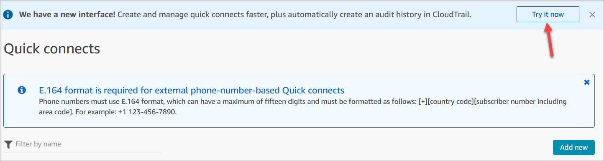

# Delete quick connects in the Amazon Connect admin website

There are two ways you can delete a quick connect:

- Use the Amazon Connect admin website. This topic provides instructions.
- Use the [DeleteQuickConnect](../APIReference/API_DeleteQuickConnect.md "../APIReference/API_DeleteQuickConnect.md") API.

###### To delete a quick connect

1. Log in to your Amazon Connect instance (https://`instance
name`.my.connect.aws/) with an Admin account or a user account
   that has **Quick connects - Delete** permissions in its [security profile](connect-security-profiles.md "connect-security-profiles.md"). (To find the
   name of your instance, see [Find your Amazon Connect instance ID or ARN](find-instance-arn.md "find-instance-arn.md").)
2. On the navigation menu, choose **Routing**, **Quick
   connects**.
3. Select the quick connect, and then choose the **Delete**
   icon.

If you don't see the delete option, check the following:

    * You are using the latest Amazon Connect user interface. The following image
     shows a banner at the top of the **Quick connects**
     page. Choose **Try it now** to use the latest Amazon Connect
     user interface.

    
    * You have **Quick connects - Delete** permission in
     your security profile.
