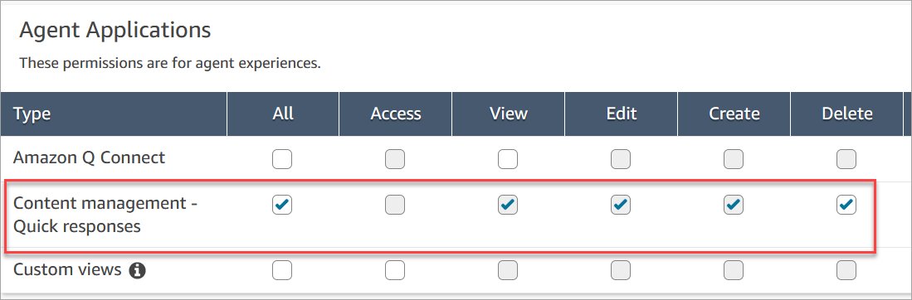

# Assign permissions to manage quick responses in

Amazon Connect

To create and manage quick responses in the Amazon Connect admin website, users need the Content Management
security profile permissions. The following image shows these permissions on the
**Security profiles** page.

Following is a description of the Content Management permissions.

- **All** – Enables all permissions, but you must have a custom view
  to enable **Access**.
- **Access** – Grants users access to custom views. This checkbox
  remains unavailable until you create a custom view.
- **Create** – Enables users to create Amazon Q in Connect knowledge bases
  and quick responses in the Amazon Connect admin website. This setting also enables users to View and Edit. It does not
  grant permission to delete quick responses.
- **View** – Enables users to view quick responses in the
  Amazon Connect admin website.
- **Edit** – Enables users to edit quick responses in the
  Amazon Connect admin website.
- **Delete** – Enables users to delete quick responses in the
  Amazon Connect admin website.
  If you want the same users to add personalized attributes to quick responses, they will also
  need the **Channels and flows**, **Flows - Publish**
  permission.

For information about adding permissions to an existing security profile, see [Update security profiles in Amazon Connect](update-security-profiles.md "update-security-profiles.md").
