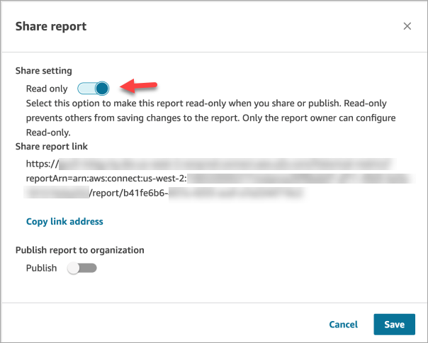
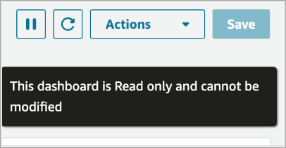
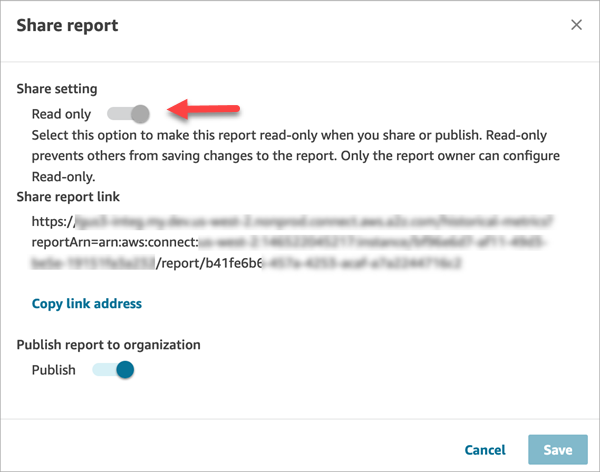

# Make a report in Amazon Connect read-only

To prevent others from saving changes to your report, you can make the report
read-only before sharing it.

Making your report read-only means the report can be read but changes cannot be saved.
If a user tries to make changes to a read-only report, they can only save their changes
by using the **Save as** option, which makes a new copy of the
report.

When a user who is not the report owner views the **Share report**
dialog box, the **Read-Only** toggle is disabled.

###### To make a report read-only

1. After you create and save a Dashboard, Real-time metrics, Historical metrics,
   or Login/logout report, choose **Actions**, **Share
   report**.
2. In the **Share report** dialog box, set the
   **Read-only** toggle to **On**, and then
   choose **Save**. This toggle is shown in the following image of
   the **Share report** dialog box.

When this toggle is **On**, no
user—_including the report owner_—can save
changes to the report settings: Interval & Time range, Groupings, Filters,
and Metrics.

###### To allow changes to a report

1. Set the **Read-only** toggle to
   **Off**.
2. Anyone who already has a shared link to the report will now be able to make
   changes to it. You don't need to send them a new link to the report.

## What users see when they view a read-only

report

Users can still make changes to the report settings but they won't be able to save
them to the report. The **Save** button on the report page is
disabled. A message is displayed, **This Report is read-only and cannot be
modified**, as shown in the following image.

When a user who is not the report owner views the **Share
report** dialog box, the **Read-Only** toggle is
disabled, as shown in the following image.

