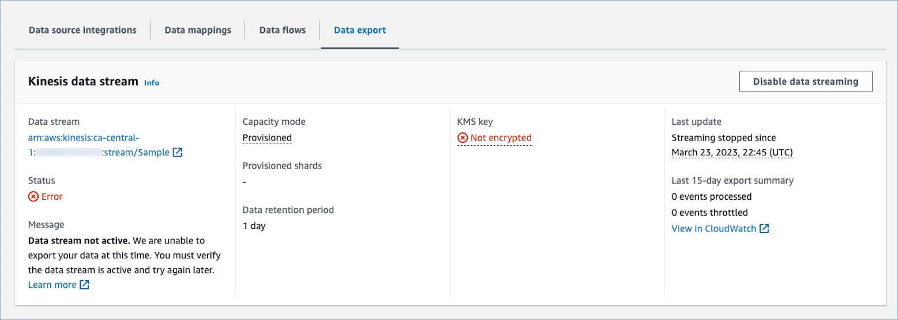

# Troubleshoot real-time event

exporting to your Kinesis Data Stream

There may be a delay when first exporting events to your Kinesis Data Stream. This
is due to the time it takes to propagate IAM permissions for the service-linked
role. When an actual issue occurs, the streaming status can enter an error
state.

The following sections display the possible error messages that you may encounter.
It also provides the cause and resolution for each issue.

## Error: The Kinesis Data

Stream is not Active. Please check the configuration and recreate the event
stream later

The destination Kinesis Data Stream is not in `ACTIVE` state. This
can happen when your Kinesis Data Stream is being created or being deleted. To
resolve the error, make sure your Kinesis Data Stream is in ACTIVE state and
re-enable the data streaming setting.

## Error: The Kinesis Data

Stream does not exist. Please recreate the event stream with valid Kinesis
Data Stream destination

The destination Kinesis Data Stream is deleted. To resolve the error,
re-enable data streaming with an existing Kinesis Data Stream as the
destination.

## Error: The Kinesis Data

Stream is being throttled. Please consider provision higher Kinesis
throughput appropriately

The destination Kinesis Data Stream is being throttled (under-provisioned). To
resolve the error, make sure the destination Kinesis Data Stream has enough
shard count and then re-enable data streaming.

## Error: The KMS key used to

encrypt Kinesis Data Stream is being throttled. Please consider increasing
the KMS request quota appropriately

The KMS key used by Kinesis Data Stream is being throttled. To resolve the
error, re-enable data streaming.

## Error: Check the KMS Key

configuration of you Kinesis Data Stream

Customer Profiles cannot access the KMS key used by Kinesis Data Stream. This can happen
when your KMS key has a key policy that denies access from Customer Profiles service-linked
role, or the key is not in Enabled status. To resolve the error, make sure the
KMS key policy does not deny access from Customer Profiles service-linked role, and the key
is in Enabled status. Re-enable data streaming to resolve the error.
