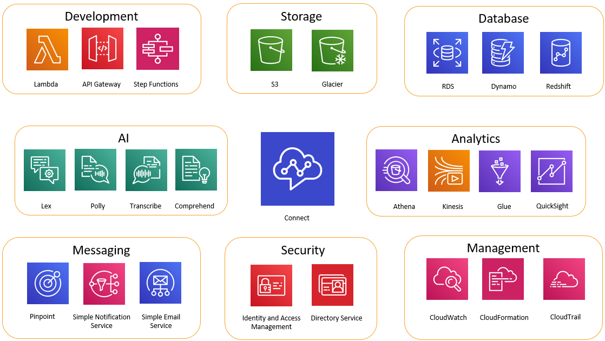

# The power of AWS with Connect Customer

**This topic is for developers and administrators who are
interested in an overview of which other AWS services you can integrate with
Connect Customer.**

The following diagram shows some of the other AWS services you can use with
Connect Customer.

## Development

You can use AWS Lambda functions to either look up or post data to sources outside
of Connect Customer. For example, you can look up an inbound caller on Salesforce based on the
customer’s phone number. The function might return such results as the customer name,
membership level (for example, frequent flyer), last order, and order status. Then
based on that information, the call can be routed to an Amazon Lex bot or an agent.

You can also use Lambda with AWS databases like DynamoDB to create dynamic routing
abilities. For example, you can retrieve a prompt in a specific language, based on
input from the customer.

API Gateway and Step Functions further enhance the abilities of Lambda.

For more information, see:

- [Grant Connect Customer access to your AWS Lambda functions](connect-lambda-functions.md "connect-lambda-functions.md")

## Storage

Connect Customer uses Amazon Simple Storage Service (Amazon S3) to store recorded conversations and exported reports.
When you set up Connect Customer, it creates default buckets for these requirements, or you can
point it to existing Amazon S3 infrastructure. For more information, see [Step 4: Data storage](amazon-connect-instances.md#get-started-data-storage "amazon-connect-instances.md#get-started-data-storage") in
[Create a Connect Customer instance](amazon-connect-instances.md "amazon-connect-instances.md").

VPC endpoints are not supported.

You can also manage the Amazon S3 policies to move data to Amazon Glacier for less expensive
long-term storage. However, it breaks the link in the contact record in Connect Customer. To
fix this, use a Lambda function to rename the Amazon Glacier object to match the data in
the contact record.

## Database

You can use AWS databases with Connect Customer for a variety of reasons. For example, with
DynamoDB, you can create quick tables of data.

You can also create tables of dynamic information for call routing. For example, a
Lambda function can write inbound calls to a DynamoDB table, then query the table to see
if there are other matches for the phone number. If so, a decision can be made to
send the caller to the same queue as before, or to flag them as a repeat caller.

For more information, see:

- Blog post: [Creating dynamic, personalized experiences in Connect Customer](https://aws.amazon.com/blogs/contact-center/creating-dynamic-personalized-experiences-in-amazon-connect/ "https://aws.amazon.com/blogs/contact-center/creating-dynamic-personalized-experiences-in-amazon-connect/")

## Analytics

Connect Customer tracks all interactions using [contact
records](about-contact-states.md#ctr-events "about-contact-states.md#ctr-events"). Contact records are used for real-time and historical metrics
reports. You can also use Amazon Kinesis to stream them to an AWS database like Amazon Redshift or
Amazon Athena for BI analysis (Quick, or a third party such as Tableau). There are
AWS CloudFormation templates available to set up this functionality for Amazon Redshift and Athena.

To perform analysis on your flow logs, you can set up an Amazon Kinesis stream to stream
your flow log data from CloudWatch to a data warehouse service, such as Amazon Redshift. You can
combine the flow log data with other Connect Customer data in your warehouse, or run queries to
identify trends or common issues with a flow.

For more information, see:

- [Develop live media streaming in Connect Customer](access-media-stream-data.md "access-media-stream-data.md")
- Blog post: [Recovering abandoned calls with Connect Customer](https://aws.amazon.com/blogs/contact-center/recovering-abandoned-calls-with-amazon-connect/ "https://aws.amazon.com/blogs/contact-center/recovering-abandoned-calls-with-amazon-connect/")

## Machine Learning (ML) and Artificial Intelligence (AI)

Connect Customer uses the following services for ML/AI:

- Amazon Lex—Lets you create a chatbot to use as Interactive Voice
  Response (IVR). For more information, see [Add an Amazon Lex bot to Connect Customer](amazon-lex.md "amazon-lex.md").
- Amazon Polly—Provides text-to-speech in all flows. For more information,
  see [Add text-to-speech to prompts in flow blocks in Amazon Polly](text-to-speech.md "text-to-speech.md") and
  [SSML tags supported by Connect Customer](supported-ssml-tags.md "supported-ssml-tags.md").
- Amazon Transcribe—Grabs conversation recordings from Amazon S3, and transcribes them
  to text so you can review them.
- Amazon Comprehend—Takes the transcription of recordings, and applies speech
  analytics machine learning to the call to identify sentiment, keywords,
  adherence to company policies, and more.

## Messaging services

Connect Customer uses the following services for messaging:

- Amazon Pinpoint—Use as an outbound messaging trigger for events; for example,
  bulk messaging (such as outbound marketing campaigns). For more information,
  see this blog post: [Using Amazon Pinpoint to send text messages in Connect Customer](https://aws.amazon.com/blogs/contact-center/using-amazon-pinpoint-to-send-text-messages-in-amazon-connect/ "https://aws.amazon.com/blogs/contact-center/using-amazon-pinpoint-to-send-text-messages-in-amazon-connect/").
- Amazon Simple Notification Service (Amazon SNS)—Use to send and receive SMS and other channel
  notifications. Amazon SNS is particularly useful for sending alerts and
  validations.
- Amazon Simple Email Service (Amazon SES)—Use to send validation e-mails, such as a
  password reset bot sending a confirmation of the transaction.

## Security

Connect Customer uses the following services for added security:

- AWS Identity and Access Management (IAM)—Use to manage permissions for users. Connect Customer users
  require permission for services. For more information, see [Identity and access management for Connect Customer](security-iam.md "security-iam.md").
- Directory Service—Connect Customer supports user federation through the internal directory
  (created in the Connect Customer instance), using Active Directory integration (MAD,
  ADFS) or SAML 2.0.

For more information, see:

    + [Plan your identity management in Connect Customer](connect-identity-management.md "connect-identity-management.md")
    + Blog post: [Enabling federation with AWS Single Sign-On and
     Connect Customer](https://aws.amazon.com/blogs/contact-center/enabling-federation-with-aws-single-sign-on-and-amazon-connect/ "https://aws.amazon.com/blogs/contact-center/enabling-federation-with-aws-single-sign-on-and-amazon-connect/")

## Management

Connect Customer uses the following services for monitoring usage:

- Amazon CloudWatch—Collects logs, service metrics, performance metrics for
  Connect Customer. For more information, see [Monitoring your Connect Customer instance using CloudWatch](monitoring-cloudwatch.md "monitoring-cloudwatch.md").
- AWS CloudTrail—Provides a record of Connect Customer API calls.

For more information about Connect Customer and AWS CloudTrail, see [Log Connect Customer API calls with AWS CloudTrail](logging-using-cloudtrail.md "logging-using-cloudtrail.md").

- CloudFormation—Connect Customer supports using CloudFormation for initiating an instance with
  all the supported channels enabled. For more information, see [AWS::Connect::Instance](../../../AWSCloudFormation/latest/UserGuide/aws-resource-connect-instance.md "../../../AWSCloudFormation/latest/UserGuide/aws-resource-connect-instance.md").
