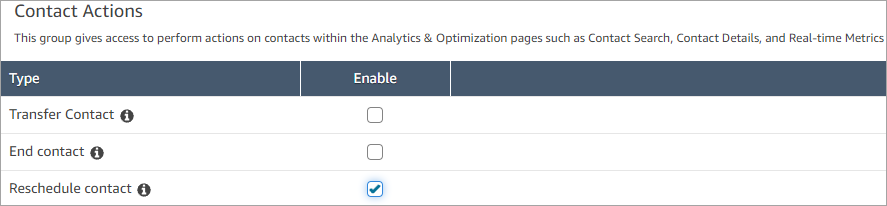
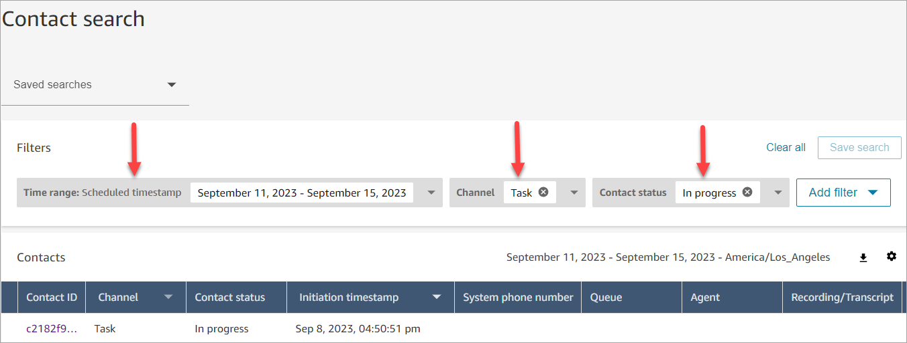
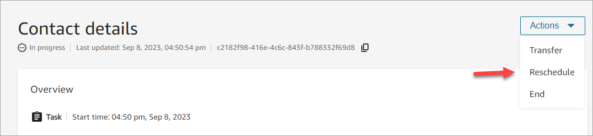

# Reschedule contacts from the Contact details

page in Amazon Connect

On the **Contact details** page of an in-progress contact, you can
reschedule a contact that was previously scheduled. This capability is currently
supported only for task contacts.

To reschedule contacts programmatically, use the [UpdateContactSchedule](../APIReference/API_UpdateContactSchedule.md "../APIReference/API_UpdateContactSchedule.md").

## Required permissions

1. Enable one of the following permissions to view contacts on the
   **Contact search** and **Contact
   details** pages:
   1. **Contact search - View**: Allows a user to view
      all contacts
   2. **View my contacts - View**: Allows agents to
      view contacts that they themselves had handled

2. **Restrict contact access** (Optional): Restrict a user's
   access to contacts on the **Contact search** and
   **Contact details** pages within their own hierarchy
   group or any hierarchy groups below them. For more information about this
   permissions, see [Manage who can search for
   contacts and access detailed information](contact-search.md#required-permissions-search-contacts "contact-search.md#required-permissions-search-contacts").
3. **Reschedule contact**: Enables a user to reschedule
   contacts on the **Analytics & Optimization** pages. The
   following image shows the **Contact Actions - Reschedule
   contact** permission.

## How to reschedule a

contact

1. Log in to Amazon Connect with a user account that has [permissions to access
   contact records](contact-search.md#required-permissions-search-contacts "contact-search.md#required-permissions-search-contacts").
2. In Amazon Connect choose **Analytics and optimization**,
   **Contact search**.
3. Search for an in-progress task contact to reschedule:
   1. Select the **Contact status** filter and change
      the selected value to **In progress**.
   2. Select the **Time range** filter. Set the
      **Timestamp type** to
      **Scheduled** to view only scheduled contacts.
      Filter for the time range. The following image shows these
      filters.

   

4. Choose the scheduled contact to view its details.
5. On the **Contact details** page of the task contact,
   choose **Actions**, **Reschedule**, as
   shown in the following image.

 6. Select the time and range to reschedule the contact. The scheduled time
must be within 6 days of when the task was initiated. 7. When the contact is rescheduled successfully, the page automatically
refreshes with the new schedule time for the task.
