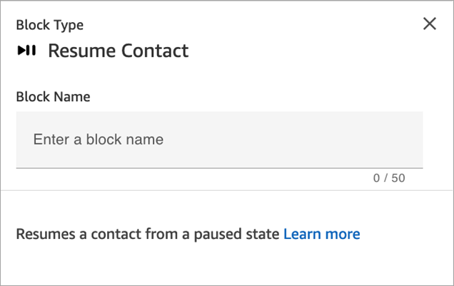
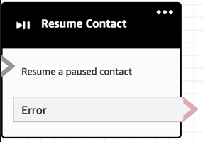

# Flow block in Amazon Connect: Resume contact

This topic defines the flow block for resuming a task contact from a paused
state.

## Description

- Resumes a task contact from a paused state. This enables agents to free up
  an active slot so they can receive more critical tasks when their current
  task is stalled, for example, because of a missing approval or waiting on an
  external input.
- For more information how pausing and resuming tasks works in Amazon Connect, see
  [Pause and resume tasks in Amazon Connect
  Tasks](concepts-pause-and-resume-tasks.md "concepts-pause-and-resume-tasks.md").

## Supported channels

The following table lists how this block routes a contact who is using the
specified channel.

| Channel | Supported?        |
| ------- | ----------------- | ---------------------------------------------------------------------------------------------------------------------------------------------------------------------------------------------------------------------------------------------------------------------------------------------------------------------------------------------------------------------------------------------------------------------------------------------------------------------------------------------------------------------------------------------------------------------------------------------------------------------------------------------------------------------------------------------------------------------------------------------------------------- |
| Voice   | No - Error branch |
| Chat    | No - Error branch |
| Task    | Yes               |
| Email   | No - Error branch | ## Flow types You can use this block on all flow types. ## Properties The following image shows the **Properties** page of the **Resume contact** block.  ## Configuration tips When you design a flow to resume unassigned, paused tasks that are dequeued, be sure to add a [Transfer to queue](transfer-to-queue.md "transfer-to-queue.md") block to the flow to queue the task after resuming. Otherwise, the task will stay in a de-queued state. ## Configured block The following image shows an example of what this block looks like when it is configured. It has an **Error event** branch.  |
