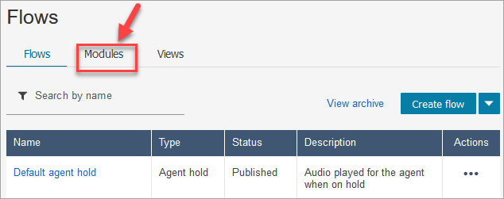
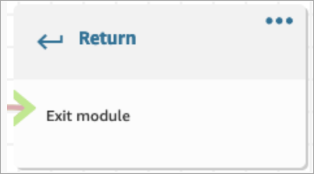
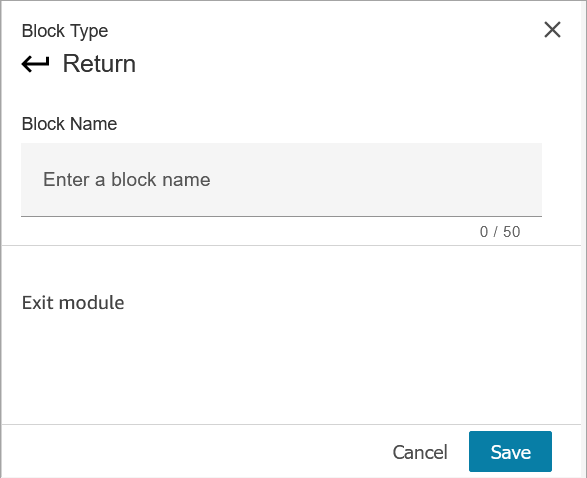

# Flow block in Amazon Connect: Return (from module)

This topic defines the flow block for resuming a task contact from a paused
state.

## Description

- Use the **Return** block to mark the terminal action or
  terminal step of a [flow module](contact-flow-modules.md "contact-flow-modules.md").
- Use this block to exit the flow module after it has run successfully. Then
  continue running the flow in which the module is referenced.

## Supported types of flows

This block is only available in [flow
modules](contact-flow-modules.md "contact-flow-modules.md"). It is not available in any other type of flow.

| Flow type                               | Supported? |
| --------------------------------------- | ---------- |
| Inbound Flow (contactFlow)              | No         |
| Customer Queue Flow (customerQueue)     | No         |
| Customer Hold Flow (customerHold)       | No         |
| Customer Whisper Flow (customerWhisper) | No         |
| Outbound Whisper Flow (outboundWhisper) | No         |
| Agent Hold Flow (agentHold)             | No         |
| Agent Whisper Flow (agentWhisper)       | No         |
| Transfer To Agent Flow (agentTransfer)  | No         |
| Transfer To Queue Flow (queueTransfer)  | No         |

## Supported types of contacts

The following table lists how this block routes a contact who is using the
specified channel.

| Contact type | Supported? |
| ------------ | ---------- |
| Voice        | Yes        |
| Chat         | Yes        |
| Task         | Yes        |
| Email        | Yes        |

## Flow block configuration

###### To use a Return block

1. In the Amazon Connect admin website choose **Routing**,
   **Flows**.
2. On the **Flows** page, choose the
   **Modules** tab, as shown in the following
   image:

 3. Choose **Create flow module** or choose the module you
want to edit. 4. Select the **Return** block from the block dock and drag
it onto the flow canvas.

### Return block in the Amazon Connect admin website (for Tag

action)

The following image shows what a **Return** block looks like
on the flow editor canvas.



### Return block in the Flow language

The **Return** flow block in the flow editor is stored as an
`EndFlowModuleExecution` flow action in the Amazon Connect Flow
Language.

For more information, see EndFlowModuleExecution in the _Amazon Connect API
Reference_.

### How to configure Return block

properties

The following image shows the **Properties** pane of the
**Return** block.



1. You don't need to configure this block because it is a terminal block
   for a flow module.
2. Choose **Save** and publish when you are
   ready!

The following code shows how this same configuration is represented as an
EndFlowModuleExecution action in the Amazon Connect Flow Language.

```
{
      "Parameters": {},
      "Identifier": "`the identifier of the Return block`",
      "Type": "EndFlowModuleExecution",
      "Transitions": {}
    },
```

#### Explanation of flow block

outcomes

None. No conditions are supported.

## Data generated by the block

No data is generated by this block.

### How to use this data in different parts

of a flow

No data is generated by this block that can be used in the flow.

### Fragmented action representation, if

any

This block does not support fragmented action.

## Known error scenarios

Because this is a terminal block there are no error scenarios that the flow may
encounter when this block is run.

## What this block looks like in a flow log

```
{
    "ContactId": "string",
    "ContactFlowId": "string",
    "ContactFlowName": "string",
    "ContactFlowModuleType": "Return",
    "Identifier": "string",
    "Timestamp": "2024-01-19T20:23:24.633Z",
    "Parameters": {}
}
```
