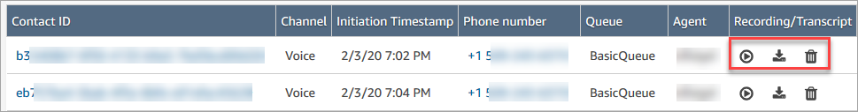
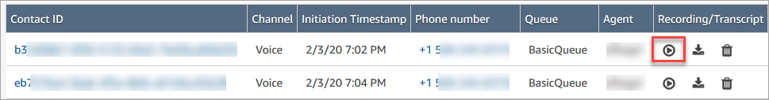
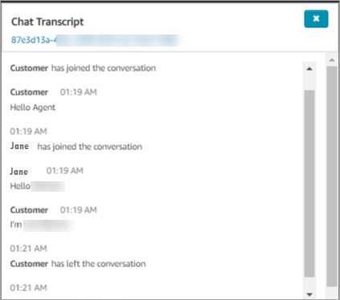
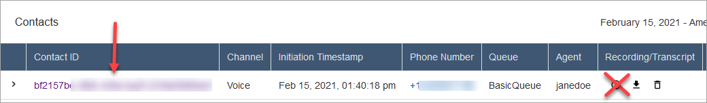
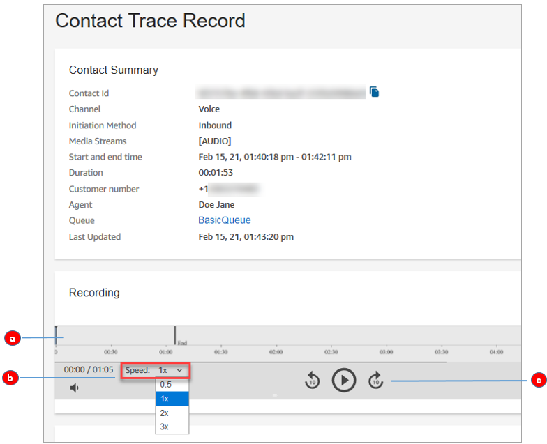
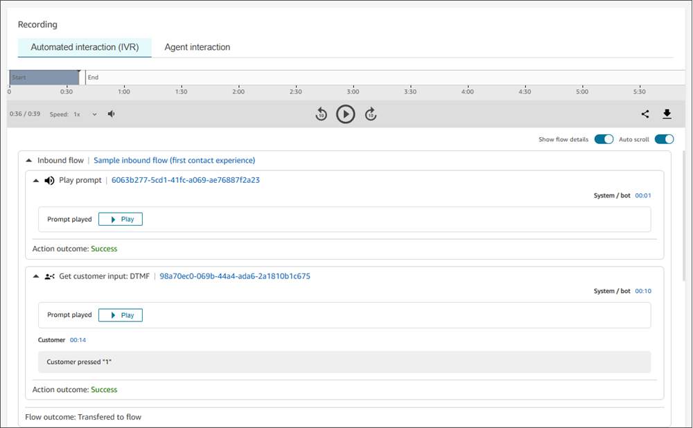
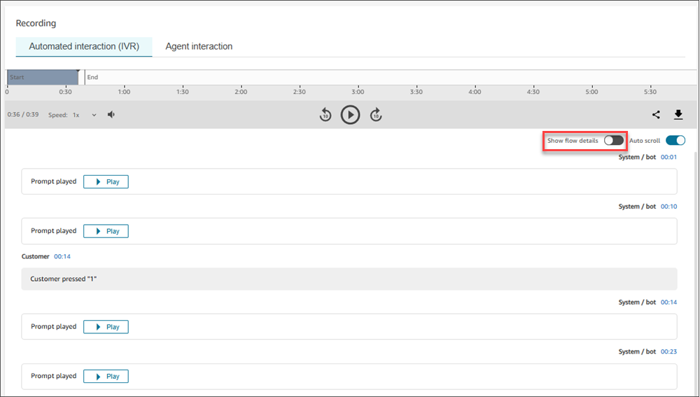

# Review recorded conversations between agents

and customers using Amazon Connect

Managers can review past conversations between agents and customers. To set this up, you
need to [set up recording behavior](set-up-recordings.md "set-up-recordings.md"), assign managers
the appropriate permissions, and then show them how to access the recorded conversations.

**When is a conversation recorded?** For detailed information
about call recording behavior, see [When, what, and where for contact
recordings](about-recording-behavior.md "about-recording-behavior.md").

###### Tip

When call recording is enabled, the recording is placed in your S3 bucket shortly
after the contact is disconnected. Then the recording is available for you to review it
using the steps in this article.

You can also access the recording from the customer's [contact record](sample-ctr.md "sample-ctr.md"). The recording is available in the contact record, however,
only after the contact has left the [After Contact Work
(ACW) state](metrics-agent-status.md#agent-status-acw "metrics-agent-status.md#agent-status-acw").

**How do I manage access to recordings?** Use the
**Call recordings (unredacted)** security profile permission to manage
who can listen to recordings, and access the corresponding URLs that are generated in S3.
For more information about this permission, see [Assign
permissions](assign-permissions-to-review-recordings.md "assign-permissions-to-review-recordings.md").

## Review recordings and transcripts of

past agent conversations

This section covers the steps that a manager takes to review past recordings and
transcripts of past agent conversations. For chat contacts, the same transcript contains
the agent interaction and the automated interaction (for example, with chat
bots).

1. Log in to Amazon Connect with a user account that has that has permissions to access
   [the contact search
   page](contact-search.md#required-permissions-search-contacts "contact-search.md#required-permissions-search-contacts") and to [access recordings](assign-permissions-to-review-recordings.md "assign-permissions-to-review-recordings.md").
2. In Amazon Connect choose **Analytics and optimization**,
   **Contact search**.
3. Filter the list of contacts by date, agent login, phone number, or other
   criteria. Choose **Search**.

###### Tip

We recommend using the **Contact ID** filter to [search for recordings](search-recordings.md "search-recordings.md"). This is the
best way to ensure you get the right recording for the contact. Many
recordings have the same name as the contact ID, but not all. 4. Conversations that were recorded have icons in the
**Recording/Transcript** column, as shown in the following
image. If you don't have the appropriate permissions, you won't see these
icons.

 5. To listen to a recording of a voice conversation, or read the transcript of a
chat, choose the **Play** icon, as shown in the following
image.

 6. If you choose the play icon for a transcript, it appears, as shown in the
following image.

### Pause, rewind, or fast-forward

a recording

Use the following steps to pause, rewind, or fast-forward a voice recording.

1. On the **Contact search** results, instead of choosing
   the **Play** icon, choose the contact ID to open the
   contact record.

 2. On the **Contact record** page, there are more controls
to navigate the recording, as shown in the following image.

    1. Click or tap to the time you want to investigate.
    2. Adjust the playing speed.
    3. Play, pause, skip backwards or forwards in 10 second
     increments.

### Troubleshoot problems

pausing, rewinding, or fast-forwarding

If you are unable to pause, rewind or fast-forward recordings on the **Contact search**
page, one possible reason could be that your network is blocking HTTP range requests.
See [HTTP
range requests](https://developer.mozilla.org/en-US/docs/Web/HTTP/Range_requests " https://developer.mozilla.org/en-US/docs/Web/HTTP/Range_requests") on the MDN Web Docs site. Work with your network
administrator to unblock HTTP range requests.

## Review recordings and transcripts of

automated voice interactions (with IVR and bots)

IVR recordings and logs enable you to monitor and improve your automated experiences
to better resolve the needs of the end-customer and maintain audio and system execution
records of the interaction for compliance purposes. To review automated interaction
(IVR) recordings and logs:

1. Log in to Amazon Connect with a user account that has permissions to access [the contact search
   page](contact-search.md#required-permissions-search-contacts "contact-search.md#required-permissions-search-contacts") and to [access recordings](assign-permissions-to-review-recordings.md "assign-permissions-to-review-recordings.md"). Note that to view information on flow execution,
   you would need permissions to view **Flows** and **Flow
   modules**.
2. On the navigation menu, choose **Analytics and optimization, Contact
   search**.
3. Search for the contact you want to review, e.g. use can search by contact
   queues, the name of the initial flow for the contact, or user-defined [custom contact attributes](search-custom-attributes.md "search-custom-attributes.md").
4. Choose the contact ID to view the **Contact details**
   page.
5. Under **Recording and Transcript** section, select
   **Automated Interaction (IVR)** that will contain an audio
   player that you can use to play the IVR recording, as shown in the following
   image. In this section you can also see the IVR prompts that were played,
   customers response to those prompts, as well as transcripts of Amazon Lex
   interactions.

 6. If you only wish to view the details on the customer interaction (without
seeing additional details on which flow was executed), you can turn off the
**Show flow details** toggle. See image below:

###### Flow blocks available within the automated interaction logs and

transcripts

You can view the following flow blocks within the Amazon Connect UI on the contact details
page;

- [Get customer input](get-customer-input.md "get-customer-input.md")
- [Store customer input](store-customer-input.md "store-customer-input.md")
- [Play prompt](play.md "play.md")
- [Loop prompts](loop-prompts.md "loop-prompts.md")
- [Lamda functions](invoke-lambda-function-block.md "invoke-lambda-function-block.md")

## Pause, rewind, or fast-forward a

recording

Use the following steps to pause, rewind, or fast-forward a voice recording.

1. On the **Contact search** results, instead of choosing the
   **Play** icon, choose the contact ID to open the contact
   record.

 2. On the **Contact record** page, there are more controls to
navigate the recording, as shown in the following image.

    1. Click or tap to the time you want to investigate.
    2. Adjust the playing speed.
    3. Play, pause, skip backwards or forwards in 10 second
     increments.

## Troubleshoot problems

pausing, rewinding, or fast-forwarding

If you are unable to pause, rewind or fast-forward recordings on the **Contact search**
page, one possible reason could be that your network is blocking HTTP range requests.
See [HTTP
range requests](https://developer.mozilla.org/en-US/docs/Web/HTTP/Range_requests " https://developer.mozilla.org/en-US/docs/Web/HTTP/Range_requests") on the MDN Web Docs site. Work with your network
administrator to unblock HTTP range requests.
