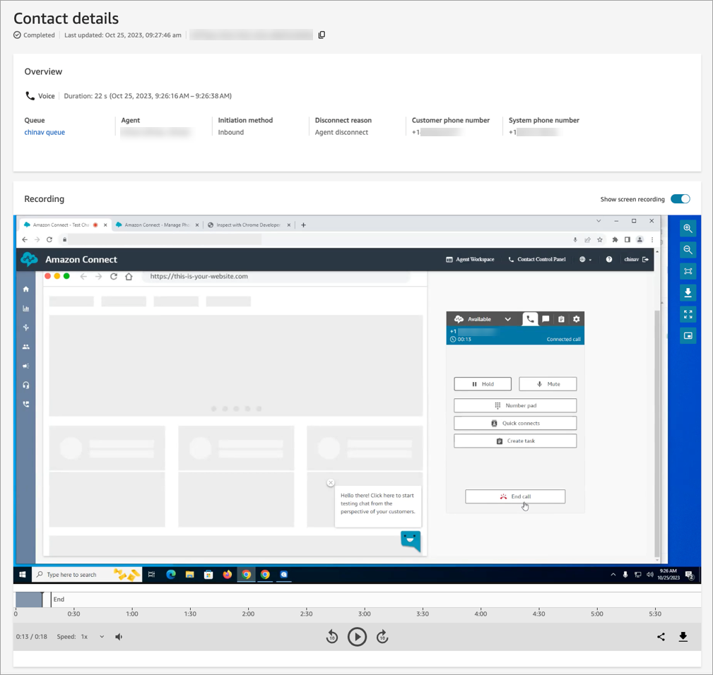
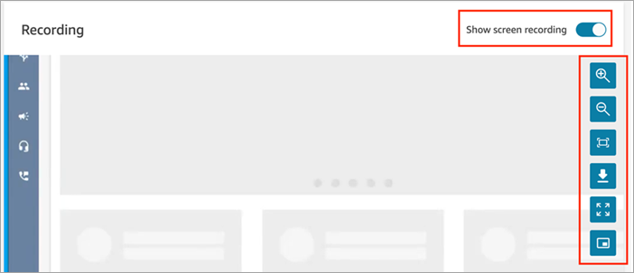
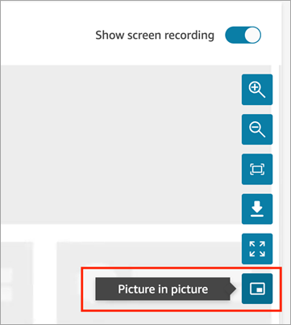
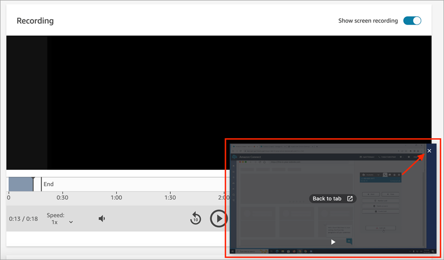

# Review agent screen recordings in the Amazon Connect

Client Application

Use screen recordings to identify areas for agent coaching (for example, long contact
handle duration or non-compliance with business processes) by watching an agent's
actions while they handle a call, chat, or task contact.

The screen recording is synchronized with the voice recording and contact transcript,
so you can hear or read what is being said at the same time.

###### Note

Screen recordings are only available for Completed contacts.

###### Contents

- [Step 1: Assign permissions to review screen
  recordings in the Amazon Connect Client Application](#assign-permissions-sr "#assign-permissions-sr")
- [Step 2: Review screen recordings](#review-sr-2 "#review-sr-2")
- [Watch in Picture-in-picture mode](#picture-in-picture "#picture-in-picture")

## Step 1: Assign permissions to review screen

recordings in the Amazon Connect Client Application

To allow users to review screen recordings, assign the following
**Analytics and optimization** security profile permission:

- **Screen recording - Access**: Allows a user, such as a
  supervisor or Quality Assurance team member, to access and review screen
  recordings.

###### Important

Screen recording merges the screen recording video with the unredacted
call recording file. If users have permission to view screen recordings,
they can listen to the unredacted audio.

- **Screen recording - Enable download button**: Allows a
  user, such as a supervisor or Quality Assurance team member, to view a
  download button on the **Contact details** page to download
  screen recording videos.

For information about how to add more permissions to an existing security profile,
see [Update security profiles in Amazon Connect](update-security-profiles.md "update-security-profiles.md").

## Step 2: Review screen recordings

1. Log in to Amazon Connect with a user account that has the **Analytics and
   optimization** - **Screen recording - Access**
   permission in its security profile.

If you also have **Screen recording - Enable download
button** permission, you can view a button on the
**Contact details** page that enables you to download a
screen recording and view it offline. 2. On the navigation menu, choose **Analytics and
optimization**, **Contact search**. 3. Search for the contact you want to review.

###### Tip

If you've added a custom attribute to your flows to indicate when
screen recording is enabled, you can [search by the custom
attribute](search-custom-attributes.md "search-custom-attributes.md") to locate contact records with screen recordings.
For more information, see [Configuration tips](enable-sr.md#tips-sr "enable-sr.md#tips-sr"). 4. Click or tap the contact ID to view the **Contact
details** page. 5. The **Recording** section contains a video player that
displays the screen recording, as shown in the following image.

###### Important

Screen recording playback in the **Contact details**
page is not supported in the legacy
`https://`your-instance-alias`/awsapps.com`
domain. We recommend using the
`https://`your-instance-alias`.my.connect.aws/`
domain to play screen recordings. For more information, see [Update your Amazon Connect domain](update-your-connect-domain.md "update-your-connect-domain.md") in this guide. 6. Use the right-side controls to zoom in and out, fit the video to the
window, download video, expand to full-screen, and play
picture-in-picture.

 7. If you don't see a video recording, check that the **Show screen
recording** toggle is on.

If no video appears, then the screen recording may not yet be ready (that
is, uploaded into the Amazon S3 bucket). If the problem persists, contact
[AWS Support Center](https://console.aws.amazon.com/support/home#/ "https://console.aws.amazon.com/support/home#/").

## Watch in Picture-in-picture mode

You may want to move the video elsewhere on your monitor while you watch it. For
example, you can reposition the video so you can read the transcript. Use
**Watch in Picture-in-picture** mode to achieve this.

1. Choose the picture-in-picture button on the right side controls, as shown
   in the following image.

 2. Choose the **X** in the top right corner to pop the
window back. The following image shows the video in Picture-in-picture mode,
and the location of the **X** to pop the window back.

