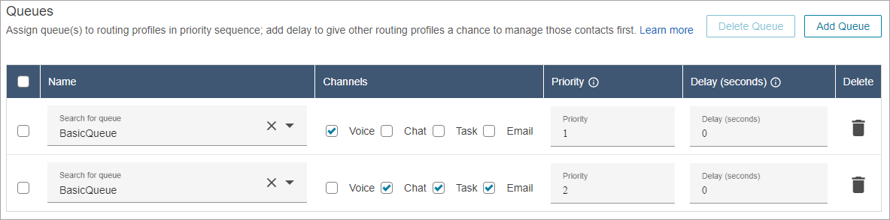
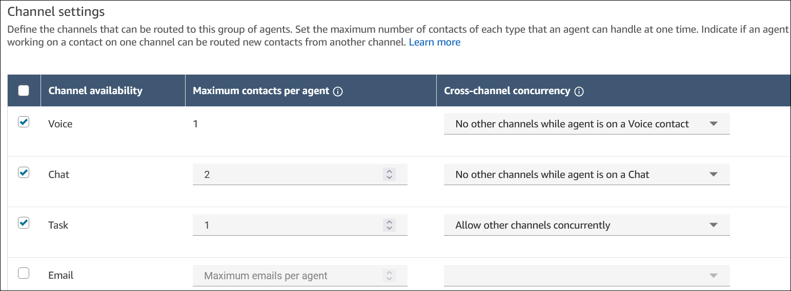

# Create a routing profile in Amazon Connect to link queues to

agents

This topic is for administrators and contact center managers. It explains how to
create routing profiles using the Amazon Connect admin website. For the APIs used to create and manage routing
profiles programmatically, see [APIs to create and manage routing
profiles](#apis-routing-profiles "#apis-routing-profiles").

While queues are a 'waiting area' for contacts, a routing profile links queues to
agents. When you create a routing profile, you specify:

- Channels: Which channels—voice, chat, task, and email—are routed
  to this group of agents; whether to allow channels concurrently.
- Queues: Which queues are in the routing profile; whether one queue should be
  prioritized over another.
  Each agent is assigned to one routing profile. For more information about routing
  profiles and queues, see [How Amazon Connect uses routing profiles](concepts-routing.md "concepts-routing.md").

**How many routing profiles can I create?** To view your
quota of **Routing profiles per instance**, open the Service Quotas console
at [https://console.aws.amazon.com/servicequotas/](https://console.aws.amazon.com/servicequotas/ "https://console.aws.amazon.com/servicequotas/").

###### To create a routing profile

1. On the navigation menu, choose **Users**, **Routing
   profiles**, **Add routing profile**.
2. In the **Routing Profile Details** section, in the
   **Name** box, enter a searchable display name. In the
   **Description** box, enter what the profile is used for.
3. In the **Channel Settings** section, enter or choose the
   following information:

| Item                           | Description                                                                                                                                                                                                                                                                                                                                                                                                                                                                                                                                                                              |
| ------------------------------ | ---------------------------------------------------------------------------------------------------------------------------------------------------------------------------------------------------------------------------------------------------------------------------------------------------------------------------------------------------------------------------------------------------------------------------------------------------------------------------------------------------------------------------------------------------------------------------------------- |
| **Channel availability**       | Choose which types of contacts will be routed to agents who are assigned to this routing profile.                                                                                                                                                                                                                                                                                                                                                                                                                                                                                     |
| **Maximum contacts per agent** | For chat, task, and email channels, specify how many contacts that an agent can handle simultaneously, up to 10. For emails, this field defines how many emails agents can receive, and double that number is how many outbound emails agents can initiate. For example, if you set \*_Maximum contacts per agent_ • to 5, agents can receive up to 5 emails and create up to 10 agent-initiated outbound emails.                                                                                                                                             |
| **Cross-channel concurrency**  | Choose one of the following options: • **No other channels while agent is on `channel`**. For example, while an agent is on a chat, they will not receive a voice contact, email, or a task. • **Allow other channel concurrently**. For example, while an agent is on a voice contact, they can be offered contacts from any other channels enabled in the routing profile, such as chats, emails, and tasks. See [Example of how a contact is routed with cross-channel concurrency](#example-routing-concurrency "#example-routing-concurrency"). |

4. In the **Queues** section, enter the following
   information:

| Item                                                  | Description                                                                                                                                                                                                                                                                                                                                                                                                                                                                                                                         |
| ----------------------------------------------------- | ----------------------------------------------------------------------------------------------------------------------------------------------------------------------------------------------------------------------------------------------------------------------------------------------------------------------------------------------------------------------------------------------------------------------------------------------------------------------------------------------------------------------------------- |
| **Name**                                              | Use the dropdown menu or text field to choose a queue that you've already set up. You can add multiple queues to a routing profile.                                                                                                                                                                                                                                                                                                                                                                                           |
| **Channels**                                          | Choose whether the queue is for chat, voice, email, task, or all of them. ImportantThe channel that you specify here must also be specified in the **Channel Settings** section. If it isn't, contacts from that channel won't be routed to agents.                                                                                                                                                                                                                                                                  |
| **Priority**                                          | Specify the order in which contacts are to be handled for that queue. For example, a contact in a queue with a priority of 2 would be a lower priority than a contact in a queue with a priority of 1.                                                                                                                                                                                                                                                                                                                     |
| **Delay (in seconds)**                                | Enter the minimum amount of time a contact should be in the queue before they are routed to an available agent. To learn more about how Priority and Delay work together, see [Queue priority and delay examples to help you load balance Amazon Connect contacts](concepts-routing-profiles-priority.md "concepts-routing-profiles-priority.md").                                                                                                                                                                   |
| **Default outbound queue**                            | Choose a queue to be associated with outbound calls or emails initiated by the agents. Outbound contacts respect the settings from the default outbound queue, such as caller ID and "From" email address. For more information, see [Create a queue using the Amazon Connect admin website](create-queue.md "create-queue.md").                                                                                                                                                                                           |
| **Set routing order**                                 | By default Amazon Connect routes new contacts to agents that have been in **Available** status the longest. You can customize this behavior, for example, to change the impact that outbound contacts have on the assignment of new inbound contacts.                                                                                                                                                                                                                                                                |
| **Outbound calls should not impact routing order** | Use this setting if you don't want agents who make outbound contacts to move to the bottom of the list for receiving inbound contacts. By default new contacts are routed to the agent who has been in \*_Available_ • status longest. By making an outbound contact, the agent drops to the bottom of the list waiting for inbound contacts. You can use this setting to override that default logic and ensure that agents making outbound contacts still get their fair share of inbound contacts. |

5. Optionally, add tags to identify, organize, search for, filter, and control
   who can access this routing profile. For more information, see [Add tags to resources in Amazon Connect](tagging.md "tagging.md").
6. Choose **Save**.

## Tips for setting up channels and

concurrency

- Use **Channel availability** to toggle on and off whether
  agents assigned to a profile get voice, chat, task, and email
  contacts.

For example, there are 20 queues assigned to a profile. All of the queues
are enabled for voice, chat, task, and email. By removing the
**Voice** option at the routing profile level, you can
stop all voice calls to these agents, across all queues in the profile. When
you want to restart voice contacts for these agents again, select
**Voice**.

- When using **Cross-channel concurrency**, Amazon Connect checks
  which contact to offer the agent as follows:

      1. It checks what contacts/channels the agent is currently
       handling.
      2. Based on what channels they are currently handling, and the
       cross-channel configuration in the agent's routing profile, it
       determines whether the agent can be routed the next contact.
      3. Amazon Connect prioritizes the longest waiting contact if Priority and
       Delay are equal. Even though it's evaluating multiple channels at
       the same time, First-In First-Out is still respected.

  See [Example of how a contact is routed
  with cross-channel concurrency](#example-routing-concurrency "#example-routing-concurrency").

- For each queue in the profile, choose whether it's for voice, chat, task,
  email, or all channels.
- If you want a queue to handle voice, chat, task, and email but want to
  assign a different priority to each channel, add the queue twice. For
  example, in the following image, voice is priority 1 but chat, task, and
  email are priority 2.

## Example of how a contact is routed

with cross-channel concurrency

For example, assume an agent is assigned to the routing profile that has the
channel settings shown in the following image. They can be routed voice, chat, task,
and email contacts. They can receive cross-channel contacts when on tasks.

The agent will experience the following routing behavior:

1. Assume the agent is fully idle. Next, the agent accepts a chat and begins
   working on it. Meanwhile, a task comes into queue.
   - Chat is set to **No other channels allowed**.
   - So even though there is a task in queue, it will not be offered to
     this agent.

2. Next, there is a chat in queue.
   - The agent's maximum chat concurrency is 2, so they are routed
     another chat for total of 2 chats. The agent continues working on
     both of the chats.

3. There are no other chats in queue. The agent finishes both chats (closes
   ACW).
   - There is still a task waiting in queue.
   - At this point, the task is offered to the agent because they are
     fully idle again. The agent begins working the task.

4. Another chat comes into queue.
   - Tasks is set to **Allow other channels
     concurrently**. So, even though the agent is already
     working on a task, they can still be offered the chat.
   - The chat gets routed to the agent, who now works on both the 1
     chat and 1 task concurrently.

5. Now there is a Voice call in queue.
   - The agent is still working on 1 chat and 1 task.
   - Even though **Task** is set to **Allow
     other channels concurrently**, the agent is still
     working on 1 chat, and **Chat** is set to
     **No other channels while agent is on a Chat
     contact**. So, the voice call is not routed to the
     agent. The agent continues working on both the chat and the
     task.

6. The agent completes the chat, but still works on the task.
   - Now, because the only contact still assigned to the agent is a
     task, and **Tasks** are set to **Allow
     other channels concurrently**, this means that the
     agent can be offered the voice call.
   - The agent picks up the voice call and is now working concurrently
     on both the voice call and the task.

7. Now there is another task in queue.
   - The agent is currently working on a voice call AND a task. Once
     again, Amazon Connect checks the cross channel settings and Voice is set to
     **No other channels while agent is on a Voice
     contact**.
   - Because the agent is working on a voice call, they cannot be
     offered any tasks until they are done with the voice call.
   - Also, because **Task** is set to
     **Maximum contacts per agent** is 1, even after
     the agent handles the voice call, they still won't be offered the
     task until they finish their current task.

## APIs to create and manage routing

profiles

Use the following APIs to create and manage routing profiles
programmatically:

- [CreateRoutingProfile](../APIReference/API_CreateRoutingProfile.md "../APIReference/API_CreateRoutingProfile.md")
- [DescribeRoutingProfile](../APIReference/API_DescribeRoutingProfile.md "../APIReference/API_DescribeRoutingProfile.md")
- [UpdateRoutingProfileConcurrency](../APIReference/API_UpdateRoutingProfileConcurrency.md "../APIReference/API_UpdateRoutingProfileConcurrency.md")
- [UpdateRoutingProfileQueues](../APIReference/API_UpdateRoutingProfileQueues.md "../APIReference/API_UpdateRoutingProfileQueues.md")
- [UpdateRoutingProfileDefaultOutboundQueue](../APIReference/API_UpdateRoutingProfileDefaultOutboundQueue.md "../APIReference/API_UpdateRoutingProfileDefaultOutboundQueue.md")
