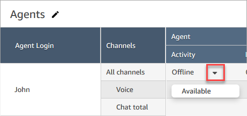
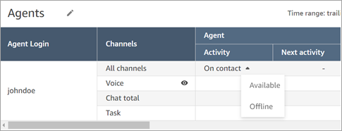
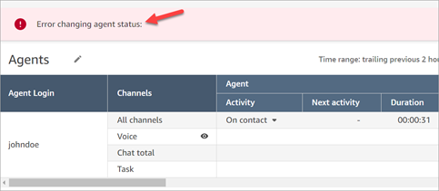
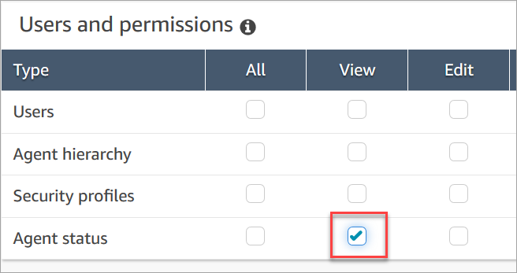
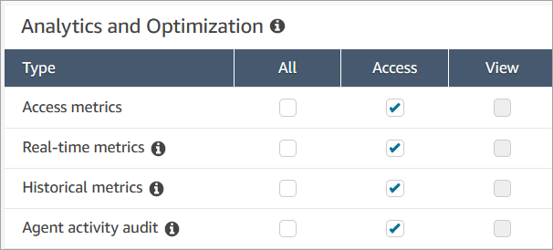

# Change the "Agent activity" status

in a metrics report in the Contact Control Panel (CCP)

Agents manually set their status in the Contact Control Panel (CCP). However, on
the real-time metrics report, managers can manually change the **Agent
Activity** status of an agent. This overrides what the agent has set in
the CCP.

The value that's displayed in the **Agent Activity** column can
be either:

- The agent's availability status, such as **Offline**, **Available**, or
  **Break**.
- The contact state, such as **Incoming** or
  **On contact**.
  When you choose the **Agent Activity** column, you can select and
  change an agent's _availability status_, such as **Offline**, **Available**, or
  **Break**. The following image shows an example
  where only the **Available** status is in the dropdown list of the
  **Activity** column.

This change appears in the agent event stream.

However, when a _contact state_ is displayed in the
**Agent Activity** column, such as
**Incoming** or **On contact**, you cannot
change it to **Available** or **Offline**, for
example, even though those options are displayed in the dropdown menu, as shown in
the following image. This means you can't set the agent's next status while they are
on a contact.

You'll get an error message that says _Error changing agent
status_, as shown in the following image.

###### Note

The Real-time metrics report does not display who changed the agent's
status.

## Required

permissions to change an agent's activity status

For someone such as a manager to be able to change an agent's activity status,
they need to be assigned a security profile that has the following permissions:

- View - Agent Status
- Access metrics

The **Agent status - View** permission is shown in the
following image of the **Users and permissions** section of the
security profile page.

The **Access metrics - Access** permission is shown in the
following image of the **Analytics and Optimization** section
of the security profile page.

