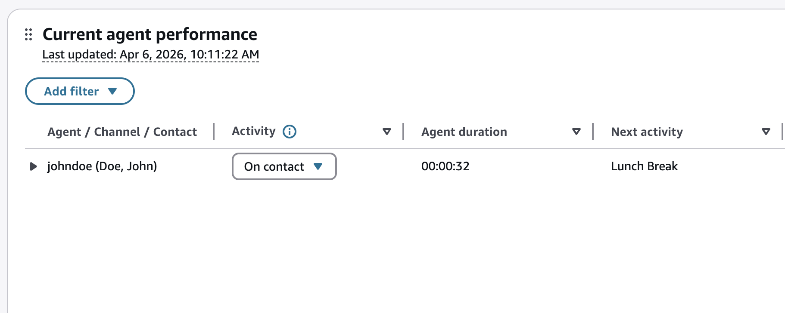
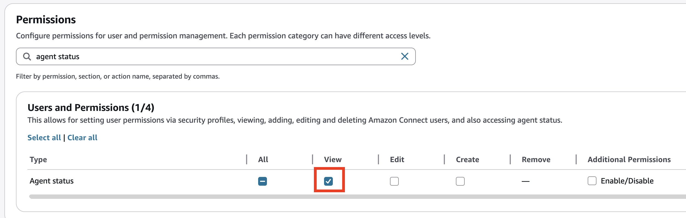

# Change the "Agent activity" status in a metrics report in the Contact Control Panel (CCP)

Agents manually set their status in the Contact Control Panel (CCP). However, on
the real-time metrics report and analytics dashboard, managers can manually change the **Agent
Activity** status of an agent. This overrides what the agent has set in
the CCP.

The value that's displayed in the **Agent Activity** column can
be either:

- The agent's availability status, such as **Offline**, **Available**, or
  **Break**.
- The contact state, such as **Incoming** or
  **On contact**.
  When you choose the **Agent Activity** column, you can select and
  change an agent's _availability status_, such as **Offline**, **Available**, or
  **Break**. The following image shows an example
  where the **Available** and **Offline** statuses,
  along with some custom statuses, are in the dropdown list of the
  **Activity** column. Once the new status is selected, it will be reflected within the
  **Activity** column itself after the update has finished.

This change also appears in the agent event stream.

When a _contact state_ is displayed in the
**Agent Activity** column, such as
**Incoming** or **On contact**, you can
change it to any other availability status and this will be displayed in the
**Next activity** column once the update has finished.

When a manager changes an agent's activity status from **Missed** contact state to an
availability status in the analytics pages, the system behavior differs for single or
multiple contact states:

- **Single-contact state scenario:** If the agent has only
  **Missed** contact states across all channels, the system clears the
  **Missed** status and immediately applies the new availability status.
- **Multi-contact state scenario:** If the agent is currently
  **On Contact/Incoming** on any channel while having
  **Missed** contacts on other channels, the system populates the
  **Next activity** column when the manager selects any status except
  **Available**.

###### Note

The real-time metrics report and analytics dashboards do not display who changed the agent's
status. This is available through [AWS CloudTrail](logging-using-cloudtrail.md "logging-using-cloudtrail.md") by looking at the PutUserStatus API logs.

## Required permissions to change an agent's activity status

For someone such as a manager to be able to change an agent's activity status on the analytics pages,
they need to be assigned a security profile that has the following permission:

- View - Agent Status

The **Agent status - View** permission is shown in the
following image of the **Users and permissions** section of the
security profile page.

