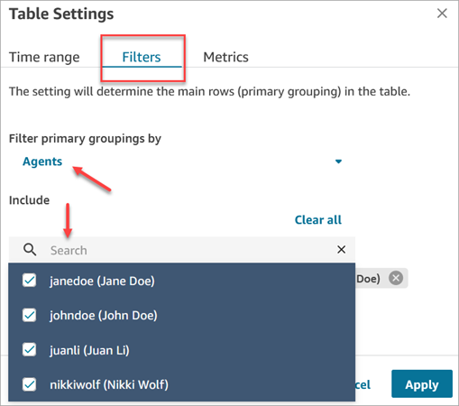
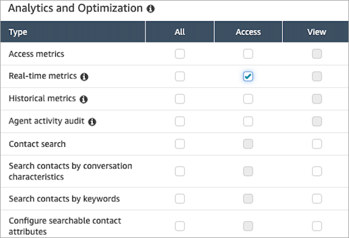
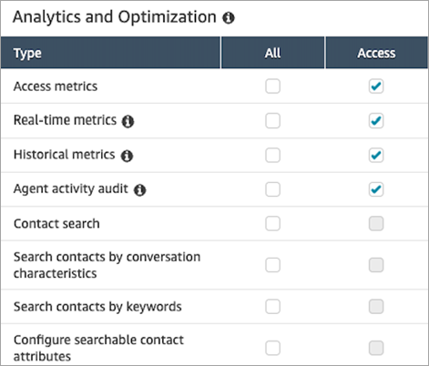
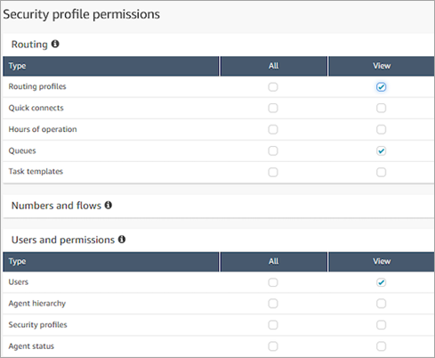
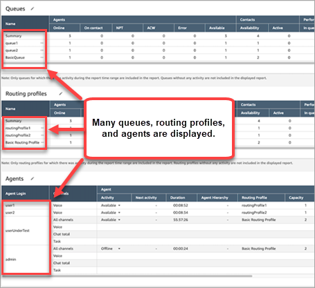
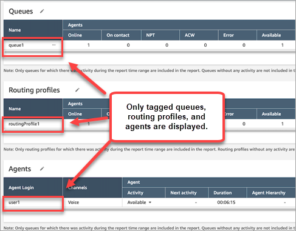

# Real-time metrics tag-based access

control in Amazon Connect

You can use resource tags and access control tags to apply granular access to
users, queues, and routing profiles for real-time metrics. For example, you can
control who has access to view specific users, queues, and routing profiles on the
**Real-time metrics** page.

You can configure tag-based access controls by using the Amazon Connect admin website or the [TagResource](../APIReference/API_TagResource.md "../APIReference/API_TagResource.md") API.

###### Contents

- [Important things to
  know](#rtm-tag-based-access-control-limitations "#rtm-tag-based-access-control-limitations")
- [How to
  enable tag-based access control](#rtm-tag-based-access-control-how-to-enable "#rtm-tag-based-access-control-how-to-enable")
- [How to view hundreds of agents, queues,
  and routing profiles on the real-time metrics report](#view-tag-based-agents "#view-tag-based-agents")
- [How to transition
  to tag-based access control](#rtm-tag-based-access-control-transitioning "#rtm-tag-based-access-control-transitioning")
- [Required security
  profile permissions](#rtm-tag-based-access-control-permissions "#rtm-tag-based-access-control-permissions")
- [Example report with tag-based access
  controls applied](#example-tag-based-results "#example-tag-based-results")

## Important things to

know

- Amazon Connect can display up to 500 resources at a time on a real-time metrics
  table. For example, in an Agents table it can display up to 500 agents
  at a time. In a Queues table it can display up to 500 queues, and so on.
- Very often fewer than 500 agents will appear on a real-time metrics
  table at any given time when tagging is enabled. Here's why:
  - Amazon Connect can return a maximum of 500 agents at a time.
  - When tagging is enabled, Amazon Connect selects the first 500 agents
    who have the appropriate tags, and then displays only those
    agents in that group of 500 **who are
    active** (Online or On Contact). Because not all of
    the 500 tagged agents may be active, it is very likely fewer
    than 500 tagged agents will be displayed in the table.
  - For example, you have 1000 tagged agents. In the first group
    of 500 tagged agents only 50 are online. Amazon Connect selects the first
    500 tagged agents but displays only 50 because they are
    currently active. It does not select the first 500 active
    agents.
  - For instructions that explain how to view the status of
    hundreds of agents when tagging is enabled, see [How to view hundreds of agents, queues,
    and routing profiles on the real-time metrics report](#view-tag-based-agents "#view-tag-based-agents").

- You can filter and group tables only by the primary resource (agent,
  queue, or routing profile). You cannot filter and group tables by
  non-primary resources. For example, you cannot filter by queue in an
  Agent table and you cannot group by queue in a Routing profile
  table.
- The drill-down button is disabled within tables except for
  **View queue graphs**. For example, you cannot
  choose **View agents** in a Queue table.
- Access to the homepage service level dashboard is disabled.
- Access to view **Agent Queues** is disabled.
- The **Agent Adherence** table is not
  supported.

## How to enable

tag-based access control for real-time metrics

1. Apply resource tags, for example, to agents, queues, and routing
   profiles. For a list of which resources support tagging, see [Add tags to resources in Amazon Connect](tagging.md "tagging.md").
2. Apply access control tags. In this step, you need to provide tag
   information in the condition element of an IAM policy. For more
   information, see [Apply tag-based access control in
   Amazon Connect](tag-based-access-control.md "tag-based-access-control.md").

###### Note

You must configure user resource tags and access control tags
before tag-based access control is applied to users for the agent
activity audit report. 3. Assign the required security profile permissions to users who are
going to view the real-time metrics reports with tagging enabled. They
need permissions to access the reports, and permissions to access the
resources. For more information, see [Required security
profile permissions](#rtm-tag-based-access-control-permissions "#rtm-tag-based-access-control-permissions").

## How to view hundreds of agents, queues,

and routing profiles on the real-time metrics report

Amazon Connect displays up to 500 resources at a time on the real-time metrics report.
For agents in particular when tags are applied it's very likely that fewer than
500 agents will be displayed. We recommend the following workaround to view the
status of hundreds of agents, queues, and routing profiles when tags are
applied.

1. Add one table for each group of 500 resources. For example, you have
   2500 agents. You would create 5 Agent tables.
2. For each table, manually filter to add up to 500 resources. For
   example, to add agents to the first table, you would choose to filter by
   **Agents**, and then choose 500 agents to include
   in the table, as shown in the following image. In table 2, add the next
   group of 500 agents, and so on.

 3. You will be able to view the data for all 2500 resources across the 5
tables. When tags are applied to agents, each table will likely display
fewer than 500 agents because not all of them may be active at the same
time.

## How to transition

to tag-based access control

If you open a saved report that contains tables with users, queues, or routing
profiles that you don't have access to anymore due to tag-based access control,
or if groupings or non-primary filters are applied to tables, you won't see data
in those tables.

To view the data, perform one of the following steps:

- Edit your table filters to include the agents, queues, or routing
  profiles that you have access to.
- Create a new report that includes the resources you have access
  to.
- Remove the groupings and non-primary filters from the table.

## Required security

profile permissions

To view real-time metrics reports that have tag-based access controls applied
to them, you need to be assigned to a security profile that has permissions to:

- [Access metrics](#tag-access-permissions "#tag-access-permissions").
- [Access the resources you want to
  view](#tag-access-resources "#tag-access-resources"), such as routing profiles, queues, and agents.

### Permissions to access

metrics

You need one of the following **Analytics and
Optimization** security profile permissions:

- **Access metrics - Access**
- **Real-time metrics - Access**, as shown in the
  following image of the **Analytics and
  Optimization** section of the security profiles
  page.

When you enable **Access metrics - Access**, permissions
are also automatically granted to **Real-time metrics** ,
**Historical metrics**, and **Agent activity
audit**. The following image shows all of these permissions
granted.

###### Note

When users have all of these permissions, they can see all data for
historical metrics for which

tag-based access controls are not currently applied.

### Permissions to access

resources

The following image shows an example of security profile permissions that
grant users the ability to view routing profiles, queues, and Amazon Connect user
accounts. **Routing profiles - View**, **Queues -
View**, and **Users - View** are
selected.

## Example report with tag-based access

controls applied

Without tag-based access controls, all queues, routing profiles, and agents
appear on the **Real-time metrics** page, as shown in the
following image.

With tag-based access controls, a limited set of queues, routing profiles, and
agents appear on the **Real-time metrics** page, as shown in
the following image.

