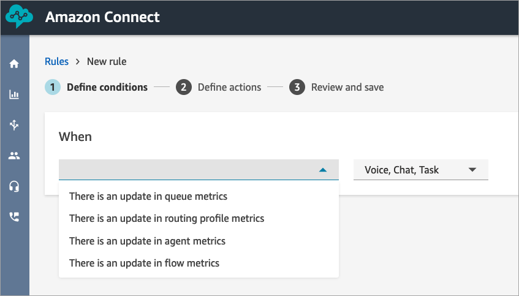
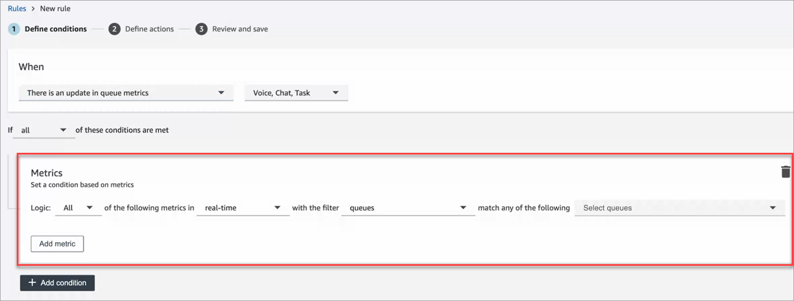
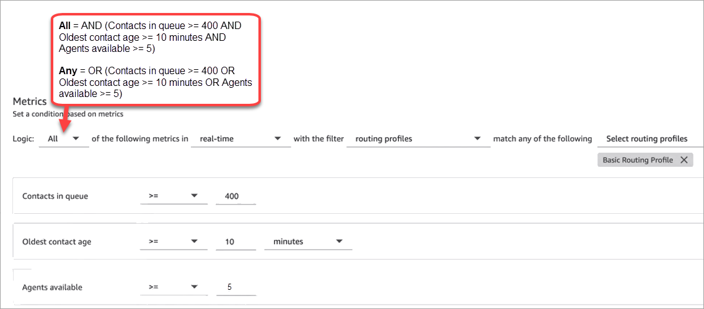
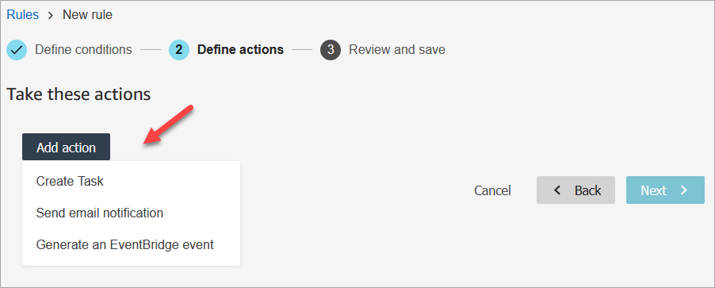
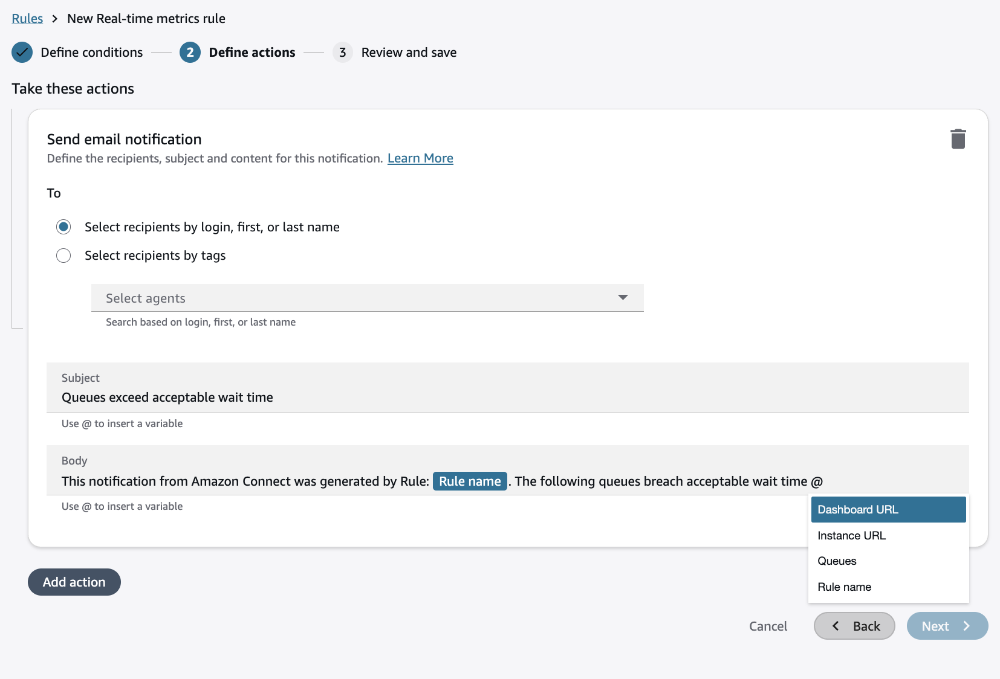

# Create alerts on real-time metrics in

Amazon Connect

You can create rules that automatically send emails or tasks to managers based on
the values of real-time metrics. This enables you to alert managers on contact
center operations that could potentially impact the end-customer experience. For
example, you can set up an alert that sends an email to a manager when one or more
agents on their team have been on break for longer than 30 minutes.

###### Contents

- [Step 1: Define rule
  conditions](#conditions-rtm "#conditions-rtm")
- [Step 2: Define rule
  actions](#rule-actions-rtm2 "#rule-actions-rtm2")

## Step 1: Define rule conditions

1. On the navigation menu, choose **Analytics and
   optimization**, **Rules**.
2. Select **Create a rule**, **Real-time
   metrics**.
3. Under **When**, use the dropdown list to choose from
   the following event sources: **There is an update in queue
   metrics**, **There is in update in routing profile
   metrics**, **There is an update in agent
   metrics**, and **There is an update in flow
   metrics**. These options are shown in the following image.

 4. Choose **Add condition**. The
**Metrics** card is added automatically, as shown
in the following image.

###### Note

    * You can add up to 2 Metrics cards. This enables you to
     create a condition where one card evaluates real-time
     metrics and another evaluates trailing windows of time. For
     example, you may want an alert when several agents on are
     lunch break (Agent activity = Lunch break for 1 hour) and
     Average handle time is greater than 5 minutes.
    * You can add up to 10 metrics to each
     **Metrics** card.

Following are the available real-time metrics you can add, depending
on the event source.

    * **There is an update in queue metrics -
     real-time**

    	+ [Contacts in
    	 queue](metrics-definitions.md#contacts-in-queue "metrics-definitions.md#contacts-in-queue"): Build rules that run when the number
    	 of contacts in a queue is a specified value.
    	+ [Oldest contact
    	 age](metrics-definitions.md#oldest-real-time "metrics-definitions.md#oldest-real-time"): Build rules that run when the oldest
    	 contact in queue reaches a specified age.
    	+ [Agents
    	 available](metrics-definitions.md#available-real-time "metrics-definitions.md#available-real-time"): Build rules that run when the
    	 number of agents available to handle contacts reaches a
    	 specified value.
    The following image shows a condition that is met when
     **Contacts in queue** is greater than or
     equal to 400 AND **Oldest contact agent** is
     greater than or equal to 10 minutes AND **Agents
     available** is greater than or equal to 0, for the
     **Basic Routing Profile**.

    

    To evaluate the condition with OR instead of AND, change the
     **Logic** setting to
     **Any**.
    * **There is an update in queue metrics - trailing
     windows of time**

    Trailing windows of time is the past x minutes or hours.

    	+ [Average handle time](metrics-definitions.md#average-handle-time "metrics-definitions.md#average-handle-time"): Build rules
    	 that run when the average handle time reaches a
    	 specified duration.
    	+ [Average queue answer time](metrics-definitions.md#average-queue-answer-time "metrics-definitions.md#average-queue-answer-time"): Build
    	 rules that run when the average queue answer time
    	 reaches a specified duration.
    	+ [Average agent interaction time](metrics-definitions.md#average-agent-interaction-time "metrics-definitions.md#average-agent-interaction-time"):
    	 Build rules that run when the average interaction time
    	 reaches a specified duration.
    	+ [Average customer hold time](metrics-definitions.md#average-customer-hold-time "metrics-definitions.md#average-customer-hold-time"): Build
    	 rules that run when the average hold time reaches a
    	 specified duration. This metric does not apply to tasks
    	 so the value for them is always 0.
    	+ [Service level](metrics-definitions.md#service-level "metrics-definitions.md#service-level"):
    	 Build rules that run when the service level reaches a
    	 specified percent.
    * **There is in update in routing profile
     metrics**

    Trailing windows is not available for rules based on routing
     profiles.

    	+ [Agents
    	 available](metrics-definitions.md#available-real-time "metrics-definitions.md#available-real-time"): Build rules that run when the
    	 number of agents available to take inbound contacts
    	 reaches a specified value.
    * **There is an update in agent metrics -
     real-time**

    	+ [Agent
    	 activity](metrics-definitions.md#agent-activity-state-real-time "metrics-definitions.md#agent-activity-state-real-time"): Build rules that run when the agent
    	 activity equals a certain value such as Available,
    	 Incoming, On contact, and more.
    * **There is an update in agent metrics - trailing
     windows**

    	+ [Average handle
    	 time](metrics-definitions.md#average-handle-time "metrics-definitions.md#average-handle-time"): Build rules that run when the Average
    	 handle time historical metric reaches a specified
    	 duration.
    	+ [Agent occupancy](metrics-definitions.md#occupancy "metrics-definitions.md#occupancy"):
    	 Build rules that run when the Occupancy historical
    	 metric reaches a specified percent.
    * **There is an update in flow metrics - trailing
     windows of time**

    	+ [Flows started](metrics-definitions.md#flows-started "metrics-definitions.md#flows-started"): Build rules that
    	 run when the flow started count reaches a specified
    	 value.
    	+ [Flows outcome](metrics-definitions.md#flows-outcome "metrics-definitions.md#flows-outcome"): Build rules that
    	 run when the flow outcome count reaches a specified
    	 value for selected flow outcomes.
    	+ [Flows outcome percentage](metrics-definitions.md#flows-outcome-percentage "metrics-definitions.md#flows-outcome-percentage"): Build
    	 rules that run when the flow outcome percentage value
    	 reaches a specified percent for selected flow
    	 outcomes.
    	+ [Average flow time](metrics-definitions.md#average-flow-time "metrics-definitions.md#average-flow-time"): Build rules
    	 that run when the average flow duration reaches a
    	 specified duration for selected flow outcomes.
    	+ [Maximum flow time](metrics-definitions.md#maximum-flow-time "metrics-definitions.md#maximum-flow-time"): Build rules
    	 that run when the maximum flow duration reaches a
    	 specified duration for selected flow outcomes.
    	+ [Minimum flow time](metrics-definitions.md#minimum-flow-time "metrics-definitions.md#minimum-flow-time"): Build rules
    	 that run when the minimum flow duration reaches a
    	 specified duration for selected flow outcomes.

5. Choose **Next**.

## Step 2: Define rule actions

1. Choose **Add action**. You can choose the following
   actions:
   - [Create
     Task](contact-lens-rules-create-task.md "contact-lens-rules-create-task.md")
   - [Send email
     notification](contact-lens-rules-email.md "contact-lens-rules-email.md")
   - [Generate
     an EventBridge event](contact-lens-rules-eventbridge-event.md "contact-lens-rules-eventbridge-event.md"): Use **Metrics Rules
     Matched** for the detail type.

###### Note

You can type @ to include the list of **agents, queues, flows or routing profile** that breached the metrics threshold within the **email** and **task** notifications.
This list is automatically included within **resources** in EventBridge notifications.

 2. Choose **Next**. 3. Review and make any edits, then choose **Save**.
