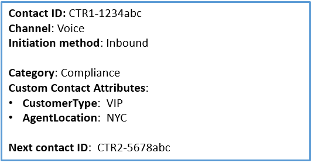
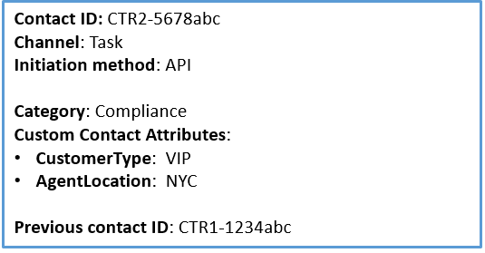

# Design a flow to use contact

attributes in a rule in Contact Lens

You can have up to 5 contact attributes in a rule.

Contact attributes are retrieved at the beginning of the real-time contact
analysis session and whatever is retrieved at that time is used for rule
evaluation during the whole session. Any contact attribute update after the
session started isn't picked up.

You can design flows to use the contact attributes you specify in a rule, and
then route the task accordingly. For example, a call or chat arrives in your
contact center. When Contact Lens analyzes the call or chat, it gets a
hit on the **Compliance** rule. The contact record that's
created for the call, for example, includes information similar to the following
image. It shows the **Category** =
**Compliance**, and it has two custom contact attributes:
**CustomerType** = **VIP**,
**AgentLocation** = **NYC**.

The Rules engine generates a task. The contact record for the task inherits
the contact attributes from the voice contact record, as illustrated in the
following image.

The voice contact record appears as the **Previous contact
ID**.

The flow that you specify in the rule should be designed to use the contact
attributes and route the task to the appropriate owner. For example, you may
want to route tasks where **CustomerType = VIP** to a specific
agent.

For more information, see [Use contact attributes](connect-contact-attributes.md "connect-contact-attributes.md").
