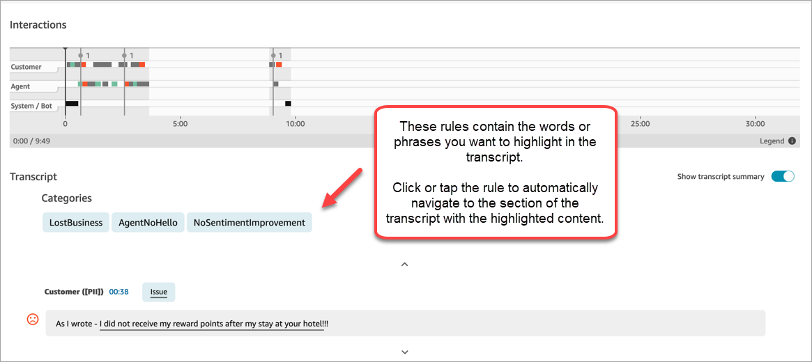
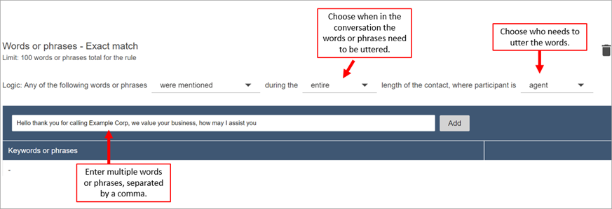
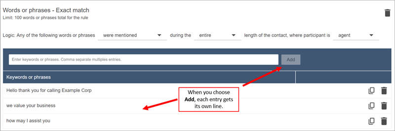
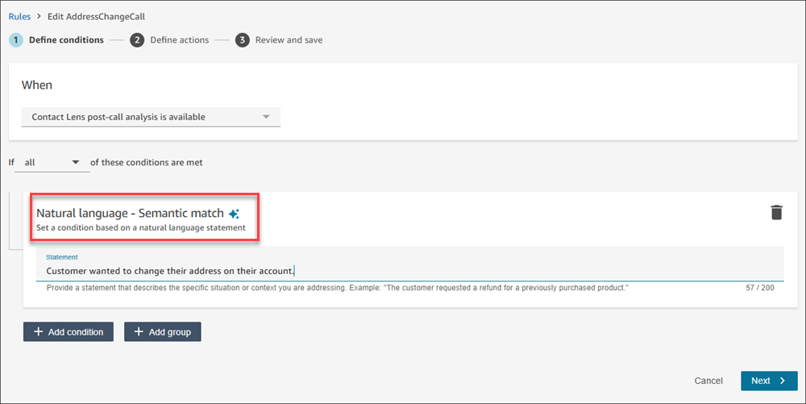

# Automatically categorize contacts by matching

conversations with natural language statements, or specific words and
phrases

Contact Lens conversational analytics enables you to automatically
categorize contacts to identify top drivers, customer experience, and agent
behavior for your contacts. On the **Contact details** page for
a chat, categories appear above the transcript, as shown in the following image.

Following are some of the key things you can do when you categorize
contacts:

- With generative AI-powered contact categorization, you can provide
  criteria to categorize contacts in natural language (for example, did
  the customer try to make a payment on their balance?).
- You can provide specific words or phrases spoken by agents or
  customers to match with a conversation. Contact Lens then
  automatically labels contacts that meet the match criteria, and provides
  relevant points from the conversation.
- You can define actions to receive alerts and generate tasks on
  categorized contacts.
- You can specify additional criteria to categorize contacts, such as
  customer sentiment score, queues, or any custom attributes that you have
  added to contacts, like customer loyalty information.

## When to use words or

phrases

Using specific words or phrases is useful when there is a well-defined
list of words or phrases that you wish to detect, for example, monitoring
agent script adherence or assessing customer interest in a product.

## When to use natural

language

Using natural language statements to match with contacts is useful when
there are too many possible words or phrases or when you want to match with
context-specific criteria, for example, "The customer wanted to make a
change to their subscription plan.", "The agent resolved all of the
customer's issues."

## Add rules to categorize

contacts

In this section:

- [Step 1: Define
  conditions](#add-category-rules-define-conditions "#add-category-rules-define-conditions")
- [Step 2: Define
  actions](#add-category-rules-define-actions "#add-category-rules-define-actions")

### Step 1: Define

conditions

1. Log in to Amazon Connect with a user account that is assigned the
   **CallCenterManager** security profile, or
   that is enabled for **Rules**
   permissions.
2. On the navigation menu, choose **Analytics and
   optimization**, **Rules**.
3. Select **Create a rule**,
   **Conversational analytics**.
4. Assign a name to the rule.
5. Under **When**, use the dropdown list to
   choose **post-call analysis**,
   **real-time analysis**, **post-chat
   analysis** or **real-time chat
   analysis**.

 6. Choose **Add condition**, and then choose the
type of match:

    * **Words or Phrases - Exact Match**:
     Finds contacts that match with the exact words or
     phrases. Enter the words or phrases, separated by a
     comma.
    * **Words or Phrases Pattern Match**:
     Finds contacts by looking for a pattern of words or
     phrases. You can also specify the distance between
     words. For example, if you are looking for contacts
     where the word "credit" was mentioned but you do not
     want to see any mention of the words "credit card," you
     can define a pattern matching category to look for the
     word "credit" that is not within a one-word distance of
     "card."
    * **Natural Language - Semantic
     Match**: Use generative AI to find contacts
     that match the provided natural language statement. The
     statement should be answerable with a yes or no answer.
     Natural language - Semantic match is used when you want
     to match contacts with context-specific criteria or when
     there are too many possible words or phrases for
     matching. The following are examples:

    	+ "The customer wanted to make a change to their
    	 subscription plan."
    	+ "The customer indicated a desire to terminate
    	 their current services."
    	+ "The agent offered multiple payment
    	 options."
    	+ "The agent assured the customer that their
    	 call was important and requested additional
    	 waiting time."
    	+ "The agent resolved all of the customer's
    	 issues."
    ###### Note

    	+ Natural Language - Semantic Match conditions
    	 cannot be used for real-time analysis.
    	+ To create rules that use generative AI
    	 requires an additional permission: **Rules
    	 - Generative AI**.
    **Pro Tip**:Use
     generative AI-powered **Natural language-
     Semantic match** if you previously used
     **Words or Phrases - Semantic
     Match**.
    * **Words or Phrases - Semantic
     Match**: Finds words that may be synonyms. For
     example, if you enter "upset" it can match "not happy,"
     or "hardly acceptable" can match with "unacceptable,"
     and "unsubscribe" can match with "cancel subscription."
     Similarly, it can semantically match phrases. For
     example, "thank you so much for helping me out," "thanks
     a lot and this is so helpful," and "I am so happy that
     you are able to help me."

    This removes the need to define an exhaustive list of
     keywords while creating categories, and provides you the
     ability to cast a wider net for searching similar
     phrases that are important to you. For best semantic
     matching results, provide keywords or phrases with
     similar meaning within a semantic matching card.
     Currently, you can provide a maximum of four keywords
     and phrases per semantic matching card.

7. Using **Words or Phrases - Exact Match** as
   an example, enter the words or phrases, separated by a comma,
   that you want to highlight and choose **Add**.
   Each word or phrase separated by a comma gets its own line in
   the card.

The logic that Contact Lens uses to read these phrases
is: (Hello AND thank AND you AND for AND calling AND Example AND
Corp) OR (we AND value AND your AND business) OR (how AND may
AND I AND assist AND you).

Alternatively, use a **Natural Language - Semantic
Match** condition and enter a natural language
statement in the textbox, that Generative AI should be able to
evaluate as either True or False.

 8. To add more words or phrases, choose **Add group of
words or phrases**. In the following image, the
first group of words or phrases are what the agent might utter,
and the second group is what the customer might utter.

    1. The logic that Contact Lens uses to read these
     phrases is: (Hello AND thank AND you AND for AND calling
     AND Example AND Corp) OR (we AND value AND your AND
     business) OR (how AND may AND I AND assist AND
     you).
    2. The two cards are connected with an AND. This means,
     one of the rows in the first card needs to be uttered
     AND then one of the phrases in the second card needs to
     be uttered.

The logic that Contact Lens uses to read the two cards
of words or phrases is (card 1) AND (card 2). 9. Choose **Add condition** to apply the rules
to:

    * Specific queues
    * When contact attributes have certain values
    * When sentiment scores have certain values

For example, the following image shows a rule that applies
when an agent is working the BasicQueue or Billing and Payments
queues, the customer is for auto insurance, and the agent is
located in Seattle.

### Step 2: Define

actions

In addition to categorizing a contact, you can define what actions
Amazon Connect should take:

1. [Generate
   an EventBridge event](contact-lens-rules-eventbridge-event.md "contact-lens-rules-eventbridge-event.md")
2. [Create
   Task](contact-lens-rules-create-task.md "contact-lens-rules-create-task.md")
3. [Create
   Case](contact-lens-rules-create-case.md "contact-lens-rules-create-case.md")
4. [Send email
   notifications](contact-lens-rules-email.md "contact-lens-rules-email.md")
5. [Create a rule that submits an automated
   evaluation](contact-lens-rules-submit-automated-evaluation.md "contact-lens-rules-submit-automated-evaluation.md")

### Step 3: Review and

save

1. When done, choose **Save**.
2. After you add rules, they are applied to new contacts that occur after the rule was added. Rules are applied when Amazon Connect conversational analytics analyzes conversations.

You cannot apply rules to past, stored conversations.
