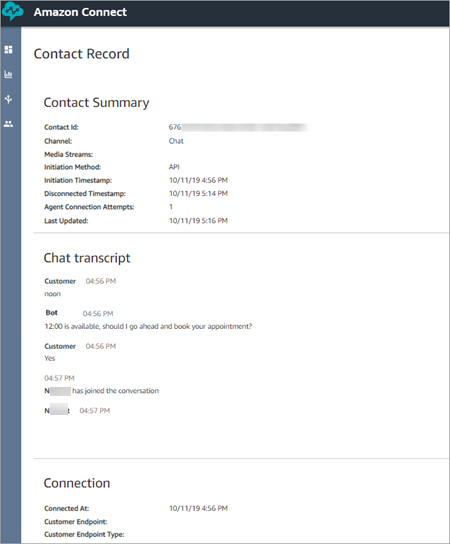

# View a contact record in the Amazon Connect admin website

1. Do a [contact search](contact-search.md "contact-search.md"). A list of contact
   IDs will be returned.
2. Choose an ID to view the contact record for the contact.
   The following image shows part of a contact record in the UI, for a chat conversation.
   Note the following:

- For chats, the initiation method is always **API**.
- The chat transcript is visible in the UI.

