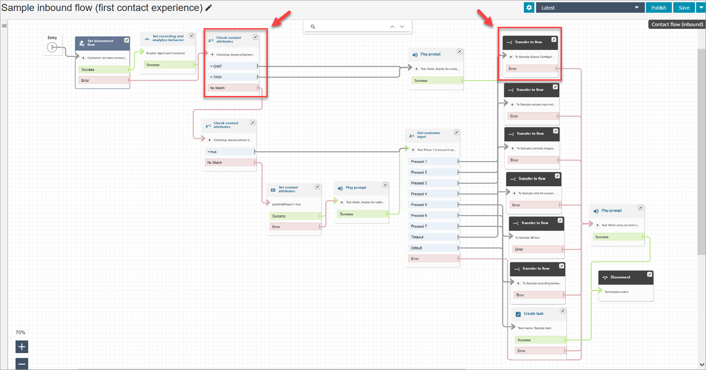

# Sample inbound flow in Amazon Connect for the first contact

experience

###### Note

This topic explains a sample flow that is included with Amazon Connect. For information
about locating the sample flows in your instance, see [Sample flows in Amazon Connect](contact-flow-samples.md "contact-flow-samples.md").

Type: Flow (inbound)

This sample flow is automatically assigned to the phone number that you claimed when
you first set up flows. For more information, see [Get started](amazon-connect-get-started.md "amazon-connect-get-started.md").

It uses the [Check contact
attributes](check-contact-attributes.md "check-contact-attributes.md") block to determine if the contact
is contacting you by phone or chat, or if it is a task, and to route them
accordingly.

- If the channel is chat or task, the contact is transferred to the [Sample queue configurations flow in
  Amazon Connect](sample-queue-configurations.md "sample-queue-configurations.md").
- If the channel is voice, then based on user input the contact is either
  transferred to the other sample flows or a sample follow-up agent task is
  created for this contact.
  The following image shows the sample inbound flow. We recommend viewing the flow in
  the flow designer so you can see the details.

