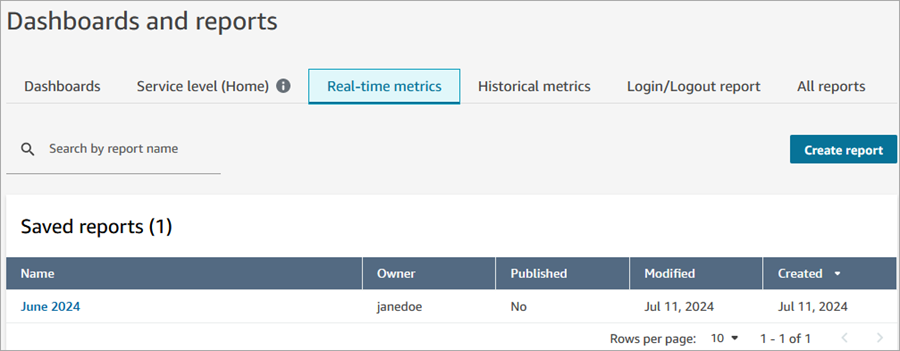
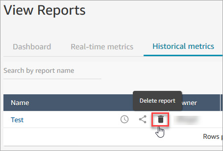

# Save custom reports in Amazon Connect

You can create custom real-time, historical, and login/logout reports that include
only the metrics you're interested in. For instructions, see [Create a real-time metrics report for your
contact center](create-real-time-report.md "create-real-time-report.md") and
[Create a custom historical
metrics report in Amazon Connect](create-historical-metrics-report.md "create-historical-metrics-report.md").

After you create a report, you can:

- [Save](#how-to-save-reports "#how-to-save-reports") the custom report and return
  to it later.
- [Share](share-reports.md "share-reports.md") a link to the custom report so only
  people in your organization who have the link AND who have the [appropriate permissions](view-a-shared-report.md "view-a-shared-report.md") in their
  security profile can access the report.
- [Publish](publish-reports.md "publish-reports.md") the report so everyone in your
  organization who has the [appropriate
  permissions](publish-reports.md#view-published-reports "publish-reports.md#view-published-reports") in their security profile can view the report.

## Personal saved reports count towards

quota

Personal saved reports count towards your service quota of reports per instance.
For example, if you save a report every day, it will count towards your
organization's number of saved reports for the instance.

For more information about quotas, see [Amazon Connect service quotas](amazon-connect-service-limits.md "amazon-connect-service-limits.md").

## Create a naming convention

All saved reports in your Amazon Connect instance must have a unique name. We
recommend creating a naming convention that indicates who the owner of the report
is. For example, use the team name or owner alias as the report suffix: Agent
Performance - _team name_. That way, if the report is published,
others will know who owns it.

If your organization needs to delete reports because you've reached the service
quota for reports for your instance, a naming convention that includes the team or
owner alias will help you track down the report owners to find out if the report is
still needed.

## How to save reports

1. Customize a real-time, historical, or login/logout report to include the
   metrics you want.
2. Choose **Save**. If you don't have permissions in your
   security profile to create reports, this button will be inactive.
3. Assign a unique name to the report.

###### Tip

We recommend establishing a naming convention for reports in your
organization, especially published reports. This will help everyone
identify who the owner is. For example, use the team name or owner alias
as the report suffix: Agent Performance - _team
name_. 4. To view to the saved report at a later time, on the navigation menu,
choose **Analytics and optimization**, **Dashboards
and reports**. 5. Choose **All reports** to search for and view your saved
report, or choose the tab for the type of report you saved. For example, you
can choose **Real-time metrics** to view your saved
real-time metrics reports, as shown in the following image.

## How to delete saved reports

1. Log in to the Amazon Connect admin website at https://`instance name`.my.connect.aws/. Use an Admin account or an account that has **Saved
   reports - Delete** permissions in its security profile.
2. On the navigation menu, choose **Analytics and
   optimization**, **Dashboards and
   reports**.
3. Choose the **Historical metrics** tab.
4. Go to the row that has the report you want to delete, and choose the
   **Delete** icon, as shown in the following image. If
   you don't have permissions in your security profile to delete reports, this
   option won't be available.

