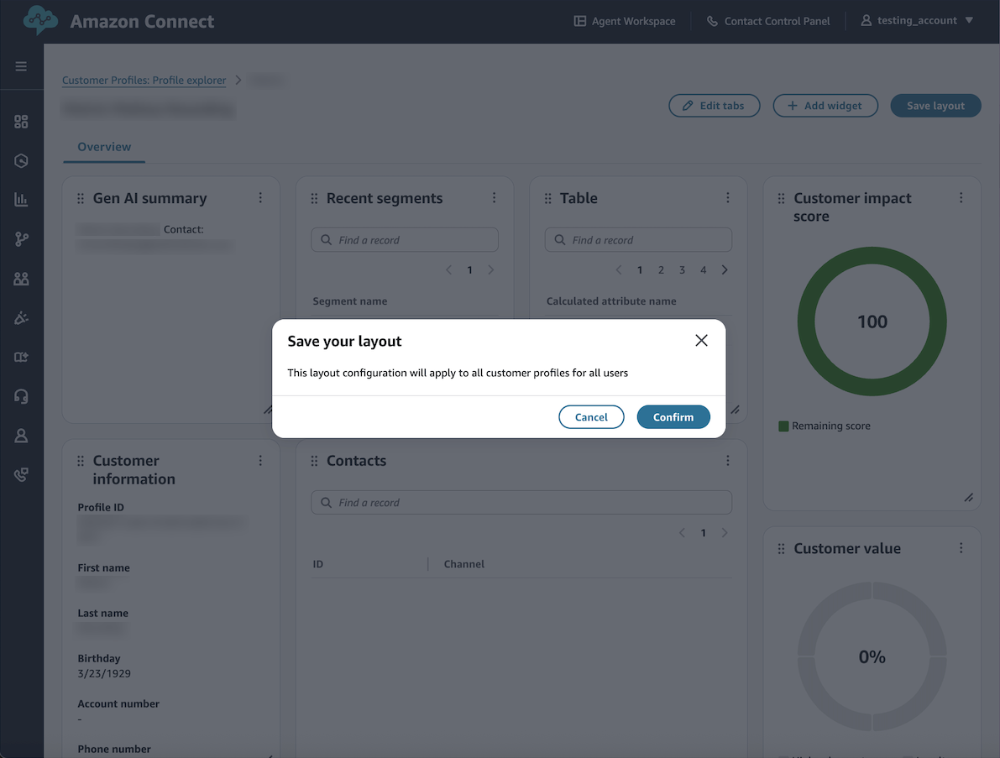

# Save your explorer layout

How to save and manage your Profile explorer layout configurations.

## Layout persistence

Changes made to your Profile explorer layout must be saved to persist. Unsaved
changes will be lost when navigating away from the page or refreshing your
browser.

## Default layout

Each Profile explorer implementation includes one default layout. This serves
as the base configuration for your organization and can be modified as
needed.

## Save changes

To save layout modifications:

1. Choose **Save** in the Layout Actions menu.
2. Confirm your changes in the save dialog.
3. The layout will update for all users upon save completion.

###### Note

The appropriate permissions are needed to save layout changes. For
information about required permissions, see [Enable Profile explorer](enabling-profile-explorer.md "enabling-profile-explorer.md").
