# Scenario and deployment approaches in Connect Customer

Connect Customer offers self-service configuration and enables dynamic, personal, and natural
customer engagement at any scale with a variety of migration and integration options. In
this section, we explain the following scenarios and deployment approaches to consider
when designing a workload for Connect Customer:

- Traditional contact center
- Inbound
- Outbound
- Hybrid contact center
- Legacy contact center migration
- Virtual desktop infrastructure (VDI)

## Traditional contact center

The traditional contact center requires a significant telephony, media,
networking, database, and compute infrastructure footprint that can span multiple
vendors and data center locations to service contacts. Each individual solution and
vendor have unique hardware, software, networking, and architectural requirements
that have to be met while resolving versioning, compatibility, and licensing
conflicts.

It is common to have separate vendors and infrastructure requirements for local
and remote agent hardware and VPN connectivity, Text-To-Speech (TTS), Automatic Call
Distribution (ACD), Interactive Voice Response (IVR), voice audio and data, physical
desk phones, voice recording, voice transcriptions, chat, reporting, database,
Computer Telephony Integration (CTI), Automatic Speech Recognition (ASR), and
Natural Language Understanding (NLP). Your contact center architecture and
infrastructure becomes more complicated when you consider multi-stage development,
quality assurance, and test environments.

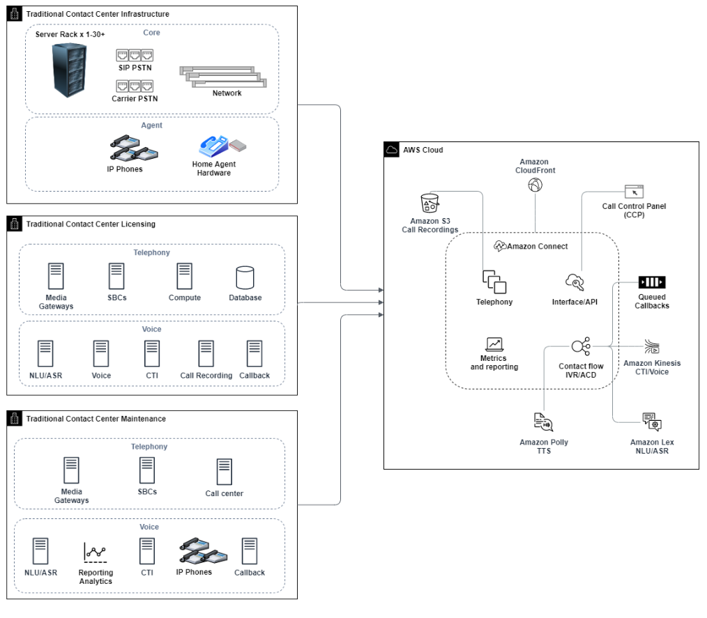

A typical Connect Customer deployment solves or reduces many of the challenges associated
with versioning, compatibility, licensing, contact center telephony infrastructure,
and maintenance. It gives you the flexibility to create instances in new locations
in minutes and migrate components individually, or in parallel, to best meet your
individual business objectives. You can use flows for your IVR/ACD, have voice and
data delivered through a supported web browser to your agent’s softphone, port your
existing phone numbers, redirect softphone audio to an existing desk phone, invoke
an Amazon Lex bot natively within your flow for ASR and NLP, and use the same flow for
chat and voice. You can use Connect Customer Contact Lens to automatically generate voice
transcriptions, perform key word identification and sentiment analysis, and
categorize contacts. For agent CTI data and real-time voice streaming, you can use
Connect Customer Agent Event Streams and Kinesis Video Streams. You can also create multi-stage development,
quality assurance, and test environments at no additional cost and only pay for what
you use.

## Inbound

Inbound is a contact center term used to describe a communication request
initiated by a contact to the center. Contacts can reach your Connect Customer instance for
inbound self-service or to speak with a live agent in a variety of ways, including
voice and chat. Voice contacts go through the PSTN and are routed to the Connect Customer
Instance telephony entry point through the phone number claimed in your instance.
You can reserve a phone number with Connect Customer directly, port your existing phone number,
or forward voice contacts to Connect Customer. Connect Customer can provide local and toll-free numbers in
all Regions where the service is supported.

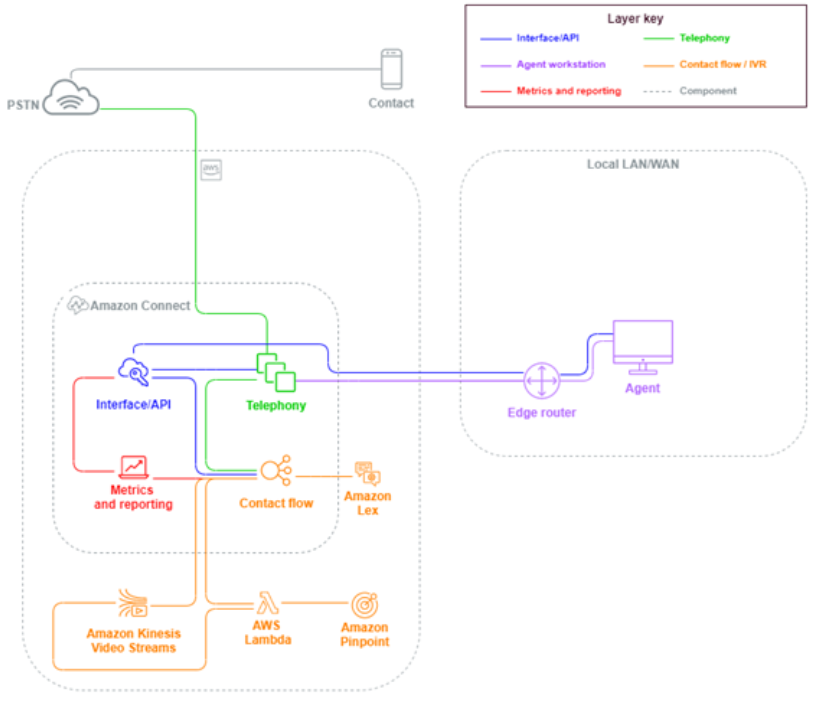

When a phone call is placed to a number claimed in or ported to your Connect Customer
instance, the flow associated with the called number will be invoked. You can define
the flow using flow blocks that can be configured with no coding knowledge required.
The flow determines how the contact should be processed and routed, optionally
prompting the contact for additional information to assist in routing decisions,
storing those attributes to the contact details, and, if necessary, routing that
contact to an agent with all of the call details and transcripts gathered along the
way. Through the flow, you can invoke AWS Lambda functions to query customer
information, call other AWS services like Amazon Pinpoint to send SMS text messages, and use
native AWS service integrations including Amazon Lex for NLU/NLP and
Kinesis Video Streams for real-time streaming of voice calls.

If an inbound contact needs to reach an agent, the contact is put into a queue and
routed to an agent when they change their status to Available, according to your
routing configuration. When the available agent’s contact is accepted manually or
through auto-accept configuration, Connect Customer connects the contact with the agent.

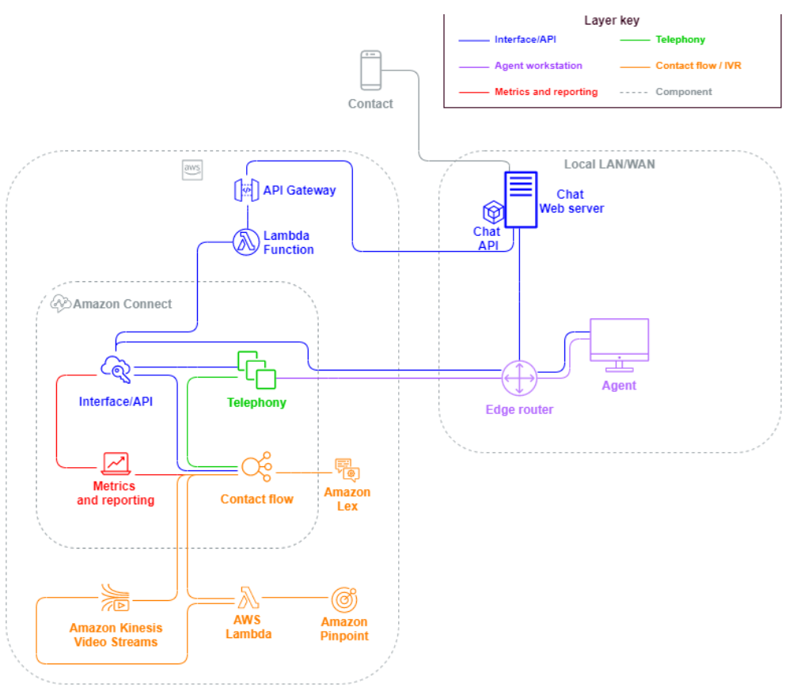

When an inbound contact comes from a browser or mobile app request for a chat
session, the request is routed to a web service or Amazon API Gateway endpoint that calls the
Connect Customer chat API to invoke the flow configured in your request. You can use the same
flows for chat and voice, where the experience is managed and routed dynamically,
based on the logic defined in the flow.

## Outbound

Connect Customer allows you the ability to programmatically make outbound contact attempts to
local and international endpoints, reduce agent set-up time between contacts, and
improve agent productivity. By using the [Connect Customer Streams](https://github.com/aws/amazon-connect-streams "https://github.com/aws/amazon-connect-streams") API
and [StartOutboundVoiceContact](../APIReference/API_StartOutboundVoiceContact.md "../APIReference/API_StartOutboundVoiceContact.md"), you can develop your own outbound solution
or take advantage of existing partner integrations that work with your CRM data to
create dynamic, personalized experiences for your contacts and empowering your
agents with the tools and resources they need to service those contacts.

Outbound campaigns are typically driven by contact data exported from CRMs and
separated into contact lists. Those contacts are prioritized and either delivered to
the agents to initiate after a period of preview or programmatically contacted using
the Connect Customer Outbound API, driven by your flow logic, and connecting to agents as
needed. Typical outbound contact center use cases include fraud and service alerts,
collections, and appointment confirmations.

## Hybrid

If you have requirements to transfer contacts between Connect Customer and legacy contact
center technologies, you can use a Hybrid model architecture to pass contact data
with the transfer. For example, a sales business unit on a legacy contact center
platform may need to transfer a call to the service business unit that’s been
migrated to Connect Customer. Without a Hybrid architecture, call details will be lost and may
require the contact to repeat information. This could increase handle times and may
result in contact calling again for the same purpose.

Hybrid architectures require you to claim as many phone numbers as your expected
maximum concurrent contacts and an intermediary state database accessible by both
Connect Customer and your legacy contact center platform. When a transfer is required to the
other platform, you will use one of these phone numbers as a unique identifier, flag
it as in-use in your intermediary database, insert your contact details, and use
that number as your ANI or DNIS when you transfer the contact. When the contact is
received by the other contact center platform, you will query the intermediary
database for the contact details based on the unique ANI or DNIS you used. Hybrid
architectures are typically used as an interim migration step because of the
additional cost and complexity associated.

### IVR-only

You may choose to use Connect Customer to drive the contact’s IVR experience while your
agent population remains on your legacy contact center platform. With this
approach, you can use Connect Customer flows to drive self-service and routing logic, and,
if necessary, transfer the contact to the target agent or agent queue on your
legacy contact center platform.

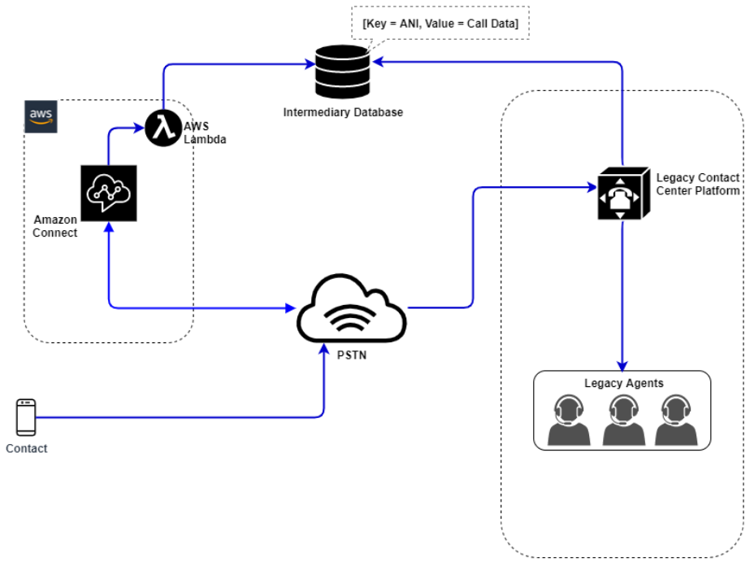

In this diagram, the contact dials a phone number claimed in your Connect Customer
instance for service. If they need to be transferred to an agent on your legacy
contact center platform, an AWS Lambda function is invoked to query an available
unique phone number, flag it as in-use, and write relevant contact details to an
intermediary database. The contact is then transferred to the legacy contact
center platform with the phone number returned from the Lambda function. The
legacy contact center will then perform a query on the intermediary database for
the contact details, route accordingly, and reset the contact data in the
intermediary database, allowing the phone number to be used again.

### Agent-only

With this approach, your legacy contact center IVR drives the contact’s IVR
self-serve and routing logic, and, if necessary, transfers the contact to Connect Customer
to route to your agent population.

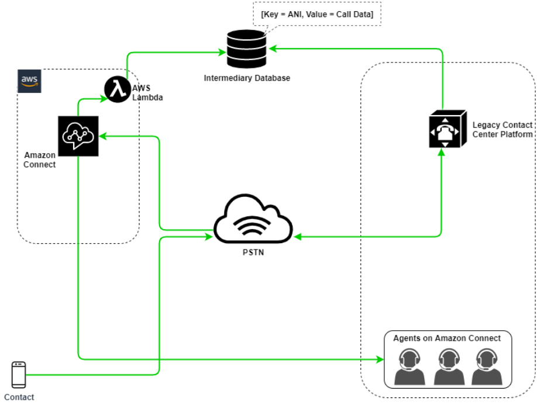

In this diagram, the contact dials a phone number claimed with your legacy
contact center platform. If they need to be transferred to an agent on Connect Customer,
the legacy contact center platform will query an available unique phone number,
flag it as in-use, and write relevant contact details to an intermediary
database. The contact will then be transferred to Connect Customerwith the phone number
returned by the legacy contact center’s query. Connect Customer will then query the contact
details from the intermediary database using AWS Lambda, route accordingly, and
reset the contact data in the intermediary database, allowing the phone number
to be used again.

### Mixed

In this scenario, you may have your IVR and agents operating in parallel on
Connect Customer and your legacy contact center platform to allow for site, agent group, or
line-of-business migrations.

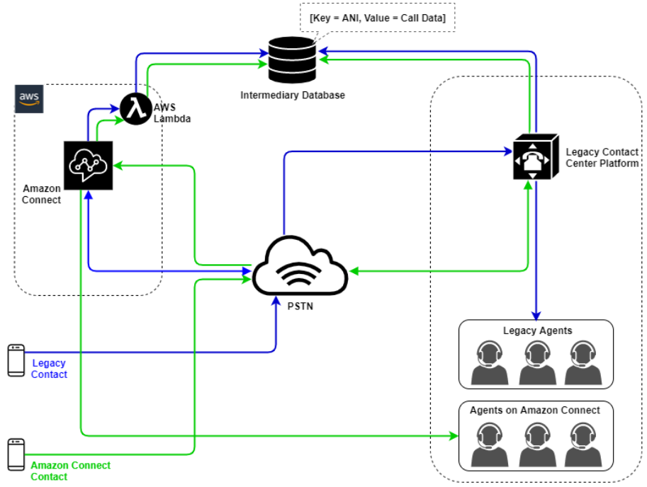

## Legacy contact center migration

When you are evaluating Connect Customer for new or existing workloads, there are several
strategies you can consider. For situations that require contact details to be
included when contacts are transferred between Connect Customer and your legacy contact center
solution, a Hybrid model architecture will be required until the migration is
complete. The approaches described in this section allow you to move specific lines
of business in phases, manage training and support, and mitigate risks associated
with change.

### New workload

You may decrease risk associated with changes to existing business units and
increase flexibility and digital innovation potential by adopting a net new
workload on Connect Customer. Net new workloads that do not require the Hybrid model
architecture are less complex, are not affected by change in business process or
agent routine, and have a faster time to market. Adopting a net new workload
allows you to take advantage of usage-based, pay-as-you-go pricing. Your contact
center resources are available to create a new experience for their end users,
test and implement it to evaluate the platform, gain confidence, and build the
skills and operational mechanisms to prepare for larger migration across
existing workloads.

### IVR First

You may choose to use Connect Customer to drive the contact’s IVR experience while your
agent population remains on your legacy contact center platform. With this
approach, you can use Connect Customer Flows to drive self-service and routing logic, and,
if necessary, transfer the contact to the target agent or agent queue on your
legacy contact center platform.

### IVR Last

With this approach, your legacy contact center IVR drives the contact’s IVR
self-serve and routing logic, and, if necessary, transfers the contact to Connect Customer
to route to your agent population.

### Line of business segmentation

If your lines of business have separate IVRs or don’t require contact
transfers to legacy contact center platforms, you may want to consider a line of
business migration approach. For example, selecting your service desk for
internal support as your first line of business to migrate. After migrating your
service desk IVR and agent population to Connect Customer, you may choose to forward your
existing contact to Connect Customer, porting the endpoint after testing and business
validation is completed.

### Site or agent group segmentation

If your contact center has a global footprint, services contacts from multiple
countries, or is managed independently by a respective geography or location,
you may want to consider a migration approach based on a physical site or
geography of agents. Each agent population and/or geography can have its own
unique requirements and considerations that may not apply globally. Approaching
your migration this way will allow each site or agent group to gain the skills
they need to continue to operate independently before moving onto the
next.

## Virtual desktop infrastructure (VDI)

While you can use the Connect Customer Contact Control Panel (CCP) within Virtual Desktop
Infrastructure (VDI) environments, it will add another layer of complexity to your
solution that warrants separate POC efforts and performance testing to optimize. The
configuration/support/optimization is best handled by your VDI support team and the
following deployment models are the most commonly implemented.

### VDI client with local browser access

You can build a custom CCP with the [Connect Customer Streams](https://github.com/aws/amazon-connect-streams "https://github.com/aws/amazon-connect-streams")
API by creating a CCP with no media for call signaling. This way, the media is
handled on the local desktop using standard CCP, and the signaling and call
controls are handled on the remote connection with the CCP with no media. The
following diagram describes this approach.

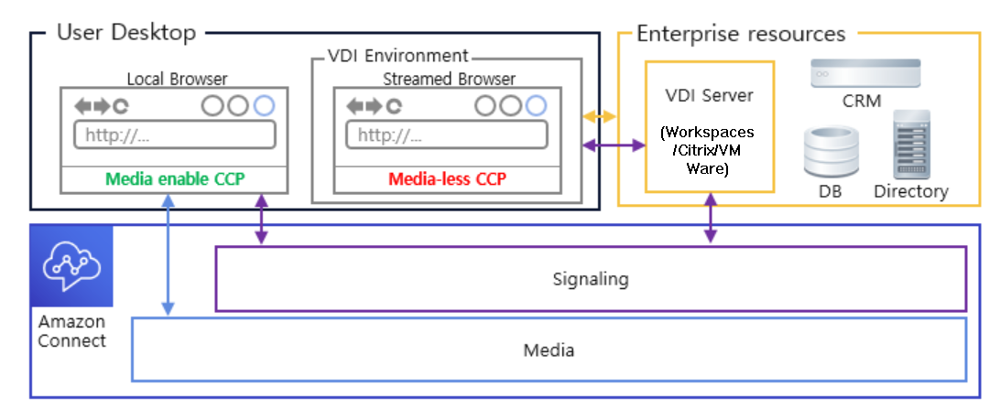

### Citrix VDI with Connect Customer audio optimization

If you use Citrix Virtual Desktop Infrastructure (VDI) environment, you can
build a custom CCP with the Connect Customer RTC JavaScript library which integrates with
Citrix United Communications SDK (ucsdk) and automatically redirects the media
from your local desktop to Connect Customer. This enables your agents to use Citrix VDI
client applications, such as Citrix Workspaces, to connect to their custom agent
applications or custom CCPs. This removes the need to develop and manage a
separate agent application, like dual-CCPs, for audio media redirection for
their Citrix environments. The following diagram describes that approach:

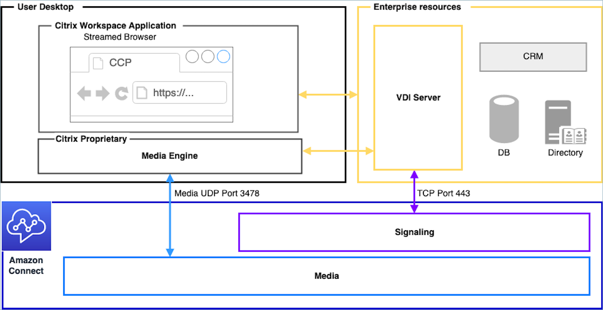

###### Note

This solution requires you to allow WebRTC signaling traffic between your
VDI server and Connect Customer, and the media connection between the agent’s desktop
and Connect Customer. For more information, see the [Set up your network to use the Connect Customer Contact Control Panel (CCP)](ccp-networking.md "ccp-networking.md") documentation.

### Amazon WorkSpaces VDI with Connect Customer audio optimization

By using Amazon WorkSpaces, a Virtual Desktop Infrastructure (VDI) environment, you
have the capability to create a customized Contact Control Panel (CCP) by
using the Connect Customer Real-Time Communications (RTC) JavaScript library. This
library seamlessly integrates with the Amazon WorkSpaces SDK, enabling automatic media
redirection from your local desktop to Connect Customer. This eliminates the need to
develop and manage a separate agent application, such as dual-CCPs, specifically
for audio media redirection within their WorkSpaces environments. The following
diagram illustrates this approach.

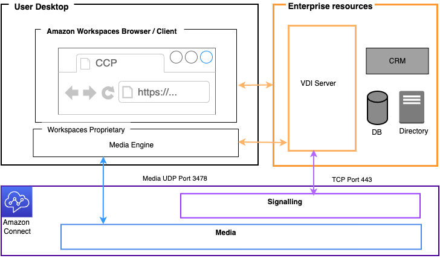

### Omnissa VDI with Connect Customer audio optimization

The Omnissa Virtual Desktop Infrastructure (VDI) solution enables a
streamlined integration with Connect Customer through the implementation of a custom
Contact Control Panel (CCP).

By using the Connect Customer RTC JavaScript library in conjunction with Omnissa's
Horizon WebRTC SDK, audio processing is optimized by redirecting media streams
directly from the agent's local endpoint to Connect Customer. This architecture eliminates
the traditional challenges of audio routing through virtual desktops, providing
agents with a superior voice experience while using their Omnissa VDI
environment. The solution removes the complexity of managing separate audio
redirection applications, offering a single, unified interface for agent
interactions. The following diagram illustrates this architectural
approach.

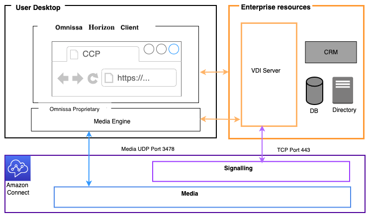

### Azure Virtual Desktop and Windows 365 VDI with Connect Customer audio optimization

If your agents use Azure Virtual Desktop (AVD) or Windows 365 Cloud PC, you can
optimize Connect Customer audio with Microsoft Multimedia Redirection (MMR). This approach
does not require a platform-specific SDK in your CCP. The MMR browser extension
transparently redirects the standard WebRTC
media from the session host to the agent's local device, where it connects
directly to Connect Customer. The agent's local device processes audio instead of the
session host, which reduces network hops and improves audio quality. The
following diagram illustrates this approach.

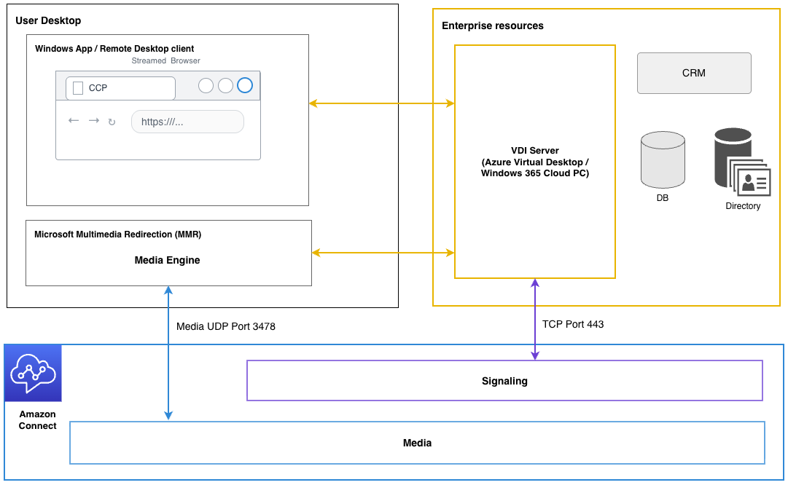

### VDI client without local browser access

Sometimes the VDI client does not have access to a local browser. In this
scenario, you can create a single CCP instance with media run from the VDI
server allowing access to enterprise resources. For this deployment model UDP
audio is usually enabled on the VDI OS. This deployment model requires extensive
testing to calibrate the different VDI server parameters to optimize quality of
experience:

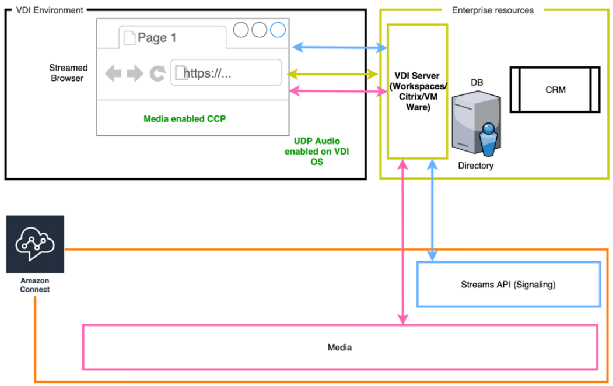
