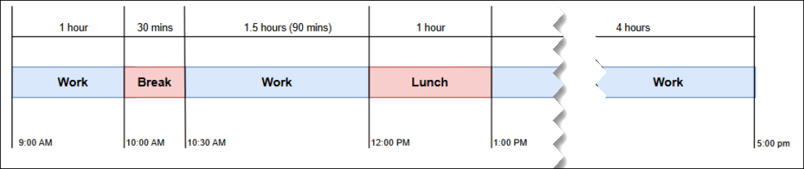

# Examples of adherence thresholds for

agent shifts in Amazon Connect

Assume a shift that starts at 9:00 AM and ends at 5:00 PM with a 30-minute break
and a 1-hour lunch. This arrangement is shown in the following image of the shift
profile.

Also assume that the activities are set up as shown in the following Activity
setup table.

| Activity setup |              | START (Min) | END (Min)   |
| -------------- | ------------ | ----------- | ----------- | ----------- | --------------------------------------------------------------------------------------------------------------------------------------------------------------------------------------------------------------------------------------------------------------------------------------- | ----------- | --------------------------------------------------------------------------------------------------------------------------------------------------------------------------------------------------------------------------------------------------------------------------------------------------------------------------------------------------------------------------------------------------------------------------------------------------------------------------------------------------------------------------------------------------------------------------------------------------------------------------------------------------------------------------------------------------------------------------------------------------------------------------------------------------------------------------------------------------------------------------------------------------------------------------------------------------------------------------------------------------------------------------------------------------------------------------------------------------------------------------------------------------------------------------------------------------------------------------------------------------------------------------------------------------------------------------------------------------------- | ---- | ----------- | --------- |
|                | EARLY        | LATE        | EARLY       | LATE        |
| Work           | 5            | 7           | 10          | 15          |
| Break          | -            | 5           | 5           | -           |
| Lunch          | -            | 10          | 10          | -           | Use Case 1: Agent Group 1 has been set up to use the shift profile shown in the previous image, with no overrides. As a result, agents assigned to Agent Group 1 will have the following tolerances for schedule adherence. Agent Group 1, Adherence thresholds with NO shift overrides |             | START                                                                                                                                                                                                                                                                                                                                                                                                                                                                                                                                                                                                                                                                                                                                                                                                                                                                                                                                                                                                                                                                                                                                                                                                                                                                                                                                                     | END  |
| ---            | ---          | ---         |
|                | EARLY        | AT          | LATE        | EARLY       | AT                                                                                                                                                                                                                                                                                      | LATE        |
| Work           | 8:55 AM      | 9:00 AM     | 9:07 AM     | 9:50 AM     | 10:00 AM                                                                                                                                                                                                                                                                                | 10:15 AM    |
| Break          | -            | 10:00 AM    | 10:05 AM    | 10:25 AM    | 10:30 AM                                                                                                                                                                                                                                                                                | -           |
| Work           | 10:25 AM     | 10:30 AM    | 10:37 AM    | 11:50 AM    | 12:00 PM                                                                                                                                                                                                                                                                                | 12:15 PM    |
| Lunch          | -            | 12:00 PM    | 12:10 PM    | 12:50 PM    | 1:00 PM                                                                                                                                                                                                                                                                                 | -           |
| Work           | 12:55 PM     | 1:00 PM     | 1:07 PM     | 4:50 PM     | 5:00 PM                                                                                                                                                                                                                                                                                 | 5:15 PM     | Use Case 2: Agent Group 2 has been setup to use the shift profile in the previous image, and the administrator has setup a shift profile override as shown in the following table. Agent Group 2, Shift profile is overridden                                                                                                                                                                                                                                                                                                                                                                                                                                                                                                                                                                                                                                                                                                                                                                                                                                                                                                                                                                                                                                                                                                                             |      | START (Min) | END (Min) |
| ---            | ---          | ---         |             |             | EARLY                                                                                                                                                                                                                                                                                   | LATE        | EARLY                                                                                                                                                                                                                                                                                                                                                                                                                                                                                                                                                                                                                                                                                                                                                                                                                                                                                                                                                                                                                                                                                                                                                                                                                                                                                                                                                     | LATE |
| Shift          | 10           | 7           | -           | 10          | As a result of these overrides, agents assigned to Agent Group 2 will have the following tolerances for schedule adherence. Agent Group 2, Adherence thresholds with shift overrides                                                                                                    |             | START                                                                                                                                                                                                                                                                                                                                                                                                                                                                                                                                                                                                                                                                                                                                                                                                                                                                                                                                                                                                                                                                                                                                                                                                                                                                                                                                                     | END  |
| ---            | ---          | ---         |
|                | EARLY        | AT          | LATE        | EARLY       | AT                                                                                                                                                                                                                                                                                      | LATE        |
| Shift          | **8:50 AM**  | **9:00 AM** | **9:07 AM** | **-**       | **5:00 PM**                                                                                                                                                                                                                                                                             | **5:10 PM** |
| Work           | **8:50 AM**  | 9:00 AM     | **9:07 AM** | 9:50 AM     | 10:00 AM                                                                                                                                                                                                                                                                                | 10:15 AM    |
| Break          | **-**        | 10:00 AM    | 10:05 AM    | 10:25 AM    | 10:30 AM                                                                                                                                                                                                                                                                                | -           |
| Work           | 10:25 AM     | 10:30 AM    | 10:37 AM    | 11:50 AM    | 12:00 PM                                                                                                                                                                                                                                                                                | 12:15 PM    |
| Lunch          | -            | 12:00 PM    | 12:10 PM    | 12:50 PM    | 1:00 PM                                                                                                                                                                                                                                                                                 | -           |
| Work           | **12:50 PM** | 1:00 PM     | **1:07 PM** | **4:50 PM** | 5:00 PM                                                                                                                                                                                                                                                                                 | **5:10 PM** | The bold cells are changed due to the override. The cells are overridden because:  • **Shift start:** Originally set to start at 9:00 AM, however, it can start 10 minutes early or 7 minutes late. As a result, for Agent Group 2, the shift can start at: + 8:50 AM (10 minutes early) + 9:07 AM (7 minutes late) + 9:00 AM (set time)  • **Shift end:** Originally set to end at 5:00 PM, however, due to the override setup, it still needs to end at 5:00 PM or it could end 10 minutes later. As a result, for Agent Group 2, the shift needs to end at: + 5:00 PM (as set in the original shift profile) + 5:10 PM (10 minutes late)  • The first and the last activities within the shift are impacted due to the shift profile override in place. This impact is as follows: + **First Activity: Work.** The Work adherence tolerance is overridden by the shift profile override. As a result:  • Start time: Can start early at 8:50 AM or start late at 9:07 AM  • End time: Can use the override at the Agent Group 2 level and end at 5:00 PM or at 5:10 PM + **Last Activity: Work.** The Work adherence tolerance is overridden by the shift profile override. As a result:  • Start time: Can start early at 12:50 PM or start late at 1:07 PM  • End time: Can end 10 mins early at 4:50 PM or end late at 5:10 PM |
