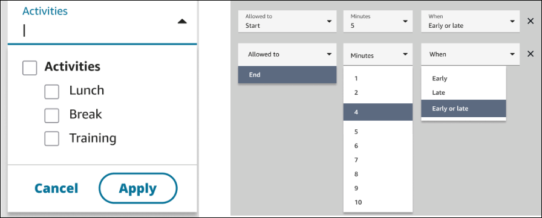
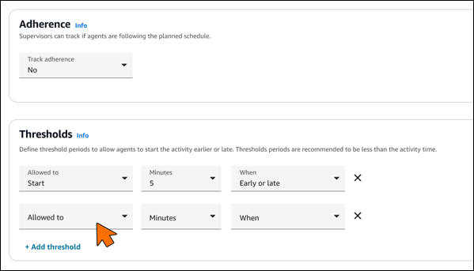
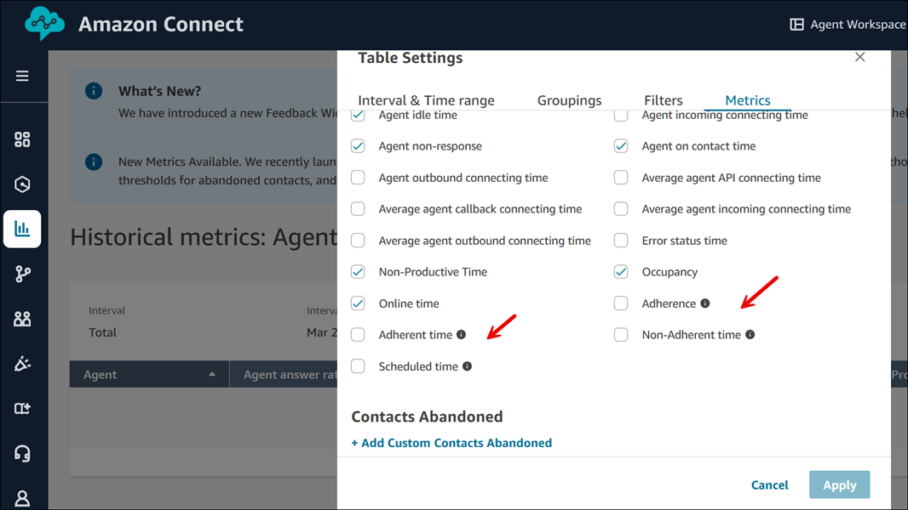
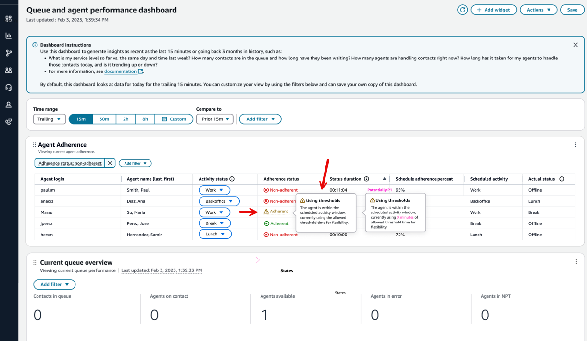

# Schedule Adherence for agent productivity in

Amazon Connect

Contact center supervisors or managers track schedule adherence to understand when
agents are following the schedule that you have created. This helps ensure you achieve
your service level targets, while improving agent productivity and customer
satisfaction.

Before you begin, note the following:

1. Schedule Adherence requires that schedules are created and published. For more
   information, see [Scheduling in Amazon Connect](scheduling.md "scheduling.md").
2. Ensure you have the right permissions to access metrics and scheduling
   information. For more information about the required permissions, see [Assign
   permissions](required-optimization-permissions.md "required-optimization-permissions.md").

###### Contents

- [How adherence is
  determined](#schedule-adherence-determined "#schedule-adherence-determined")
- [Configure adherence
  thresholds](#schedule-adherence-configure "#schedule-adherence-configure")
- [Where you can view schedule
  adherence](#schedule-adherence-view "#schedule-adherence-view")
- [Monitor adherence with
  thresholds](#monitor-adherence-thresholds "#monitor-adherence-thresholds")
- [Schedule adherence
  notifications](#schedule-adherence-notifications "#schedule-adherence-notifications")
- [What happens when
  ....](#schedule-adherence-what-happens "#schedule-adherence-what-happens")
- [Schedule Adherence
  metrics](scheduling-metrics.md "scheduling-metrics.md")
- [Real-time
  Schedule Adherence](definition-real-time-schedule-adherence.md "definition-real-time-schedule-adherence.md")
- [Examples of Agent
  Adherence calculations](calculating-agents-productivity-time.md "calculating-agents-productivity-time.md")
- [Examples of adherence
  thresholds for agent shifts](schedule-adherence-examples.md "schedule-adherence-examples.md")

## How adherence is determined

Amazon Connect begins generating schedule adherence automatically as soon as a published
schedule starts that has shift activities where `Adherence = yes`.

Adherence for a given shift activity is determined using the
**Default** or **Custom** methods.

- The **Default** method uses the Productive/Non-productive
  flag on shift activities.

An agent is considered adherent when they are scheduled for Productive
activities and have the "Available" status, or when they are scheduled for
Non-Productive activities and have the "Offline" status or any custom
status.

For example, when an agent is scheduled for the Productive activity
"Back-office work" and their status in Amazon Connect is "Offline," they are
considered non-adherent to their schedule.

- The **Custom** method enables you to map specific shift
  activities to agent statuses for determining adherence.

An agent is adherent when their current status matches any of the mapped
statuses for their scheduled activity.

For example, if you map the "Back-office work" activity to both the
"Back-office work" and "Offline" statuses, an agent is considered adherent
when they are in either of these statuses during their scheduled
"Back-office work" activity. Any unmapped agent status (such as "Available"
in this example) is considered non-adherent.

If an agent has no schedule, their adherence status will be marked as
"Unscheduled" to indicate the absence of a defined schedule for that time
period.

For examples that show how Adherent and Non-adherent time are calculated, see
[Examples of Agent
Adherence calculations](calculating-agents-productivity-time.md "calculating-agents-productivity-time.md").

You can configure adherence thresholds for individual activities like Break,
Training, and Lunch using the following activity threshold settings:

- **Allowed to:** Choose whether the threshold
  applies to activity Start or End time.
- **Minutes:** Select the threshold duration
  (1-10 minutes).
- **When:** Specify if agents can be Early,
  Late, or Early or late while remaining adherent.

Each activity can have its own threshold configuration to accommodate different
operational needs. For example, you might configure a 5-minute early/late threshold
for breaks to accommodate agents who are finishing customer interactions. The
following two images show these options.

## Configure adherence

thresholds

Complete the following steps to configure activity-based thresholds.

1. In Amazon Connect admin website, navigate to **Schedule Management**,
   **Shift Activities.**
2. Select an activity, and then choose **Edit**.
3. On the **Add shift activity** page, under
   **Adherence**, set **Track adherence**
   to **Yes**.

 4. In the **Thresholds** section, choose **Define
thresholds**. 5. Configure the following options:

    * **Start Early/Late**: How many minutes
     before/after scheduled time an agent can start.
    * **Allowable variance**: Minutes allowed to extend
     or reduce the activity.

### Staffing group

threshold configuration

You can configure specific thresholds for activities within a staffing group.
Complete the following steps.

1. In Amazon Connect admin website, navigate to **Scheduling**,
   **Staffing Groups**.
2. Select a staffing group.
3. Under **Adherence Settings**, you can:
   - Select which activities to override (Break, Training,
     Lunch)
   - Configure specific thresholds for the selected
     activities:
     - **Allowed to**: Start or End
       time
     - **Minutes**: 1-10 minutes
     - **When**: Early, Late, or Early or
       late

   - Apply the changes only to selected activities within the
     staffing group.

You can see which thresholds are active in the **Queue and agent
performance** dashboard's **Using thresholds**
status.

###### Important

- The maximum threshold value is 10 minutes.
- Each activity can have its own threshold settings.
- Thresholds apply to all agents assigned to the staffing
  group.
- Changes to thresholds apply to future adherence calculations
  only.

## Where you can view schedule

adherence

### Real-time and historical metrics

reports

You can view Schedule Adherence metrics on the **Historical
metrics** and **Real-Time metrics** pages. The
Schedule Adherence metrics are:

- [Adherent time](scheduling-metrics.md#adherent-time-hmetric "scheduling-metrics.md#adherent-time-hmetric")
- [Adherence](scheduling-metrics.md#adherence-hmetric "scheduling-metrics.md#adherence-hmetric")
- [Scheduled time](scheduling-metrics.md#scheduled-time-hmetric "scheduling-metrics.md#scheduled-time-hmetric")
- [Non-adherent time](scheduling-metrics.md#non-adherent-time-hmetric "scheduling-metrics.md#non-adherent-time-hmetric")

The following image shows an example of choosing Schedule Adherence metrics to
appear in a historical metrics report.

### Published calendar

view

You can also view schedule adherence data in a calendar view. This view
provides a visual and intuitive representation of adherence breaches by agent
and day, for up to 30 days in the past, alongside their shifts. This
visualization allows you to immediately spot adherence breaches across your
team, prioritize the most critical incidents, compare with past agent behavior,
and take steps to address concerns with the agent. For more information, see
[How supervisors
view published schedules](scheduling-view-schedule-supervisors.md "scheduling-view-schedule-supervisors.md").

The following image shows an example of adherence on a calendar view.

### Queue and agent performance

dashboard

Real-time agent adherence is available in the **Agent
adherence** widget on the [Queue and agent performance
dashboard](queue-performance-dashboard.md "queue-performance-dashboard.md"). This widget provides
detailed agent adherence information that you can filter and sort. It also
provides conditional formatting to help you proactively manage and optimize
workforce performance.

The following image shows an example of the **Agent
adherence** widget. The red highlight is conditional formatting
applied on the **Adherence status duration**.

### Adherence threshold

reports

The **Queue and agent performance** dashboard includes
threshold-specific information:

- Visual indicators for agents operating within thresholds
- Remaining threshold time available
- Threshold utilization percentage
- Option to toggle between strict and threshold-based adherence
  views

Historical reports can display:

- Adherence percentage with and without thresholds
- Time spent within configured thresholds
- Threshold utilization patterns

## Monitor adherence with

thresholds

In the **Queue and agent performance** dashboard, the
**Agent Adherence** widget shows how agents are performing
against configured thresholds:

- The **Adherence status** column shows:
  - Non-adherent (red indicator)
  - Using thresholds (yellow warning icon) - indicates the agent is
    operating within configured threshold windows
  - Adherent (green indicator)

- The **Status duration** column shows how long an agent
  has been in their current adherence state.
- The **Schedule adherence percent** shows the adherence
  calculation taking thresholds into account.

You can hover over the **Using thresholds** indicator to see
details about the threshold being used.

The following image shows an example **Queue and agent
performance** dashboard, with an **Adherent** status,
and the **Using thresholds** message. One message is general, the
other message shows X minutes as a placeholder for what would be your adherence
threshold.

## Set up schedule adherence

notifications

You can use Contact Lens rules to configure notifications to be sent when
agents are out of adherence.

1.  In the Amazon Connect admin website, navigate to **Analytics and Optimization**,
    **Contact Lens**,
    **Rules**, and then choose **Create a
    rule**, **Real-time metrics**.
2.  For **When**, choose **There is an update in
    agent metrics** from the dropdown list.
3.  Select **Trailing window of time** and then select the
    following metric:

        * Adherence: >= or <= X%
        * Non-adherent time: >= or <= X seconds

    For example, in trailing 15 minutes, if adherence for a certain group of
    agents is <= 80%, then take one of these actions: **Create a
    task**, **Generate EventBridge event**, or
    **Send email**.

4.  Choose **Next**.
5.  Specify the action to take, choose **Next**, and then
    choose **Save**.

For more information about creating rules, see [Create alerts on real-time
metrics](rule-real-time-metrics.md "rule-real-time-metrics.md").

## What happens when ....

- **An agent starts working before their schedule
  starts**

If an agent does not have a schedule, their adherence status will be
marked as "Unscheduled" to indicate the absence of a defined schedule for
that time. This means that if an agent starts working 5 minutes before or 5
minutes after their schedule, it will not count against their adherence.
However, if they decide to leave work 5 minutes early because they started 5
minutes early, they would be considered non-adherent for that 5 minute
interval.

- **An agent flips to offline when they are supposed to
  be a non-productive state**

This would be considered non-adherent because the agent state is offline,
rather than Non-Productive Time.

- **An agent leaves training to answer contacts because
  of high contact volume**

In this scenario, the agent would be marked as non-adherent. However, if
leaving training is intended, you can adjust the schedule retroactively and
adherence will be re-calculated with the new shift.

- **A historical schedule is changed**

If an agent's schedule is changed within the last 30 days from the current
date (not the date of the schedule), adherence is re-calculated with the new
schedule. This allows you to make real-time adjustments to an agent's shift
and correctly evaluate their adherence.

- **An agent starts an activity within the configured
  threshold**
  - The agent is considered adherent.
  - Their status shows **Using thresholds** in the
    dashboard.
  - The time spent within the threshold counts as adherent
    time.
  - The adherence percentage calculation includes time within
    configured thresholds.
