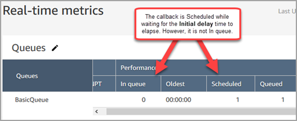
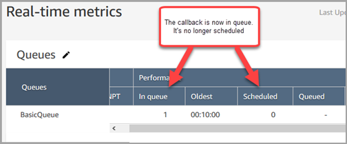
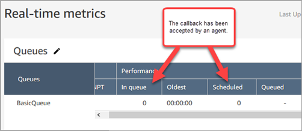

# How Initial delay affects Scheduled and In

queue metrics in Amazon Connect

In the [Transfer to queue](transfer-to-queue.md "transfer-to-queue.md") block, the
**Initial delay** property affects when a callback is put in
queue. For example, assume **Initial delay** is set to 30 seconds.
Here's what appears in your real-time metrics report:

1. After 20 seconds, the callback has already been created, but it is not yet
   in queue because of the **Initial delay** setting. In the
   following image of the **Real-time metrics** page,
   **In queue** = 0 and **Scheduled** =
1.

 2. After 35 seconds, the callback contact has been placed in queue. In the
following image, the callback is now **In queue**. It is no
longer scheduled.

 3. Assume that after 40 seconds, an agent accepts the callback. The
**In queue** column = 0, the
**Scheduled** column = 0.

