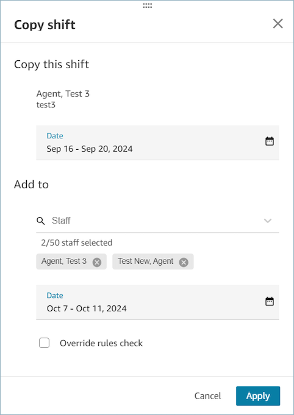

# Copy agent shifts

Contact center managers, supervisors, and schedulers can copy shifts from one
agent to another agent or to that same agent. They can copy shifts one day at a time
or multiple days at a time. For example, copy the schedule for agent A for this week
to next week, or copy agent A's schedule for the next two weeks to agent B.

###### Complete the following steps to copy shifts

1. Log in to the Amazon Connect admin website with an account that has security profile permissions
   for **Scheduling**, **Schedule manager -
   Edit**.

For more information, see [Assign
permissions](required-optimization-permissions.md "required-optimization-permissions.md"). 2. On the Amazon Connect admin website, on the navigation menu, choose **Analytics and
optimization**, **Scheduling**, and then
select the **Published scheduled calendar** tab. 3. Select the shift that you would like to copy and choose **Copy
shift**. This will open the **Copy shift**
screen. You can copy shifts from either the day view or week view. 4. In the **Copy this shift** section, select a single date
or a date range (up to 14 days) that you would like to copy from. 5. In the **Add to** section, select the agents (up to 50
agents) you would like to copy the shift to. 6. In the **Add to** section, select a single date or date
range to copy to. Ensure that the number of days selected in **Copy
from** matches the number of days selected in **Copy
to**. 7. Choose **Apply** and then
**Confirm**. 8. Select **Override rules check** if you want the system to
ignore rules such as minimum and maximum working hours. If unselected,
copying the shift will fail for agents on specific dates where rule
violations occur and you will be able to review the list of errors after
choosing **Confirm**.

###### Note

- Time-off, Overtime, and, Voluntary time-off are not copied.
- If one or more agents in **Copy To** have Time-off,
  Overtime, or, Voluntary time-off, copy will fail on those specific days.
  **Override rules check** does not override these
  validations.

