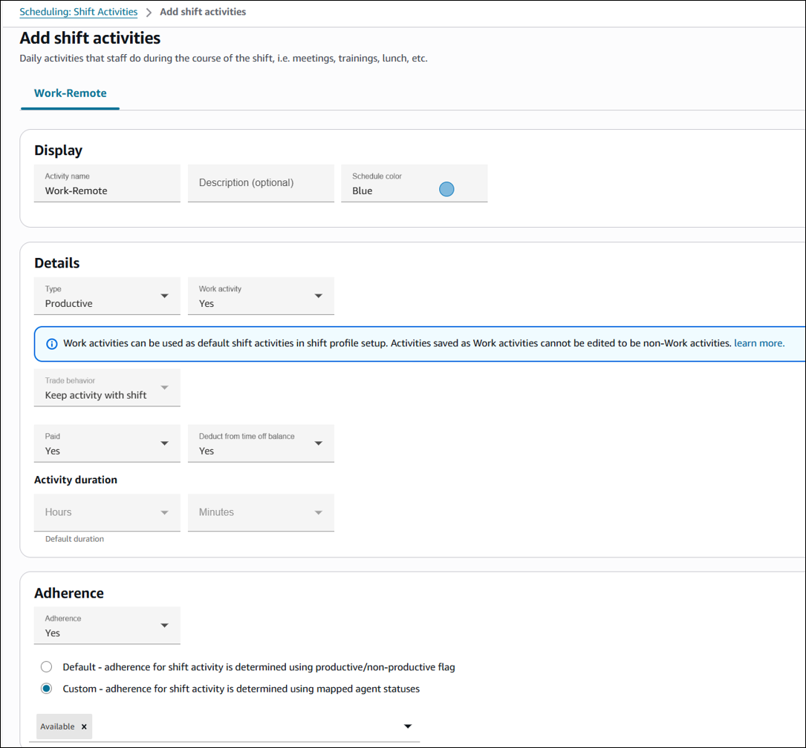

# Create daily activities in

Amazon Connect for an agent's shift in your contact center

Shift activities are daily activities that the staff (agents) does during their
shift. For example:

- **Productive**: At work activities that agents do that
  are counted as productive work, such as answering contacts.
- **Non-Productive**: At work activities that agents do
  that are not counted as productive work, such as breaks and team
  meetings.
- **Time off**: Absent from work. Their status in the agent
  application is **Offline**.
  You can create multiple shift activities to include as part of your staff
  shifts.

1. Log in to the Amazon Connect admin website with an account that has security profile permissions
   for **Scheduling**, **Schedule manager -
   Edit**.

For more information, see [Assign
permissions](required-optimization-permissions.md "required-optimization-permissions.md"). 2. On the Amazon Connect navigation menu, select **Analytics and
optimization**, **Scheduling**. 3. On the **Scheduling** page, choose the **Shift
Activities** tab, and then choose **Add shift
activities**. The following image is an example **Add
shift activities** page.

 4. Complete the following details on the page.

    * **Activity name**: Name of the
     activity
    * **Description (Optional)**:
     Additional information on the activity
    * **Schedule color**: Choose the color
     you want this activity to appear in supervisor and agent view of
     schedules. By default Light blue is the first option. Click inside
     the box to see other options.

    The color you choose appears in both the draft and published
     versions of the schedule.
    * **Type**: Select if this activity is
     of type Productive, Non-productive, or Time off

    	+ **Productive**: Use this type
    	 for activities that represent time spent by agents doing
    	 productive work such as handling contacts in Amazon Connect, or
    	 working on tasks in another system.
    	+ **Non-productive**: Use this
    	 type for activities that represent time spent by agents on
    	 activities such as meetings, training, 1:1s, etc.
    	+ **Time off**: Use this for
    	 activities that agents and supervisors use for creating
    	 time-off requests such as PTO, sick leave, leave of absence,
    	 etc.
    * **Sub-type**

    	+ **If non-productive: Break or
    	 meal**: Set this subtype for breaks, lunches or
    	 meal activities. This option is available only for
    	 Non-Productive activity types. This setting allows automated
    	 break or meal time adjustments when time offs or overtimes
    	 are added or removed from staff shifts, to comply with the
    	 break rules configured in the Staffing Group and Shift
    	 Profiles.
    	+ **Time off: Staff
    	 Requestable**: Set to **Yes**
    	 to allow agents to see and pick the respective time off
    	 activity during time off creation. Set to
    	 **No** for time off activities that can
    	 be requested only by supervisors on behalf of an
    	 agent.
    * **Work activity**: This option is
     available only for productive activities. Select
     **Yes** if this activity represents agents
     scheduled for this activity are working towards forecasted demand in
     Amazon Connect.

    ###### Note

    	+ Existing activities cannot be changed to a work
    	 activity.
    	+ An activity saved as work activity cannot be changed
    	 back to non-work activity.
    	+ When editing agent schedules, you can replace a work
    	 activity with another work activity for the entire
    	 shift.
    * **Trade behavior**: This option
     controls how [shift exchange](shift-exchange.md "shift-exchange.md")
     works for the shift activity. Choose one of the following
     values:

    	+ **Do not trade shift**: This is the
    	 default. Choose this option to block trades if this shift
    	 activity exists.
    	+ **Keep activity with shift**: Choose this
    	 option to move the activity together with the shift.
    	+ **Remove from shift**: Choose this option
    	 to remove the activity from the shift.
    ###### Important

    For work activities, the default configuration is
     **Keep activity with shift**.
    * **Paid**: Yes/No
    * **Deduct from time-off balance**:
     Select **Yes** if this activity should be deducted
     from the agent's time-off balance. Otherwise choose
     **No**.

    For example, an agent requests an all day time-off on July 31.
     They have an 8 hour shift on that day and have this activity in
     their shift for 30 minutes.

    	+ If this field is set to **Yes**, the 8
    	 hours will be deducted from agent's time-off balance.
    	+ If it's set as **No**, then 7 hours and
    	 30 minutes will be deducted from agent's time-off
    	 balance.
    * **Default duration**: Select default
     duration for this activity. Not applicable for work
     activities.
    * **Adherence**: The following options
     are enabled when **Adherence** =
     **Yes**:

    	+ **Default**: Determines adherence using
    	 the productive/non-productive flag.
    	+ **Custom**: Enables an additional
    	 dropdown for mapping shift activity to specific agent
    	 statuses.
    The [Adherence](scheduling-metrics.md#adherence-hmetric "scheduling-metrics.md#adherence-hmetric") metric is not calculated
     when you set **Adherence** to
     **No**.

    For more information about these options, see [Schedule Adherence](schedule-adherence.md "schedule-adherence.md").

5. If desired, add another activity.
6. Choose **Save**.
7. The next time a schedule is created as part of the scheduling cycle, the
   shift activities are applied.

###### Tip

Create shift profiles to ensure the desired sequence of the shift activities.
For example, to schedule agents to go on their break two hours before lunch. For
instructions, see [Create a template for an agent's
weekly shift in Amazon Connect](scheduling-create-shift-profiles.md "scheduling-create-shift-profiles.md").
