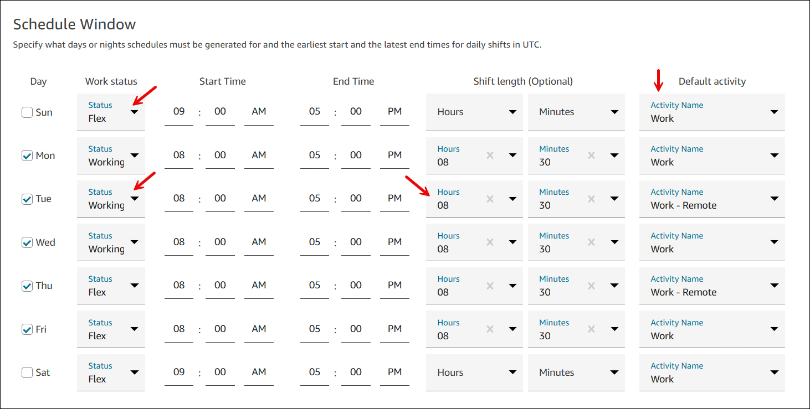
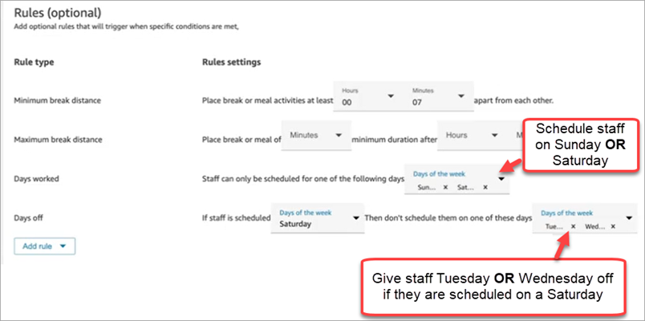
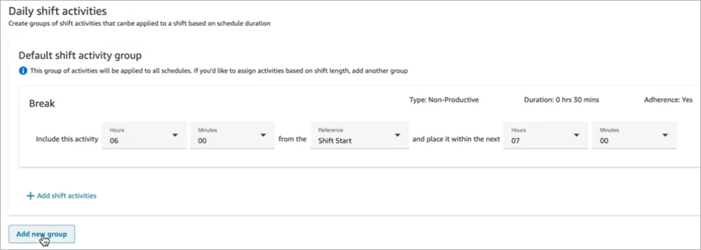
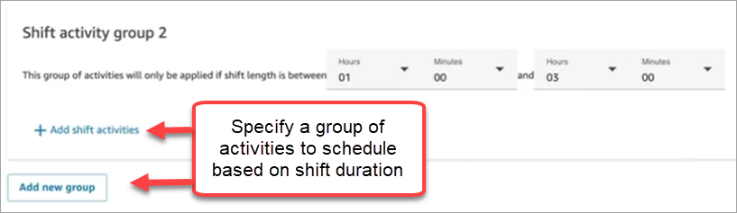

# Create a template for an agent's

weekly shift in Amazon Connect

Use shift profiles to create templates for weekly shifts. The template includes
the days of the week worked, the earliest start time and the latest end times the
staff can be scheduled, the activities they would do during their shift, and various
roles.

1. Log in to the Amazon Connect admin website with an account that has security profile permissions
   for **Scheduling**, **Schedule manager -
   Edit**.

For more information, see [Assign
permissions](required-optimization-permissions.md "required-optimization-permissions.md"). 2. On the Amazon Connect navigation menu, select **Analytics and
optimization**, **Scheduling**. 3. Choose the **Shift Profiles** tab, and then choose
**Add shift profiles**. 4. On the **Add shift profile** page, choose a time-zone for
this shift profile. This time-zone configuration will automatically adjust
agent shifts for daylight saving changes. For example, an 8AM - 5PM (8:00 -
17:00) shift profile for US/Pacific time-zone will automatically switch from
8AM - 5PM (8:00 - 17:00) Pacific Standard Time to 8AM - 5PM (8:00 - 17:00)
Pacific Daylight Savings Time. 5. In the **Schedule Window** section, complete the section
as follows:

    * For **Work status**, choose one of the following
     options:

    	+ **Working**: This means when Amazon Connect
    	 generates the schedule, it must schedule the staff to work
    	 between the specified hours and minutes.
    	+ **Flex**: This means if Amazon Connect predicts
    	 enough contact volume to warrant scheduling the agent, it
    	 may schedule them to work between the specified hours and
    	 minutes.
    The following image shows the **Schedule Window**
     section of the **Add shift profile** page. It shows
     examples of Flex, Working (with a shift length of 8 hours and 30
     minutes), and the Default activity.

    
    * **Start Time** and **End Time**:
     Specify the earliest start time and the latest end time for each day
     in the selected time zone.
    * **Shift length (Optional)**: Specify the maximum
     shift length that an agent can be scheduled on a specific day. This
     option is especially useful if your contact center is open for long
     periods of time, such as 24 hours, but each shift is shorter than
     that, such as 8 hours.
    * **Default activity**: Specify the default
     activity for each day. Only activities set up as work activities can
     be selected as default activities. For more information about work
     activities, see [Create shift
     activities](scheduling-create-shift-activities.md "scheduling-create-shift-activities.md").

Depending on the contact demand pattern forecast, Amazon Connect determines the
best possible start and end times for shifts, while adhering to the minimum
and maximum hours per day and week worked. 6. Choose **Add shift activities**. Select the shift
activities the staff will do during their shift. (You [create the shift
activities](scheduling-create-shift-activities.md "scheduling-create-shift-activities.md") that appear in the list, such as Productive, Time off,
and Non-Productive.) 7. For each activity, set placement rules. The rules include:

    * The time duration from the beginning to end of the shift where the
     activities need to be placed.
    * The time window for Amazon Connect to pick the best spot to maximize
     efficiency of the generated schedules to meet the goals, such as the
     service level percent (SL%) targets.

8. Optionally, complete the **Rules** section as follows:

###### Important

These rules override the settings in the **Schedule
Window** section.

Choose the **Add rule** dropdown box and choose from the
following options:

    * **Minimum break distance**
    * **Maximum break distance**
    * **Days worked**: If you list multiple days, they
     are separated by OR.
    * **Days off**: If you list multiple days, they are
     separated by OR.

9. In the **Daily shift activities** section, complete the
   **Default shift activity group** section to specify
   when activities such as lunch breaks and training should be scheduled during
   the shift. The shift activities apply to everyone in the shift. In the
   following image, agents are scheduled for a **Break** 6
   hours after starting their shift and within 7 hours.

Optionally, choose **Add new group** to add a subgroup of
agents and specify shift activities for them. In the following image, the
shift is 2 hours and no activities are specified. This means the agents in
**Shift activity group 2** don't get a break.

 10. After saving the shift profile, you can edit or remove it from the list
view.
For example, if you set break to start 6 hours after the start of a shift and
lunch to start 3 hours after the start of a shift, the lunch is scheduled to occur
first.
