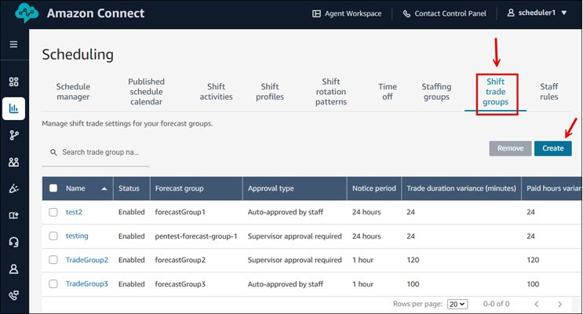

# Create shift trade

groups

You create shift trade groups so that agents within the same forecast group can
trade shifts with each other. For information about the shift exchange capability,
see [Set up shift exchange in Amazon Connect](shift-exchange.md "shift-exchange.md").

You can create up to 500 trade groups per Amazon Connect instance. You can create up to 100
custom trade groups.

1. Log in to the Amazon Connect admin website with an account that has security profile permissions
   for **Scheduling**, **Schedule manager -
   Edit**.

For more information, see [Assign
permissions](required-optimization-permissions.md "required-optimization-permissions.md"). 2. On the Amazon Connect navigation menu, select **Analytics and
optimization**, **Scheduling**. 3. On the **Scheduling** page, choose the **Shift
trade groups** tab, and then choose
**Create**, as shown in the following image.

 4. On the **Add shift trade group** page, complete the
following boxes:

    1. **Trade group name**: Name of the trade
     group.
    2. **Description (Optional)**: Additional
     information on the trade group.
    3. **Associate to forecast group**: Choose the
     forecast group to associate to this trade group. Each forecast group
     can be associated to only one trade group.
    4. **Status**: Enable or disable this trade group.
    5. **Notice period (hours)**: The number of hours
     before a trade can be active.
    6. **Approval type**:

    	* **Auto-approval by staff**: Choose this
    	 option to automatically approve shift exchange requests
    	 between agents when all the specified criteria are met.
    	* **Supervisor Approval required**: Choose
    	 this option to mandate that a supervisor must manually
    	 approve trade requests.
    7. **Trade duration variance (minutes)**: The
     maximum number of minutes between two shifts to allow the
     trade.
    8. **Paid hours variance (minutes)**: The maximum
     number of paid minutes that can be different between two shifts to
     allow the trade.

    For example, say you set this to 30 minutes. One agent has a paid
     break that's 90 minutes, and another agent has a paid break that's
     30 minutes. They wouldn't be able to trade shifts because the
     difference is 60 minutes.

    This option is useful if you have agents with contracts that
     guarantee them a certain number of paid hours, for example.
    9. **Override labor laws**: Do you want to allow
     agents to make trades that override the labor laws specified in
     staff rules? These rules are specified on the **Staff
     rules** page.

    For example, say an agent cannot work more than 40 hours a week.
     But that agent wants to make a trade to work more than 40 hours, and
     the **Paid variance** setting allows it. If
     **Force trade** is set to
     **Enable**, then the agent is allowed to make
     the trade that overrides the 40 hour per week rule.
    10. **Staffing groups**

    	* All staffing groups within the forecast group can trade
    	 shifts.
    	* **Custom**

    		+ Create a custom trade group by selecting the
    		 desired staffing groups. This restricts trades to
    		 only the selected staffing groups.
    		+ You can create a maximum of 100 custom trade
    		 groups.
