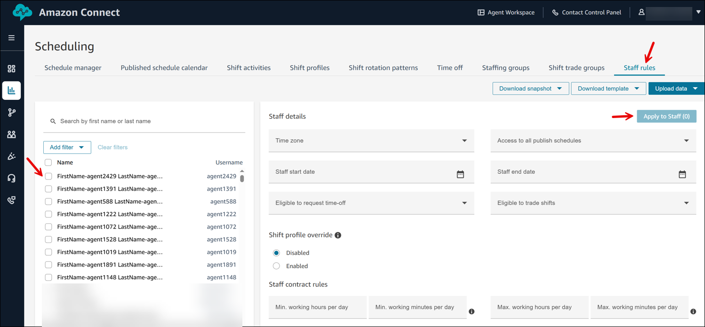
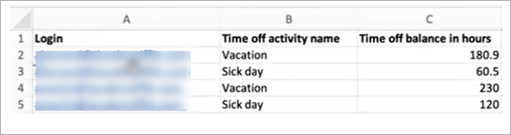

# Create staff rules for scheduling in

Amazon Connect

Use staff rules to specify optional details for individual agents and supervisors,
such as their local time zone, start and end dates, and contract details.

###### Note

The individual staff rules you specify here override any staffing group rules
when their schedule is generated.

For example, you might set up the staffing group to generate a schedule where
everyone works 40 hours per week. In the staff rules, you can choose specific
employees to schedule for 20 hours per week.

###### Contents

- [Create staff rules for individuals](#individual-rules "#individual-rules")
- [Import time off balance for
  individuals](#scheduling-upload-ic-timeoff "#scheduling-upload-ic-timeoff")

## Create staff rules for individuals

1. Log in to the Amazon Connect admin website with an account that has security profile
   permissions for **Scheduling**, **Schedule
   manager - Edit**.

For more information, see [Assign
permissions](required-optimization-permissions.md "required-optimization-permissions.md"). 2. On the Amazon Connect navigation menu, select **Analytics and
optimization**, **Scheduling**. 3. On the **Scheduling** page, choose the
**Staff rules** tab, and then search and choose one
or more staff from the list. Every time staff is selected, the staff
count is displayed in the **Apply to Staff**
button.

The following image of the **Scheduling** page shows
you **Staff rules** tab, the list of agents, and the
**Apply to Staff** button.

 4. In the **Staff details** section, specify optional
details such as:

    * **Time zone**: Render schedules in the local
     time zone of the agent.
    * **Access to all published schedules**: Select
     **Yes** to give this user access to all
     published schedules without being a supervisor in staffing
     groups. Note that the user still needs **Scheduling,
     Schedule manager - Edit** permission in their
     security profile.
    * **Staff start date** and **Staff end
     date**: Schedule agents based on respective start
     and end dates. For example, if someone is starting on May 15th,
     set this start date as May 15th to ensure that schedules are not
     generated for this agent before this date.
    * **Eligible to request time-off**: Specify
     whether this agent is eligible to request time-off.
    * **Eligible to trade shifts**: Specify whether
     this agent eligible to trade shifts.

5. In the **Shift profile override** section, choose
   **Enabled** to define a specific shift profile or
   shift rotation pattern for each agent.
6. In the **Staff contract rules** section, define rules
   that must be applied when scheduling this agent. For example, they must
   get 2 consecutive days off every week, they cannot work more than 40
   hours per week, they must have a gap of 11 hours between consecutive
   shifts, and more.
7. Choose **Apply to Staff**. This saves the rules, and
   ensures they are applied during the next scheduling cycle.

## Import time off balance for

individuals

For the maximum file size that you can upload, see _File size per
upload of agent time off data_ in [Forecasting, capacity
planning, and scheduling feature specifications](feature-limits.md#forecasting-cap-planning-scheduling-specs "feature-limits.md#forecasting-cap-planning-scheduling-specs").

1. Log in to the Amazon Connect admin website with an account that has security profile
   permissions for **Scheduling**, **Schedule
   manager - Edit**.

For more information, see [Assign
permissions](required-optimization-permissions.md "required-optimization-permissions.md"). 2. On the Amazon Connect navigation menu, select **Analytics and
optimization**, **Scheduling**. 3. On the **Scheduling** page, choose the
**Staff Rules** tab. 4. Choose Download template and store the .csv file on your desktop. It
looks similar to the following image.

 5. Add data or make changes to the .csv file as needed and then save to
your desktop with a new file name. 6. Choose **Upload data** to upload the .csv file. Amazon Connect
does the following:

    * Validates the data and provides details if there are
     errors.
    * Prompts you for confirmation that you want to upload the
     data.
    * Uploads the file and displays a confirmation message when
     complete.

After the .csv file is successfully uploaded, Amazon Connect checks the available time
off balance when time off requests are submitted. If there is enough time off
balance it approves the request. Otherwise, the request is declined.

###### Note

The time off balance for the requested time off type must be equal to or
greater than the duration of the requested time off.
