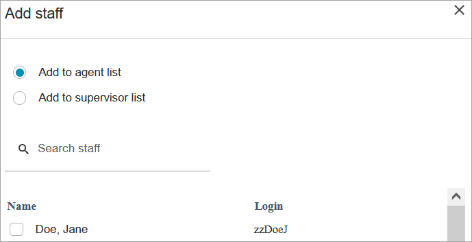

# Create groups and rules for

staffing and scheduling in Amazon Connect

A _staffing group_ is a group or team of agents who are skilled
to take specific types of contacts.

You add agents who need a schedule generated for them, and supervisors who manage
agent schedules. You can also add rules that apply at the staffing group level, such
as the minimum staff required and the minimum working hours per day or week for the
group.

For example, say your contact center opens at 9AM but the forecast says no
contacts arrive between 9-9:30AM. You can add a rule that says, despite what the
forecast predicts, there should be a minimum of one agent during this time.

If you don't have a shift start time rule, then the schedule is built using the
predictions from the forecast.

For a list of staffing group limits, see [Forecasting, capacity
planning, and scheduling feature specifications](feature-limits.md#forecasting-cap-planning-scheduling-specs "feature-limits.md#forecasting-cap-planning-scheduling-specs").

## Example

For example, you might create one staffing group named General Enquiry, and
another named Tier 2 Support. Because you map one or
more staffing groups to a forecast group, here's how you would create staffing
groups in this case:

1. Group all General Enquiry queues to a General Enquiry forecast
   group.
2. Map the General Enquiry forecast group to multiple staffing groups
   that have agents who can take general enquiry contacts.

## Important things to

know

- Every agent must be in a staffing group in order for a schedule to be
  generated for them. You can add and remove agents in between schedule
  cycles and manually add shifts.
- Even after an agent is in a staffing group, you can assign them their
  own shift profile by using the **Staff rules** tab. The
  agent-level shift profile overrides the profile set at the staffing
  group level. For more information, see [Create staff rules for scheduling in
  Amazon Connect](scheduling-create-staff-rules.md "scheduling-create-staff-rules.md").
- If a user needs to view published agent schedules from the
  **Published** calendar view, then the user must be
  added to the staffing group as a supervisor.
- A user cannot be an agent in one staffing group AND a supervisor in
  another staffing group.
- When you remove an agent from a staffing group, it does not
  automatically delete their shifts. Adherence will continue to be
  tracked. If you don't plan on adding them to another staffing group, we
  recommend removing the shifts for that agent before removing them from
  the staffing group.

## Create group and add staff

1. Log in to the Amazon Connect admin website with an account that has security profile
   permissions for **Scheduling**, **Schedule
   manager - Edit**.

For more information, see [Assign
permissions](required-optimization-permissions.md "required-optimization-permissions.md"). 2. On the Amazon Connect navigation menu, select **Analytics and
optimization**, **Scheduling**. 3. Choose the **Staffing Groups** tab, and then choose
**Create staffing group**. 4. On the **Create Staffing Group** page, under
**Associate to forecast group**, use the dropdown
to choose the forecast group to associate with this staffing group.

In the following example, contacts from the queues in the
Forecast_Group_20220124 will be routed to the agents in this staffing
group. 5. Choose **Add staff** to add agents and supervisors to
this staffing group. Only names for Amazon Connect users appear in the list of
staff. The following image shows the name Jane Doe, which can be added
to the agent list.

## Add rules

To generate a schedule, Amazon Connect uses information from the forecast group, which
reflects the historical demand pattern for your contact center. Staffing rules
enable you to specify conditions that must be accounted for in the schedule,
regardless of what the forecast predicts.

For example, your contact center opens at 9AM but the forecast says no
contacts arrive between 9AM-9:30AM. You can add a rule that, despite what the
forecast predicts based on historical demand, there should be a minimum of one
agent during this time. This forces Amazon Connect to keep one agent in the schedule from
9-9:30AM. In addition, you can add a rule to set the **Working
Hours** to start at 9AM, even though the forecast would start it at
9:30AM.

###### To add rules

- In the **Rules** section, choose
  **+** and then use the dropdown to choose the type
  of rule to create for the staffing group. For example, you can
  specify:
  - **Minimum staff required**: Specify the
    minimum number of agents that should be available, despite what
    the forecast indicates. For example, if the forecast says that
    you do not need any agents in the first half hour that your
    contact center opens, you can ensure that there is a minimum of
    one agent during this time.
  - **Shift start time:**
    - **Same Start Time**: This creates
      schedules with the same shift start time for all
      staff.
    - **Previous day's start time**: This
      creates schedules such that for each agent in the
      staffing group, a shift does not start earlier than
      previous day's shift.

  - **Working time**: Specify the group's minimum
    and maximum working hours per day or week. This setting applies
    to all staff in the staffing group. You can override this
    setting for individual staff. For instructions, see [Create staff rules for scheduling in
    Amazon Connect](scheduling-create-staff-rules.md "scheduling-create-staff-rules.md").
  - **Minimum rest between shifts**: Specify the
    minimum number of hours of rest period a staff should receive
    between the end of one shift and start of next shift. This
    setting applies to all staff in the staffing group. You can
    override this setting for individual staff.
  - **Consecutive working days**: Specify the
    minimum and maximum consecutive days each staff in the staffing
    group should be scheduled for. This setting applies to all staff
    in the staffing group. You can override this setting for
    individual staff.
  - **Maximum consecutive day of the week
    worked**: For each day of the week, specify if
    staff should not be scheduled for more than the defined number
    of times consecutively. For example, do not schedule staff for
    more than 2 Sundays in a row. This setting applies to all staff
    in the staffing group.
  - **Minimum consecutive rest period per week**:
    Specify the rest period (in hours or days) a staff should
    receive each week. This setting applies to all staff in the
    staffing group.
