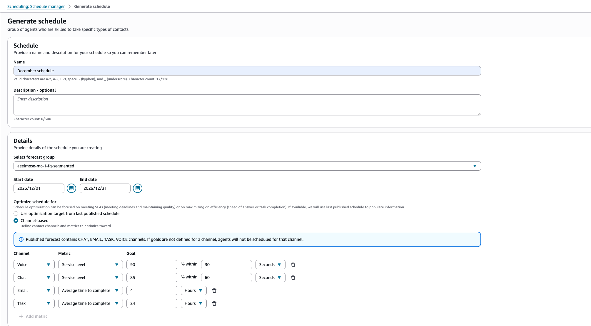
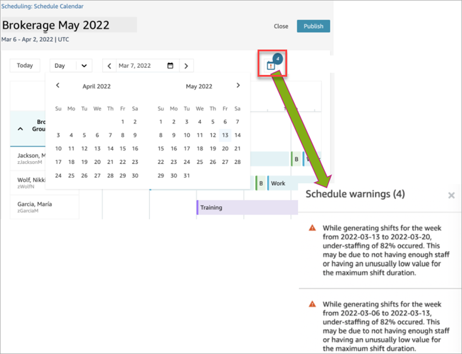
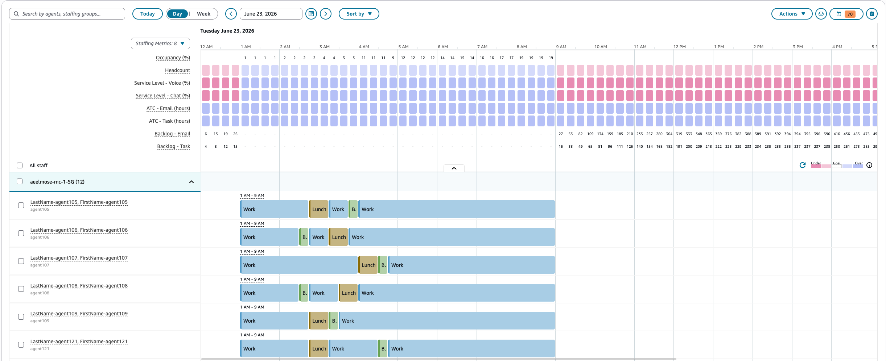
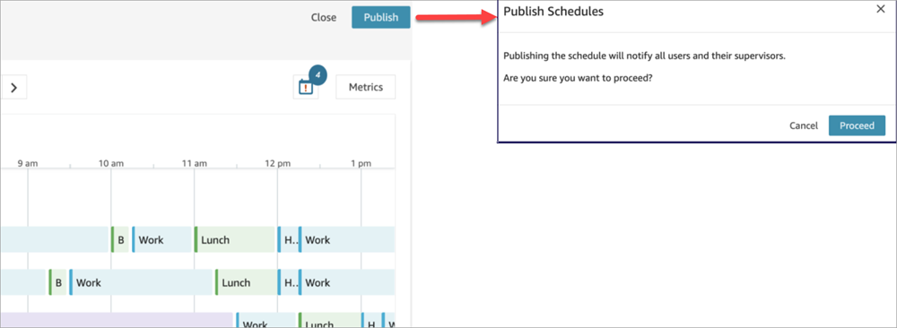
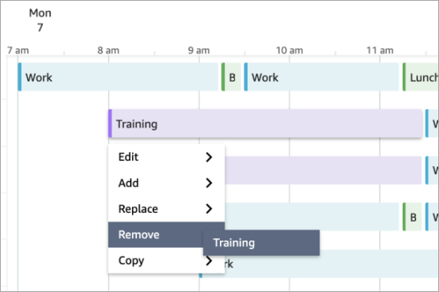
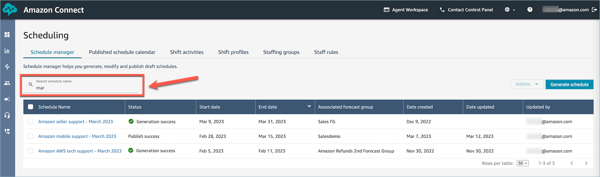

# Generate, review, and publish a schedule by using Schedule Manager in Connect Customer

Connect Customer is designed to generate the least number of shifts for agents based on the
forecasted demand pattern and configured constraints to hit the optimization
goal.

After you create shift activities, shift profiles, staffing groups and staffing
group rules, you can generate a schedule.

1. Log in to the Connect Customer admin website with an account that has security profile permissions
   for **Scheduling**, **Schedule manager -
   Edit**.

For more information, see [Assign
permissions](required-optimization-permissions.md "required-optimization-permissions.md"). 2. On the Connect Customer navigation menu, select **Analytics and
optimization**, **Scheduling**. 3. Choose the **Schedule Manager** tab, and then choose
**Generate schedule**. 4. Enter a name and description for the schedule. 5. In the **Schedule input** section, select the forecast
group from the dropdown menu.

Currently you cannot schedule for multiple forecast groups. 6. Specify the duration of the schedule - the start and end dates. You can
schedule up to 18 weeks out. 7. Select optimization goals for each channel in your forecast:

    * **Voice**: **Service
     level** or **Average speed of
     answer**
    * **Chat**: **Service
     level** or **Average speed of
     answer**
    * **Task**: **Service
     level** or **Average time to
     complete**
    * **Email**: **Service
     level** or **Average time to
     complete**

For Task and Email: use **Service level** when the
work is done synchronously, for example, a Task is picked up within 5
minutes of arriving. Use **Average time to complete**
when the work can be deferred and is completed over hours or
days.

###### Note

Backlog metrics are only available when **Average time to
complete** is selected as the optimization
goal.

 8. Choose **Generate schedule**.

###### Note

Connect Customer generates a draft schedule. It will not be visible to agents or
supervisors until you publish it. 9. In the list of schedules, the schedule you created shows a status of
**In progress**. It takes 30 minutes to 3 hours to
generate, depending on the number of agents, number of configured rules,
schedule duration, and more. After the schedule is generated, it's status is
**Complete** or **Failed**. 10. To view any warnings, breaches of rules, or constraints breaches, choose
the warnings icon, as shown in the following image. More information about
the warnings is displayed. Schedule generation warnings come in three
severities: **HIGH**, **MEDIUM**,
and **LOW**.

    1. **HIGH** warnings indicate an agent has
     not been successfully scheduled.
    2. **MEDIUM** warnings indicate an agent was scheduled
     but could not meet all the given requirements
     (for example, an agent's schedule for a day not meeting the minimum
     working hours required for them).
    3. **LOW** warnings indicate minor problems
     with the schedule (for example, overstaffing occurring for a given day).

 11. When the status is **Complete**, choose the draft
schedule to view it. The following image shows a sample schedule for one
day, with staffing metrics and individual agent shifts.

Schedulers can:

    * View schedules for all agents.
    * Pick a date to view a specific shift.
    * Navigate back to today's date.
    * View failed rules and goals.

12. When you're satisfied with the schedule, choose
**Publish**. You'll get a confirmation page. Choose
**Proceed** to make the schedule official!

Staff (agents) and supervisors specified in the staffing groups can now
view the schedule. See the following topics to learn about their experience:

    * [How supervisors view published schedules using the Connect Customer admin website](scheduling-view-schedule-supervisors.md "scheduling-view-schedule-supervisors.md")
    * [How agents view their schedule in the Connect Customer agent workspace](scheduling-view-schedule-agents.md "scheduling-view-schedule-agents.md")

## Edit a schedule

Before publishing a schedule, you might want to edit it. For example, if you
notice that all the agents are scheduled to be on break at the same time and no
one is scheduled to take contacts.

You can:

- Change agent shift start or end time, duration.
- Change activity shift start or end time, duration.
- Add an activity to one or more agents shift.
- Remove or replace activity from an agent shift.
- Copy an entire shift from one agent to another.
- Recompute metrics to ensure schedule adjustments result in better
  service level (SL%) or occupancy.

The following image shows these options in the dropdown list:
**Edit**, **Add**,
**Replace**, **Remove**,
**Copy**.

## Regenerate a schedule

Managers and supervisors can regenerate agent schedules for up to six
different forecast groups after making changes to the scheduling
configuration.

1. To edit a schedule, select the schedule, choose
   **Actions**, and select **Edit
   Schedules**. Make your changes and choose
   **Save**.
2. To regenerate one or more schedules, select the schedules you want to
   regenerate, choose **Actions**, and select
   **Regenerate schedules**.

## Search and sort a schedule

Managers and supervisors can search and sort schedules from within the
schedule manager. Schedulers can search for schedule names using partial
keywords or sort the schedule list based on start date, end date, creation date,
or updated date.

The following image shows the search box on the
**Scheduling** page. Entering **mar**
returns schedules that have March in their name.

