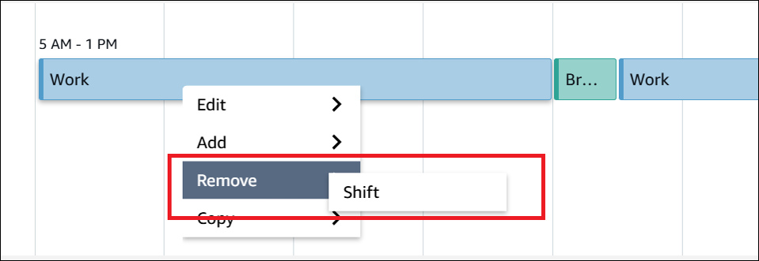
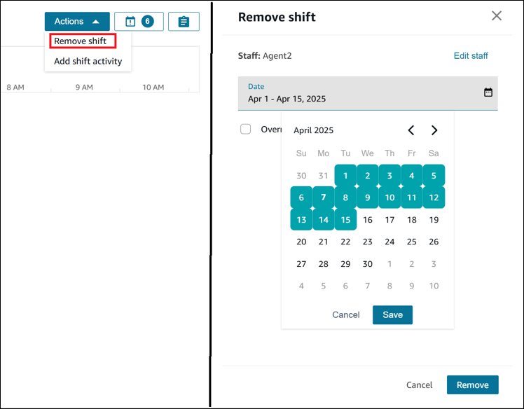

# Remove agent shifts

Contact center managers, supervisors, and schedulers can remove agent shifts, for
either one agent at a time or multiple agents simultaneously. For example:

- Remove all shifts for next Monday.
- Remove future shifts for an agent who is no longer with the
  organization.
  You can remove up to 30 days of shifts for an agent. You can remove shifts for up
  to 400 agents for a day.

###### To remove shifts

1. Log in to the Amazon Connect admin website with an account that has security profile permissions
   for **Scheduling**, **Schedule manager -
   Edit**.

For more information, see [Assign
permissions](required-optimization-permissions.md "required-optimization-permissions.md"). 2. On the Amazon Connect admin website, on the navigation menu, choose **Analytics and
optimization**, **Scheduling**, and then
select the **Published scheduled calendar** tab. 3. Complete the following steps to remove shift(s):

    * **Remove one shift for one agent**:
     Choose that shift and then choose **Remove Shift**,
     as shown in the following image.

    
    * **Remove multiple shifts for one
     agent**:

    ###### Note

    The following procedure does not remove any time-offs that are
     scheduled for the selected date range.

    	1. One the left side of the **Scheduling** -
    	 **Published schedule calendar** page,
    	 select the agent.
    	2. Use the **Actions** dropdown list to
    	 select **Remove shift**.
    	3. Select a date range in the **Remove
    	 shift** section.
    	4. Choose **Remove**.

    	
    * **Remove shifts for multiple agents for a
     single day**:

    ###### Note

    The following procedure does not remove any time-offs that are
     scheduled for the selected date range.

    	1. On the left side of the page, select up to 400 agents. If
    	 you select more than 400 agents, only the first 400 agents
    	 will be part of the remove shift operation.
    	2. Use the **Actions** dropdown list to
    	 select **Remove shift**.
    	3. Select a date range in the **Remove
    	 shift** section.
    	4. Choose **Remove**.
    You can repeat this operation to select remaining agents and
     remove shifts for them.
