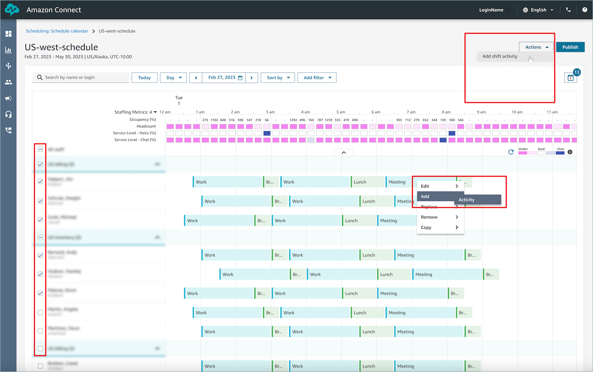
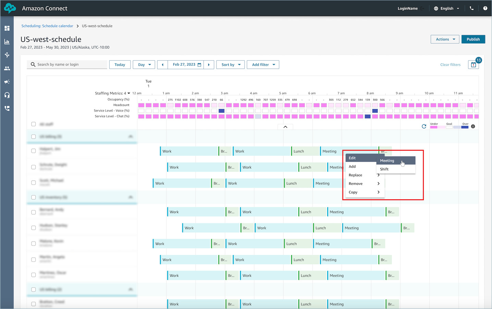
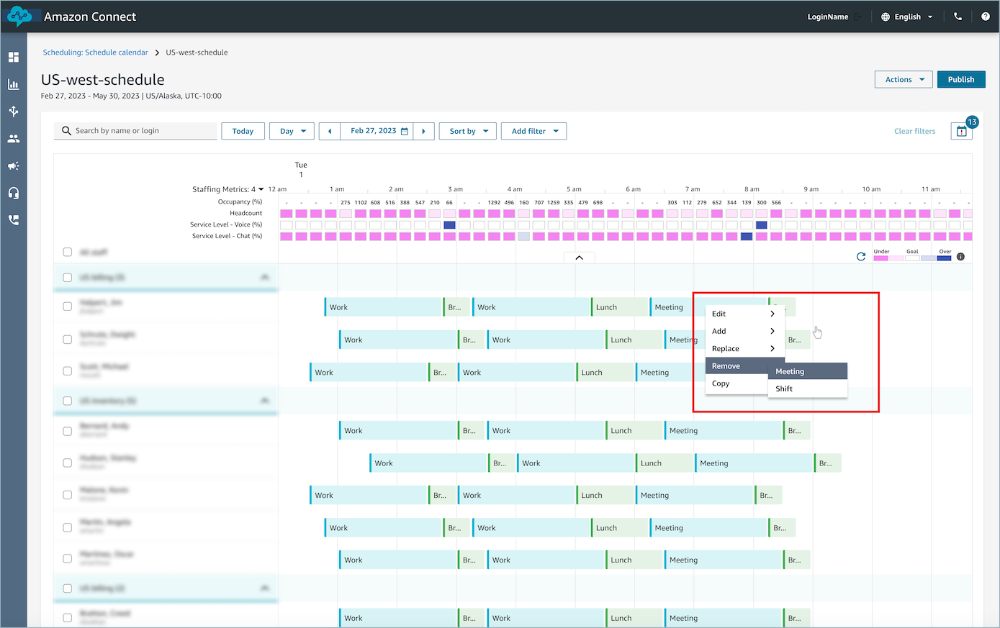

# Add shift activities in

draft or published schedules in Amazon Connect

Amazon Connect scheduling allows contact center managers, supervisors, and schedulers to
insert activities into agent schedules, both draft and published. For example,
activities such as team meetings, 1:1 coaching sessions, and trainings can be added
into an agent's schedule.

###### Note

- You cannot use the **Add Shift Activity** option
  described in this topic to add activities to an agent's shift when they
  are flagged as [Work
  activities](scheduling-create-shift-activities.md "scheduling-create-shift-activities.md").
- You can replace activities of type = work with another work activity,
  and it will replace it for the whole shift.
- A work activity cannot be replaced with a non-work activity.

## Add a shift

activity

1. Log in to the Amazon Connect admin website with an account that has security profile
   permissions for **Scheduling**, **Schedule
   manager - Edit**.

For more information, see [Assign
permissions](required-optimization-permissions.md "required-optimization-permissions.md"). 2. On the Amazon Connect admin website, on the navigation menu, choose **Analytics and
optimization**, **Scheduling**, and then
select the **Published scheduled calendar** tab. 3. Choose the agents you want to include in the activity by selecting the
check-boxes next to their names. 4. Choose the **Actions** drop-down and select
**Add Shift Activity**. The **Add Shift
Activity** page is displayed, populated with all the agents
you selected in the previous step.

    1. An alternative way to access the **Add Shift
     Activity** page is as follows: choose any agent's
     shift, then select **Add**, followed by
     **Activity**. The **Add Shift
     Activity** pop-up is displayed, showing the shift
     of the agent you initially chose. To include additional agents
     in the activity, choose **Edit staff**.

 5. Select a shift activity from the drop-down. 6. Select an activity type of **Shared** or
**Individual**:

    1. **Shared** activity: A singular occurrence of
     the activity is shared among all participating agents. Any
     modifications made to the activity, such as adjustments to the
     date or time, will apply to all agents simultaneously.
    2. **Individual** activity: Separate instances
     of the activity will be created for each individual agent. Any
     modifications made to the activity, such as adjustments to the
     date or time, will apply to an individual agent.

7. Select the date and time for the activity.
8. Select if you want to create this as a repeating activity.

For example, let's say you have:

    * A published schedule that runs through August 31, 2025
    * A weekly team meeting you want to add that occurs every Monday
     at 9 AM indefinitely

When you add this meeting to the current published schedule:

    1. It appears on all Mondays through August 31, 2025.
    2. When you create a draft schedule for September 2025, the
     meeting automatically carries over.
    3. If you modify the meeting in the draft schedule (for example,
     moving it from Monday to Tuesday), publishing the draft schedule
     will:

    	* Update all future occurrences of the meeting to the
    	 new day.
    	* Apply any other changes you made to the recurring
    	 meeting pattern.

9. Choose **Override rules check** to bypass scheduling
   restrictions like minimum and maximum working hours.

If you don't select this option:

    * Agents who would violate scheduling rules are automatically
     excluded from the activity.
    * You can view excluded agents and the reasons for their
     exclusion in the **Actions log**.

10. Enter any note in the provided **Comment** text
    box.
11. Choose **Apply** to add the activity to agent
    schedules.
12. You can monitor the progress in the **Actions log**,
    where the status will transition from **In progress**
    to **Complete**.

###### Note

The **Actions log** is designed to track the status of
long running actions, such as adding a shift activity with optimization. The
**Actions log** does not track all changes made to
schedules.

## Edit a shift

activity

1.  From an agent's shift, choose the activity, select
    **Edit**, and then select the activity name to open
    the edit activity screen.
2.  If the activity you are editing is part of a recurring series, you can
    choose to edit just this occurrence. Or, you can edit the series.
    - To edit just this occurrence, continue editing using steps
      below.
    - To edit the series, choose **Go to series**.
      When editing a series, you cannot edit activity name and
      activity type, you can edit other fields.

    ###### Note

    When a series is edited, any occurrences that are in the
    past are not modified. Only future occurrences are modified
    based on the latest repeating pattern.

3.  If the activity was added as a **Shared activity**,
    then all of the agents added to the activity will be listed under
    **Staff**.
    1. From here, you can add or remove agents, change the date or
       time of the activity, apply the **Override rules
       check**, and add or update
       **Comments**.
    2. Choose **Apply** to commit the
       changes.

4.  If the activity was added as an **Individual
    activity**, then only the agent whose shift you chose will
    be listed under **Staff**.

        1. From here, you can: change the date or time of the activity,
         apply the **Override rules check**, and add or
         update **Comments**.
        2. Choose **Apply** to commit the
         changes.

    

## Remove a

shift activity

1. From an agent's shift, choose the activity, select
   **Remove**, and then select the activity name to
   open the remove activity screen.
2. If the activity you are removing is part of a recurring series, you
   can choose to remove just this occurrence or you can remove the entire
   series.
   - To remove just this occurrence, continue removing using steps
     below.
   - To remove the series, choose **Go to series**
     and then continue removing using steps below.

   ###### Note

   When a series is removed, any occurrences that are in the
   past are not modified. Only future occurrences are modified
   based on the latest repeating pattern.

3. Choose the **Override rules check** option as
   needed.
4. Choose **Remove** to remove the activity.

