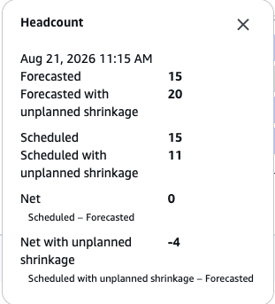

# Upload unplanned shrinkage data to published schedules in Connect Customer

You can upload unplanned shrinkage assumptions to improve the
accuracy of published schedules. Unplanned shrinkage accounts for anticipated
deviations from the schedule, such as late logins, early logouts, and last-minute
sick call outs.

By uploading this data, you help the system account for expected agent
unavailability and generate more accurate staffing metrics.

###### Note

Shrinkage data uploaded through the **Published calendar** tab is
also used when generating new schedules for the dates where unplanned shrinkage
data is available.

## Required permissions

To upload unplanned shrinkage data, you must have the following security
profile permissions:

- **Analytics and Optimization** -
  **Scheduling** - **Edit**
- **Analytics and Optimization** -
  **Team calendar** -
  **View**

## Upload unplanned shrinkage data

1. Log in to the Connect Customer admin website at
   `https://`instance
   name`.my.connect.aws/`.
2. In the navigation pane, choose **Analytics and
   Optimization**, **Scheduling**.
3. Navigate to a published schedule.
4. Choose **Actions**, **File
   upload**, **Unplanned shrinkage**.
5. Upload a .csv file that follows the format described in [Unplanned shrinkage file format](#scheduling-unplanned-shrinkage-file-format "#scheduling-unplanned-shrinkage-file-format").

## Unplanned shrinkage file format

The .csv file must contain the following columns:

Unplanned shrinkage file columns| Column | Required | Description |
| --- | --- | --- |
| START\_INTERVAL\_TIMESTAMP | Yes | The start time of the interval in ISO 8601 format. For<br>example,<br>`2026-08-21T00:00:00-07:00`. |
| END\_INTERVAL\_TIMESTAMP | Yes | The end time of the interval in ISO 8601 format. For<br>example,<br>`2026-08-21T23:45:00-07:00`. You can upload<br>one row for each 15-minute or 30-minute interval, cover an<br>entire day in one row, or span multiple days in a single<br>row. |
| FORECAST\_GROUP\_NAME | Yes | The name of the forecast group to apply the shrinkage<br>data to. |
| DEMAND\_GROUP\_NAME | No | The name of the demand group. When provided, demand<br>group level values override forecast group level<br>metrics. |
| UNPLANNED\_SHRINKAGE\_PERCENT | No | The expected unplanned shrinkage as a percentage. For<br>example, `25` represents 25% unplanned<br>shrinkage. |
| DAY\_OF\_SCHEDULE\_SHRINKAGE\_PERCENT | No | The unplanned shrinkage expected on the day of the<br>schedule. The system automatically updates metrics on the<br>schedule using the value in this field. |

###### Example Sample .csv file

```
START_INTERVAL_TIMESTAMP,END_INTERVAL_TIMESTAMP,FORECAST_GROUP_NAME,DEMAND_GROUP_NAME,UNPLANNED_SHRINKAGE_PERCENT,DAY_OF_SCHEDULE_SHRINKAGE_PERCENT
2026-08-21T00:00:00-07:00,2026-08-21T23:45:00-07:00,Billing-Queues-Forecast-Group,,25,5
```

## How unplanned shrinkage is applied

Unplanned shrinkage data is applied in two ways:

- **During schedule generation** –
  Unplanned shrinkage is used to increase the required headcount numbers.
  This allows the system to schedule more agents than it would have
  without the unplanned shrinkage data, compensating for anticipated
  agent unavailability.
- **When calculating projected metrics** –
  When calculating projected net staffing, service levels, average speed
  of answer, and average time to complete metrics, unplanned shrinkage is
  applied to the _scheduled headcount_ metric. It is
  not applied to the required headcount metric.

The following image shows an example of the Headcount popup for an interval
where unplanned shrinkage has been applied.



In this example:

- **Forecasted** = 15. This is the
  original required headcount based on the forecast.
- **Forecasted with unplanned shrinkage**
  = 20. The system increases the required headcount from 15 to 20 to
  account for unplanned shrinkage. During schedule generation, the system
  uses this higher number to schedule more agents.
- **Scheduled** = 15. The number of agents
  actually scheduled for this interval.
- **Scheduled with unplanned shrinkage**
  = 11. The effective number of agents expected to be available after
  applying unplanned shrinkage to the scheduled headcount.
- **Net** = 0 (Scheduled − Forecasted =
  15 − 15). Without considering unplanned shrinkage, staffing appears
  balanced.
- **Net with unplanned shrinkage** = -4
  (Scheduled with unplanned shrinkage − Forecasted = 11 − 15). After
  accounting for unplanned shrinkage, there is a projected shortfall of 4
  agents for this interval.
