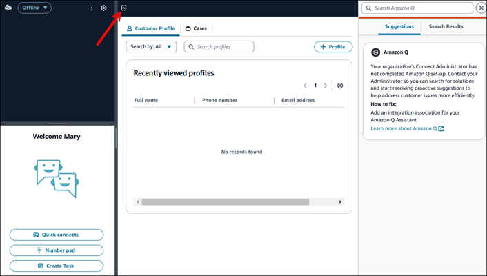

# How agents view their schedule in

the Amazon Connect agent workspace

There are two ways agents can access their schedules:

- If your organization uses the Amazon Connect agent workspace, agents access their
  schedule by entering **https://`instance
name`/connect/agent-app-v2/** into their
  browser and then choosing the calendar icon.
- If your organization uses the Salesforce CTI, or a custom-built agent
  desktop, agents access their schedule by entering
  **https://`instance
 name`/connect/agent-app-v2/scheduling** into their
  browser, logging into Amazon Connect, and then choosing the calendar icon.
  Following are steps agents use to view their schedule in the agent
  application.

1. Log on to the agent workspace using the URL that your admin gives you.
2. Choose the **Calendar** icon on the application
   navigation bar to launch the staff schedule manager viewer, shown in the
   following image. Otherwise, the staff schedule manager viewer launches
   automatically.

The following image shows a sample schedule in the agent workspace.

