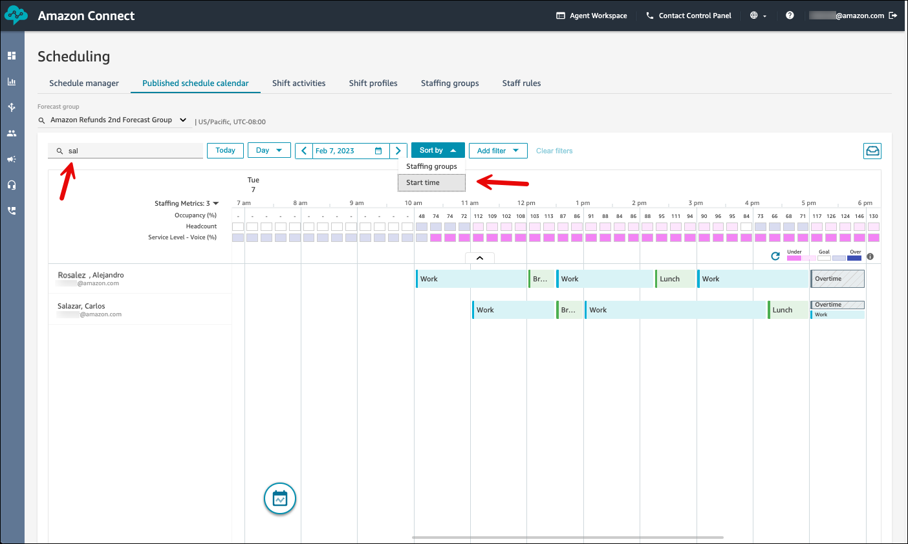
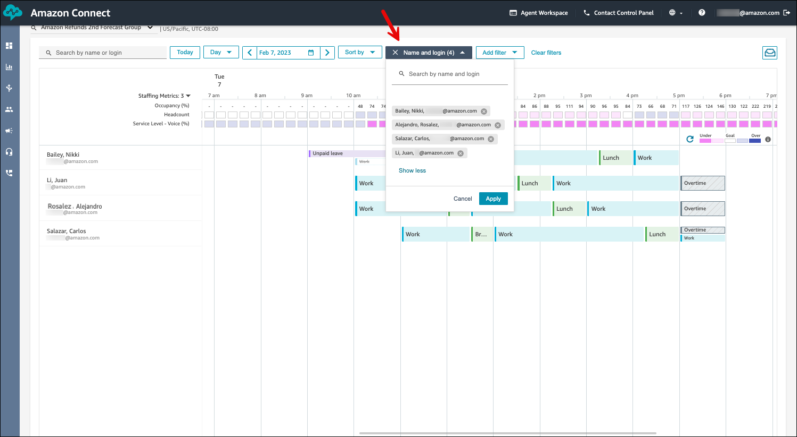
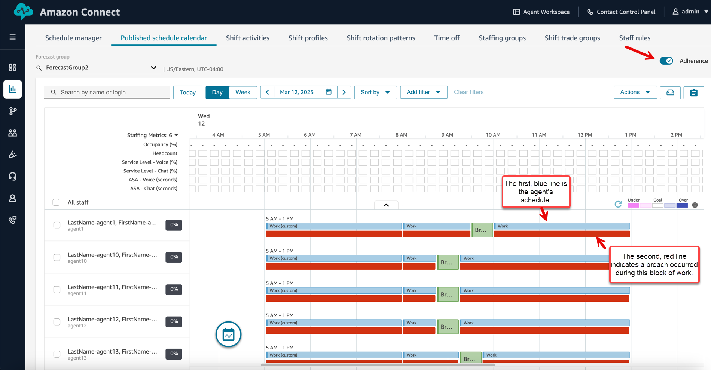
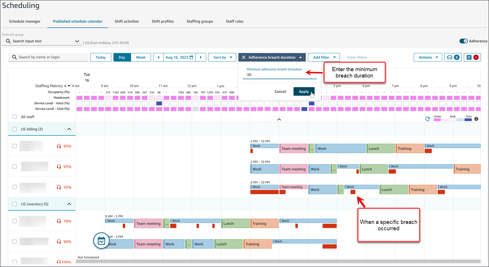
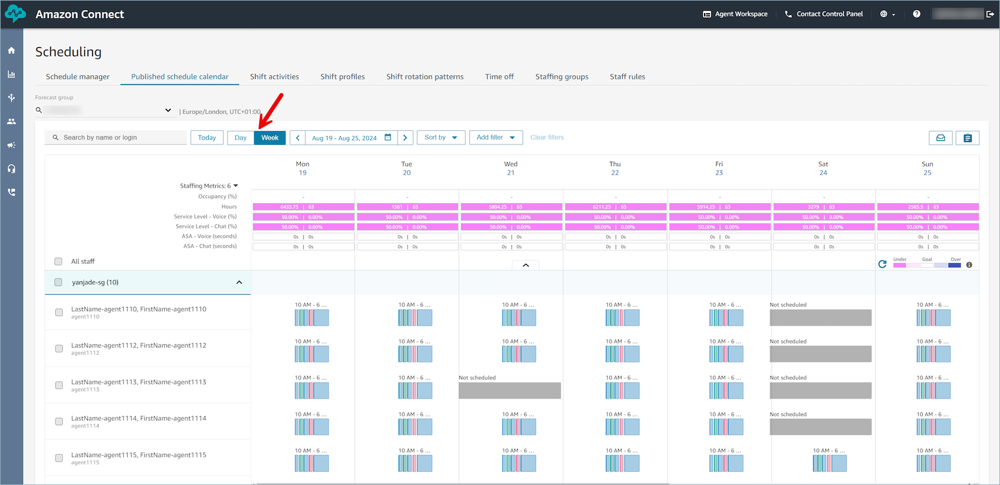

# How supervisors view

published schedules using the Amazon Connect admin website

After a scheduler publishes a schedule, it's official. Agents can now view their
individual scheduling using their agent workspace. Supervisors can also view their
agents schedules using the Amazon Connect admin website.

Supervisors who have **Scheduling**, **Schedule manager -
Edit** permissions in their security profile can edit agent
schedules.

###### Important

When a supervisor edits an agent schedule and publishes it, the change appears
immediately to the agent. They do not need to refresh their browser for the
agent workspace to reflect the change.

###### Contents

- [Sort and
  filter schedules](#scheduling-view-schedule-sort-and-filter "#scheduling-view-schedule-sort-and-filter")
- [Display
  adherence data](#scheduling-display-adherence-data "#scheduling-display-adherence-data")
- [Display Week schedule view](#scheduling-view-schedule-supervisors-weekly "#scheduling-view-schedule-supervisors-weekly")

## Sort and filter

schedules

Managers and supervisors can sort or filter schedules based on the following
criteria.

- **Sort** schedules based on the earliest shift start
  time. For example, agents who login first to take customer contacts are
  listed first in the schedule.

The following image shows a schedule by agent first name, last name,
or login ID with the string `sal`, sorted by their shift
start times. Alejandro logged in first so he is listed first.

- **Filter** schedules based on agent names or agent
  IDs, staffing groups, or supervisor names. The following image shows a
  schedule filtered by name and login.

###### Tip

Supervisors view agent schedules in the time zone defined on the
Supervisor's profile on the **Staff Rules** page.
Supervisors can choose to view agent schedules in a different time zone by
selecting the desired time zone from the date filter.

## Display adherence

data

As a manager or supervisor, you can display the adherence view by enabling the
**Adherence** toggle.

The following image shows the agent's schedule, and a second line under it
that indicates a breach occurred during that block of the agent's schedule, for
example, after their break. It doesn't indicate how long the breach was.

- The adherence view displays the agents' non-adherence data alongside
  their scheduled activities. It displays breaches that are longer than a
  minute. The data refreshes approximately every 5 minutes.
- You can hover over the non-adherence activities to view details such
  as start time, end time, duration, scheduled activity, and actual
  activity. You can also view the adherence percentage that is calculated
  for this shift.
- Non-adherence data is visible for up to 90 days in the past. It is
  available only in the daily view.

To see which agents have exceeded a specified adherence duration, you can
filter agents based on adherence breach duration. For example, you can choose to
view agents who have breached adherence by more than 10 minutes. The following
image shows the breach duration filter set to 30 minutes. The red lines indicate
when the breach occurred.

###### Note

If an agent's schedule is changed within the last 30 days from the current
date (not the date of the schedule), adherence is re-calculated with the new
schedule. This enables you to make real-time adjustments to an agent's shift
and correctly evaluate their adherence.

## Display Week

schedule view

In addition to Day view, supervisors can display a Week view of agent
schedules in both draft and published calendars.

- You can toggle between Day view and Week view by clicking on the
  respective option at the top of the calendar. As you toggle between Day
  and Week views, any filters and sort options you have applied are
  preserved. It also preserves your scroll position.

###### Note

Sort by start time is not available in Week view.

- By default, Weekly view is Sunday to Saturday. You can change start
  day of the week to another day from the date filter. For example, for a
  weekly view starting on Monday September 16th, choose that date in the
  date filter while in the Week view. It automatically selects the
  remaining 6 days of the week. Choose **Apply**.
- You can make the following shift level edits from the weekly view by
  choosing the shift: Edit shift, Copy shift, and Remove shift. For
  editing activities within a shift, you can switch to Day view by
  choosing that date.
- Week view provides the following metrics, aggregated at a day
  level:
  - Occupancy
  - Hours: forecasted versus scheduled hours
  - Service level (by channel): goal versus actual based on
    scheduled agents
  - Average speed of answer (by channel): goal versus actual based
    on scheduled agents

