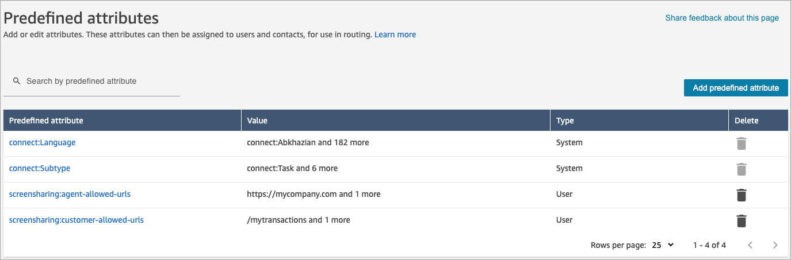
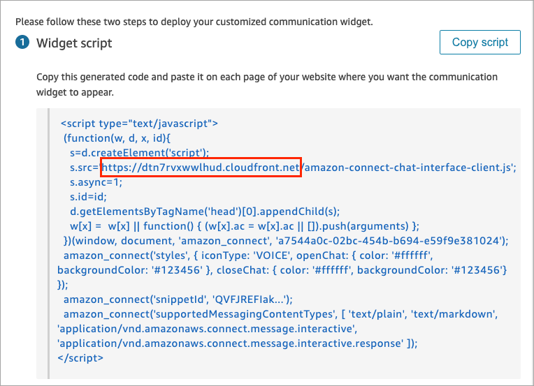

# Enable URL restriction for screen

sharing

You can manage the URLs that your customers and agents are allowed to share during the
contact. This enables you to achieve enhanced security and privacy. When a customer or
agent shares a URL that is not allowlisted, they receive an error message and the screen
share video is automatically paused and blacked out.

###### Important

The following browsers are supported:

- Chrome version 109 and later
- Edge version 109 and later
  Agents and customers can share only the browser tab. They cannot share the window
  or entire screen. If you enable this feature and your customers or agents use an
  unsupported browser, window, or the entire screen, they will receive an
  error.

Complete the following steps to enable URL restriction for screen sharing.

## Step 1: Create an allowed URLs list

You configure the lists of allowed URLs by using predefined attributes. Complete
the following steps.

1. In the Amazon Connect admin website, choose Routing, **Predefined
   attributes**, **Add predefined
   attribute**.
2. In the **Add predefined attributes** section, in the
   **Predefined attribute** box, add one of the
   following.
   - To create allowed list for customer screen sharing, enter
     `screensharing:customer-allowed-urls`.
   - To create allowed list for agent screen sharing, enter
     `screensharing:agent-allowed-urls`.

3. In the **Value** box, enter the allowed URL. It can be a
   fully formatted URL or a string pattern for substring matching, such
   as `https://mycompany` or `/mytransactions`. The
   following table shows examples of valid formats.

| Allowed URL           | website URL                                                                     |
| --------------------- | ------------------------------------------------------------------------------- | --------------------------------------------------------------------------------------------------------------------------------------------------------------------------------------------------------------------------------------------------------------------------------------------------------------------------------------------------------------------------------------------------------------------------------------------------------------------------------------------------------------------------------------------------------------------------------------------------------------------------------------------------------------------------------------------------------------------------------------------------------------------------------------------------------------------------------------------------------------------------------------------------------------------------------------------------------------------------------------------------------------------------------------------------------------------------------------------------------------------------------------------------------------------------------------------------------------------------------------------------------------- |
| https://mycompany.com | https://mycompany.com                                                           |
| /mytransactions       | https://mycompany.com/mytransactions https://othercompany.com/mytrasactions.com |
| mycompany.com         | https://mycompany.com https://internal.mycompany.com                            | 4. Save the list. The URLs appear on the **Predefined attributes** page, as shown in the following example.  ## Step 2: Add script to your website list You need to embed a script into your website so the URL of the page can be exposed to the capturing application. You get the capture handler from a file on the Amazon CloudFront endpoint that Amazon Connect hosts. Complete the following instructions. 1. In the Amazon Connect admin website, choose **Channels**, **Communicate widgets**. On your Communication widget summary page, look for the widget script. Get the endpoint from the `s.src` attribute, as shown in the following example.  The endpoint can be in a different AWS Region than your Amazon Connect instance. For best performance, we recommend using the same Region as your Amazon Connect instance. 2. Replace the following placeholder `${endpoint}` with the value from previous step. Copy the entire code snippet and paste it on the top level of your website. `` |
