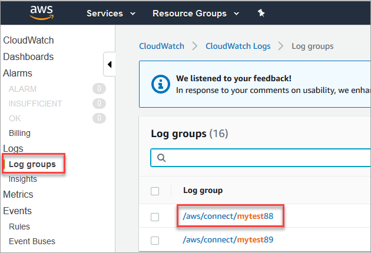
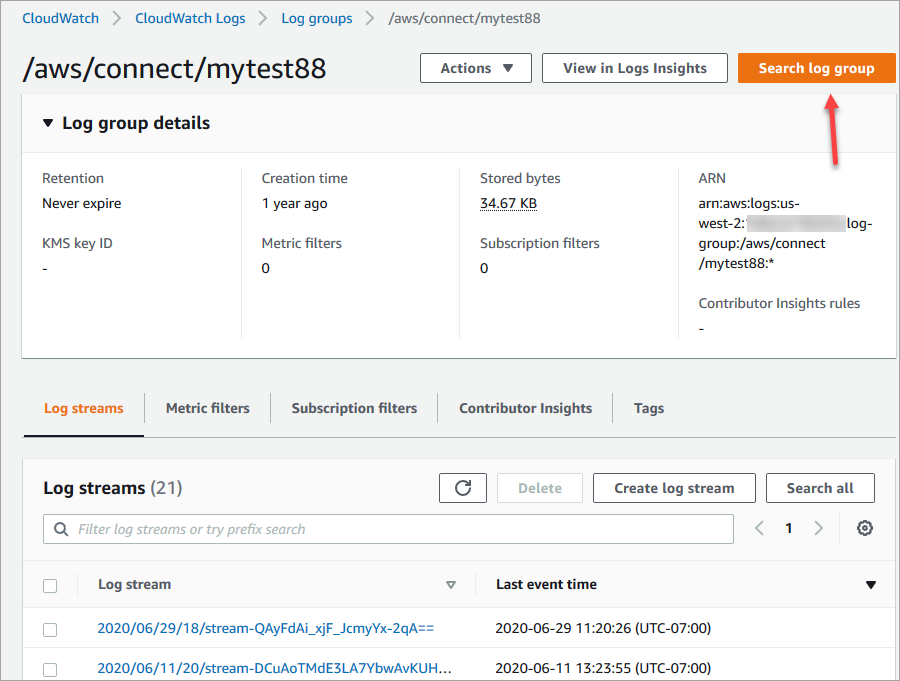
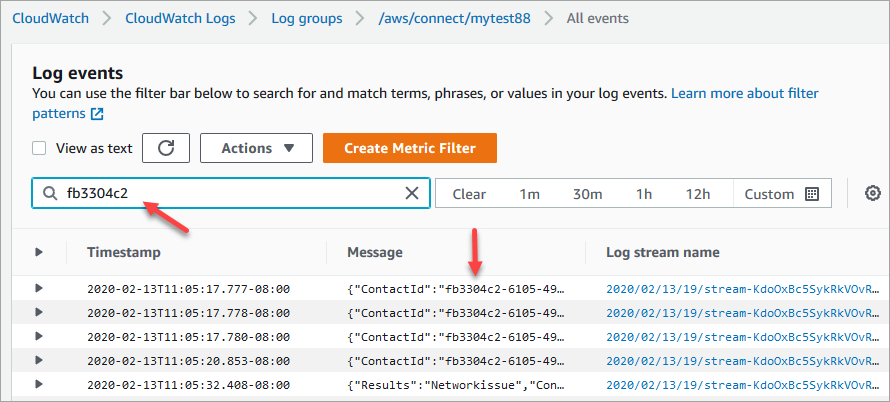
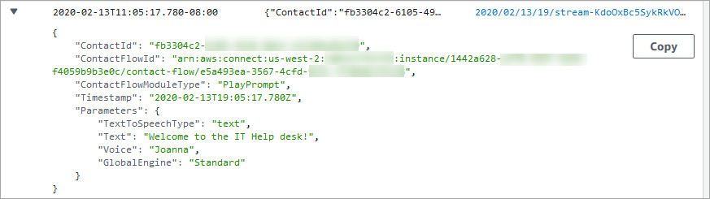

# Search flow logs stored in an Amazon CloudWatch log

group

Before you can search flow logs, you must first [enable flow logging](contact-flow-logs.md "contact-flow-logs.md").

Logs will be created for conversations that occur after logging is enabled.

###### To search flow logs

1. Open Amazon CloudWatch console, go to **Logs**,
   **Log groups**. The following image shows a sample log
   group named **mytest88**.

 2. Choose the log group for your instance.

A list of log streams will be displayed. 3. To search all the log streams in the instance, choose **Search log
group**, as shown in the following image.

 4. In the search box, enter the string you want to search for, for example, all
or a portion of the contact ID. 5. After a couple of moments (longer depending on how big your log is), Amazon CloudWatch returns results. The following image shows a sample contact ID
**fb3304c2**, and the result.

 6. You can open each event to see what happened. The following image shows the
event for when a **Play prompt** block runs in a flow.

